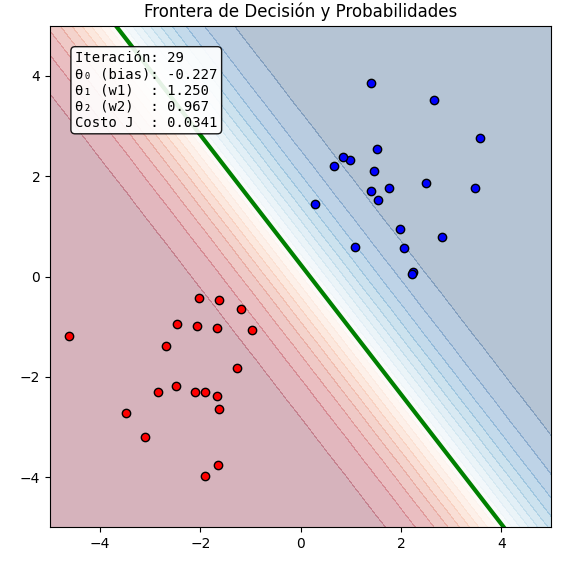
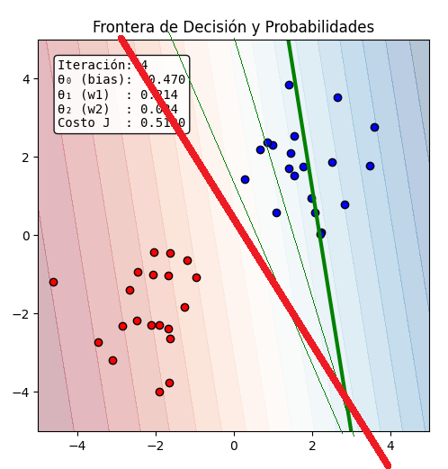
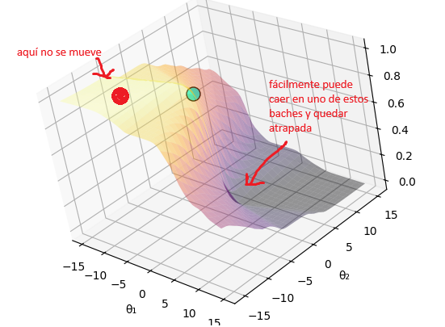
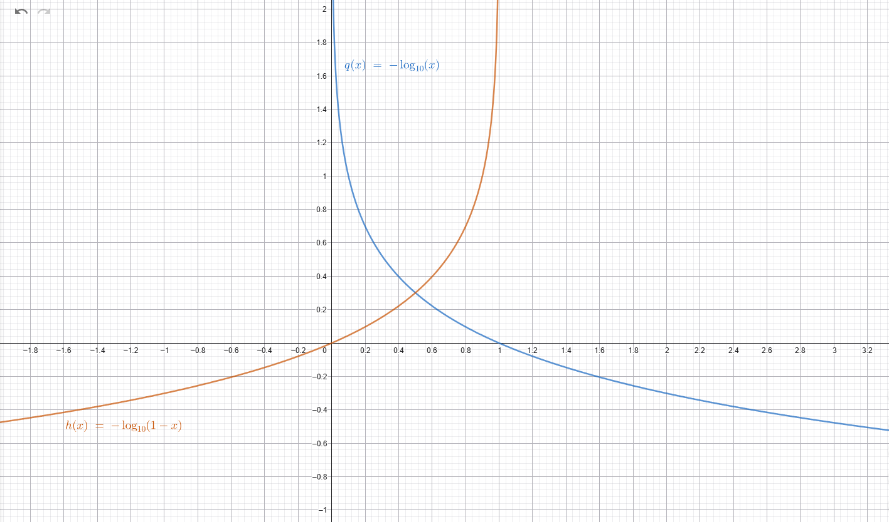
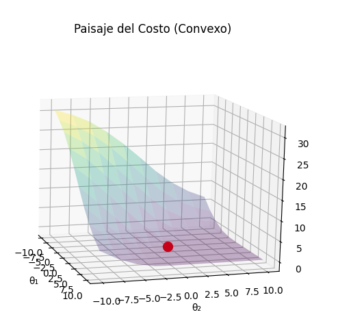
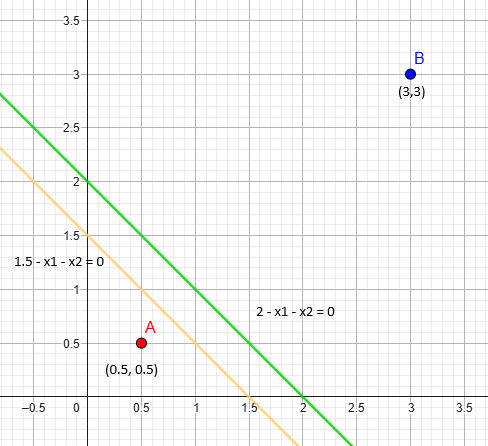

# Repaso de conceptos

Después de entender como funciona linear regression, vamos a rescatar algunos conceptos clave que nos serviran como punto de partida para logistic regression.

### Ejemplos de entrenamiento

Los ejemplos de entrenamiento son vectores n dimensionales que representan caracteristicas con valores numericos. Al tener varios ejemplos de entrenamiento y varias características podemos acomodar todo en una matriz.

Por ejemplo en esta tabla hay datos de varias casas y cada casa tiene valores para cada caracteristica. Entonces cada fila es una casa, y cada colunma es una caracteristica de la casa

| size  | number of bedrooms | number of floors | age of home | price |
|-------|--------------------|------------------|-------------|-------|
| 2104  | 5                  | 1                | 45          | 460   |
| 1416  | 3                  | 2                | 40          | 232   |
| 1543  | 6                  | 4                | 20          | 2345  |
| 163   | 2                  | 2                | 22          | 123   |
| ↑     | ↑                  | ↑                | ↑           | ↑     |
| $x_1$ | $x_2$              | $x_3$            | $x_4$       | $y$   |

así pues

$$X = \begin{bmatrix}
x_1^{(1)} & x_2^{(1)} & x_3^{(1)} & x_4^{(1)} \\
x_1^{(2)} & x_2^{(2)} & x_3^{(2)} & x_4^{(2)} \\
x_1^{(3)} & x_2^{(3)} & x_3^{(3)} & x_4^{(3)} \\
x_1^{(4)} & x_2^{(4)} & x_3^{(4)} & x_4^{(4)}
\end{bmatrix}$$

osea

$$X = \begin{bmatrix}
2104 & 5 & 1 & 45 \\
1416 & 3 & 2 & 40 \\
1543 & 6 & 4 & 20 \\
163 & 2 & 2 & 22
\end{bmatrix}$$

Y se introducen estas notaciones para acceder a los diferentes vectores y valores

$$x^{(2)} = \begin{bmatrix}
1416 \\
3 \\
2 \\
40
\end{bmatrix} \quad x_3^{(2)} = 2$$

### Variable salida / objetivo

Ahora analicemos la ultima columna, en este ejemplo es el precio de la casa. Esto es lo que queremos inferir para un nuevo ejemplo después de realizar el entrenamiento. Es también un vector, y aunque la nomenclatura sea un poco confusa, obtenemos los datos de la siguiente manera

$$y= \begin{bmatrix}
460 \\
232 \\
2345 \\
123
\end{bmatrix} \quad y^{(2)} = 232$$

### Hipótesis

Ahora que tenemos los datos de entrenamiento, vamos a formular una hipótesis. Esta es una función que nos servirá para **describir** nuestros datos, por lo tanto, despendiendo de lo que querramos hacer la hipótesis va a ser diferente.

En la regresión lineal utilizabamos una recta, la cual "acomodabamos" para que se adaptara lo mejor posible a los datos. Entonces, la hipótesis era la recta

$$h_\theta(x) = \theta_0 + \theta_1 x$$

### Parámetros

Como podemos observar, la recta depende de unos valores $\theta$ que definen la pendiente y posición de la recta. Estos son los parámetros que se optmizan durante la fase de entrenamiento y de esta manera el modelo "aprende".

$\theta_0$ es el punto de corte con el eje Y. 

$\theta_1$ es la pendiente de la recta.

Si consideramos que nuestros datos de entrenamiento tiene varias características, entonces $\theta$ es también un vector

$$\theta = \begin{bmatrix}
\theta_0 \\
\theta_1 \\
\theta_2 \\
\vdots \\
\theta_n
\end{bmatrix}$$

es decir, nuestra hipótesis sería una recta como esta

$$h_\theta(x) = \theta_0 + \theta_1 x_1 + \theta_2 x_2 + \theta_3 x_3 + \dots + \theta_n x_n$$

donde vemos que aparecen ambas $X$ y $\theta$, y como sigue siendo una recta, el parámetro $\theta_0$ sigue siendo el desplazamiento de la recta, y esta no depende de $X$.

### Sesgo

Así que, como nos gusta la elegancia y la facilidad vamos a hacer lo siguiente: Definamos de nuevo a X, y hagamos un producto de vectores

$$x = \begin{bmatrix}
x_0 \\
x_1 \\
x_2 \\
\vdots \\
x_n \\
\end{bmatrix} 
\quad 
\theta = \begin{bmatrix}
\theta_0 \\
\theta_1 \\
\theta_2 \\
\vdots \\
\theta_n \\
\end{bmatrix}$$

Como vimos al inicio las catacterísticas se definieron con $x_1, x_2, \dots, x_4, \dots, x_n$, pero... 👀 ahí no está $x_0$, es justo que agregamos recientemente. A partir de ahora siempre $x_0 = 1$. De esta manera podemos hacer esto

$$\theta^T \cdot X = \begin{bmatrix} \theta_0 & \theta_1 & \theta_2 & \dots & \theta_n \end{bmatrix}  \cdot
\begin{bmatrix}
x_0 = 1 \\
x_1 \\
x_2 \\
\vdots \\ 
x_n \\
\end{bmatrix} = \theta_0 + \theta_1 x_1 + \theta_2 x_2 + \dots + \theta_n x_n$$

Y esto se conoce como la forma vectorial de la hipótesis.

### Función de costo

Ahora que tenemos todos los elementos para escribir matemáticamente nuestro problema, se introduce la función que sirve para **saber qué tan buenos son nuestros parámetros $\theta$**, es decir, necesitamos medir qué tan lejos están nuestras predicciones $h_\theta(x)$ de los valores reales $y$. Por lo tanto, podemos decir que el costo es un único valor, entre mas cerca a cero mejor son las predicciones.

Como vimos anteriormente para linear regression esta es la función de costo

$$J(\theta_0, \theta_1, \dots, \theta_n) = \frac{1}{2m} \sum_{i=1}^{m} (h_\theta(x^{(i)}) - y^{(i)})^2$$

Queríamos encontrar el error cuadratico medio, es decir, qué tan lejos estaba nuestra hipótesis (nuestra linea recta) de los puntos. Eso está mejor explicado en el tutorial anterior

### Optimización

Ya tenemos todos los componentes, solo falta el algoritmo que hace mínimo el costo. Para que el costo sea mínimo los parámetros $\theta$ deben ajustarse. Dependiendo del problema el movimiento de los parámetros cumplira un objetivo diferente, si es regresión los parametros ajustarán la recta los datos, si es clasificación la recta separará mejor los datos.

Existen muchos algoritmos para optimizar, uno muy famoso es el gradient descent. Para esto está el otro tutorial

# Logistic Regression

Este es el problema que se plantea:

Tenemos un dataset y queremos responder a la pregunta **que tan probable** es que cada ejemplo pertenezca o no a una categoría

Por ejemplo **que tan probable es que**... el email es o no spam, el paciente tiene un tumor con cancer o no, aplica o no aplica al descuento etc.

Para generalizar, llamamos al si y no como categorías, porque mas adelante veremos que se puede clasificar en mas de dos categorías. Por ahora tenemos la categoría 1 y la categoría 0

Imaginemos primero un plano cartesiano con puntos, ignoresmos el resto de la información

Aqui vemos unos puntos rojos y unos puntos azules, nuestro objetivo es separarlos de la mejor manera posible. En la siguiente imagen podemos ver varios intentos de rectas para separar los datos

la pregunta es ¿cómo elegimos esa recta?, este ejemplo es sencillo, pero nuestro dataset podría ser mucho mas complejo, con puntos que se superponen unos con otros, como una nube de las categorias mezcladas.

Empecemos entonces a rescatar conocimiento que aprendimos de linear regression. Aprendimos que una recta puede ser nuestra hipótesis

$$h_\theta(x) = \theta_0 + \theta_1 x$$

Pero aquí no nos sirve, porque la recta por si sola no puede darnos la información de la clasificación. Es decir, no hay una manera clara en que esta ecuación nos diga si un ejemplo pertenece o no pertenece a una categoría. **Osea, esta ecuación no nos retorna un valor 0 o 1** sino que su rango es $-\infty$ hasta $+\infty$, y por tanto no responde a la pregunta de **qué tan probable es...** ya que la probabilidad se da entre 0 y 1

### Decision boundary

Intuitivamente y visualmente podemos ver algo en lo que la recta es muy buena, sirve como límite para decir "aqui empieza una categoría y aqui termina la otra". Por eso se le llama decision boundary, porque es la frontera, el límite. Por lo cual conservaremos la recta para nuestro estudio

### Sigmoid function

Entonces estamos en el dilema de elegir una hipótesis que nos diga **la probabilidad** de si un ejemplo de entrenamiento pertenece o no pertenece a una categoría. Y hay una función bella que nos ayuda a esto, es la sigmoid function:

$$g(z) = \frac{1}{1 + e^{-z}}$$

### "Disección" analítica de la Sigmoid function

Antes de presentar esta función graficada pensemos un poco...

#### Dominio de la función:

Analizando el denominador encontramos que 

$$1+e^{-z} \neq 0 \forall z \in \mathbb{R}$$

ya que $e^{x}, x \in \mathbb{R}$ nunca es -1 ya que $ln(-1)$ no está definido

#### Rango de la función

Podemos justificar que el rango de la función está entre 0 y 1 de esta manera

Cuando $z \to \infty$: $e^{-z}$ se vuelve casi $0$. Entonces $g(z) \approx \frac{1}{1+0} = 1$.

Cuando $z \to -\infty$: $e^{-z}$ se vuelve un número gigantesco. Entonces $g(z) \approx \frac{1}{\text{infinito}} = 0$.

Cuando $z = 0$: $e^{0} = 1$, por lo que $g(0) = \frac{1}{1+1} = 0.5$

#### Continuidad de la función

Una función es continua si

$$f(x) \text{ es continua en } a \iff \lim_{x \to a} f(x) = f(a)$$

Esto nos dice que el limite tiene que existir, $f(a)$ tiene que existir y ambos el limite y la función en a tienen que ser iguales.

Para demostrar que $g(z) = \frac{1}{1 + e^{-z}}$ es continua en un punto $c$, debemos probar que: $$\forall \epsilon > 0, \exists \delta > 0 \text{ tal que } |z - c| < \delta \implies |g(z) - g(c)| < \epsilon$$

Demostración formal de continuidad ($\epsilon - \delta$) Para demostrar que $g(z)$ es continua en cualquier punto $c \in \mathbb{R}$, analizamos la diferencia:
$$|g(z) - g(c)| = \left| \frac{1}{1+e^{-z}} - \frac{1}{1+e^{-c}} \right|$$

Al operar la resta de fracciones obtenemos:

$$|g(z) - g(c)| = \left| \frac{(1+e^{-c}) - (1+e^{-z})}{(1+e^{-z})(1+e^{-c})} \right| = \frac{|e^{-z} - e^{-c}|}{(1+e^{-z})(1+e^{-c})}$$

Sabemos que para cualquier $z$, el denominador $(1+e^{-z})(1+e^{-c})$ es siempre mayor que $1$ (ya que cada término es $> 1$). Por lo tanto:

$$\frac{|e^{-z} - e^{-c}|}{(1+e^{-z})(1+e^{-c})} < |e^{-z} - e^{-c}|$$

Ahora, apelamos a la continuidad de la función exponencial $f(z) = e^{-z}$. Por definición de continuidad de la exponencial, para cualquier $\epsilon > 0$, existe un $\delta > 0$ tal que si $|z - c| < \delta$, entonces $|e^{-z} - e^{-c}| < \epsilon$.Como hemos establecido que $|g(z) - g(c)| < |e^{-z} - e^{-c}|$, basta con elegir el mismo $\delta$ que satisface la condición para la exponencial. Así:

$$|z - c| < \delta \implies |g(z) - g(c)| < |e^{-z} - e^{-c}| < \epsilon$$

Esto demuestra que la función Sigmoide es continua en todo su dominio.

#### Primera derivada de la función

Para que sea derivable debe ser continua en a y sus derivadas laterales deben existir. Ya sabemos que es continua y también sabemos que la función exponencial es derivable en todo su dominio, entonces la sigmoide también es derivable

$$g(z) = \frac{1}{1 + e^{-z}}$$
$$g(z) = (1 + e^{-z})^{-1}$$
$$g'(z) = -1 \cdot (1 + e^{-z})^{-2} \cdot (-e^{-z})$$
$$g'(z) = \frac{e^{-z}}{(1 + e^{-z})^2}$$
$$g'(z) = \frac{1}{1 + e^{-z}} \cdot \frac{e^{-z}}{1 + e^{-z}}$$
$$g'(z) = \frac{1}{1 + e^{-z}} \cdot \left( \frac{1 + e^{-z} - 1}{1 + e^{-z}} \right)$$
$$g'(z) = \frac{1}{1 + e^{-z}} \cdot \left( \frac{1 + e^{-z}}{1 + e^{-z}} - \frac{1}{1 + e^{-z}} \right)$$
$$g'(z) = g(z)(1 - g(z))$$

> **Conclusión importante:** Como $g(z)$ es siempre un valor entre $0$ y $1$, su derivada $g'(z)$ siempre será un valor real positivo

Y haciendo algunos cálculos, la derivada es cero cuando $z \to  \pm \infty$ y su valor es $0.25$ cuando $z = 0$

#### Segunda derivada y concavidad

Esto es especialmente importante en nuestro contexto

$$g'(z) = g(z)(1 - g(z))$$
$$g''(z) = g'(z)(1 - g(z)) + g(z)(-g'(z))$$
$$g''(z) = g'(z) [ (1 - g(z)) - g(z) ]$$
$$g''(z) = g'(z) (1 - 2g(z))$$
$$g''(z) = g(z)(1 - g(z))(1 - 2g(z))$$

ya sabemos que $g''(z) = g(z)(1 - g(z))$ es positivo, entonces todo depende de $(1 - 2g(z))$

##### Punto de inflexión

veamos donde la concavidad es cero, para eso tomemos el termino que analizamos anteriormente (ya que es el único que puede ser negativo ya que el 2 hace que cambie la amplitud de la sigmoide)

$$1 - 2g(z) = 0$$
$$g(z) = 0.5$$

y esto ocurre cuando z es cero, ya que 

$$g(z) = \frac{1}{1 + e^0}$$
$$g(z) = \frac{1}{1 + 1}$$
$$g(z) = \frac{1}{2}$$

> Entonces, en el z = 0 cambia la concavidad de la función

##### Concavidad

ahora veamos en donde es concava hacia arriba y concava hacia abajo:

Cóncava hacia arriba ($g''(z) > 0$) Ocurre cuando $1 - 2g(z) > 0$, es decir, cuando $g(z) < 0.5$.Esto sucede cuando $z < 0$.

Cóncava hacia abajo ($g''(z) < 0$) Ocurre cuando $1 - 2g(z) < 0$, es decir, cuando $g(z) > 0.5$.

Con este análisis ya estamos seguros de que cualquier valor de x que le pasemos a la función, será mapeado a un rango entre 0 y 1, por eso se le conoce también como filtro o embudo.

También tenemos claro que en $x = 0$ es el punto de inflexión, y este se llama Decisión boundary, que es precisamente el término que utilizamos anteriormente para la recta. En este punto entendemos el valor retornado 0.5 como indecisión (probabilidad de 0.5 para aplicar a una u otra categoría).

Por lo tanto, **el objetivo de todo esto es encontrar una frontera que logre clasificar los datos correctamente, es decir, que estén los mas alejados posible de la frontera de decisión o punto de inflexión.**

> Cuando entrenamos el modelo, lo que buscamos es ajustar los parámetros $\theta$ para que la "recta" $\theta^T x$ se posicione de tal forma que:
>
> Para los ejemplos donde la etiqueta real es $y=1$, el valor de $\theta^T x$ sea un número positivo muy grande. Esto empuja la probabilidad $h_\theta(x)$ hacia 1 (lejos del 0.5).
>
> Para los ejemplos donde la etiqueta real es $y=0$, el valor de $\theta^T x$ sea un número negativo muy grande. Esto empuja la probabilidad $h_\theta(x)$ hacia 0 (también lejos del 0.5).

#### Resumen

La función: 

- Es continua
- Es derivable
- Es monotona creciente
- Tiene un punto de inflexión en x = 0 y su concavidad cambia de cóncava hacia arriba a cóncava hacia abajo
- En x = 0 tiene el punto de crecimiento

### Eligiendo la función de costo

Ya vimos los beneficios de usar la **función sigmoide como hipótesis**. Esta nos puede decir la **probabilidad** de que un ejemplo de entrenamiento pertenezca a una categoría. Ahora necesitamos la función de costo, que sirve para **saber qué tan buenos son nuestros parámetros $\theta$**, es decir, necesitamos medir qué tan lejos están nuestras predicciones $h_\theta(x)$ de los valores reales $y$. Por lo tanto, podemos decir que el costo es un único valor, entre mas cerca a cero mejor son las predicciones.

Como comentamos al inicio, usamos la función de minimos cuadrados para linear regression

$$J(\theta_0, \theta_1, \dots, \theta_n) = \frac{1}{2m} \sum_{i=1}^{m} (h_\theta(x^{(i)}) - y^{(i)})^2$$

**Y aqui analizaremos los problemas de usar mínimos cuadrados + sigmoid function.**

#### Castigo

Como vimos anteriormente, la función sigmoide tiene rango $(0, 1)$ por lo cual, es bastante mala diciendo si un ejemplo de entrenamiento está mal clasificado. Veamoslo con un ejemplo

Imaginemos un ejemplo de entrenamiento donde **la respuesta real es $y = 1$ (por ejemplo, "Es Spam").**

| Escenario          | Predicción $h_\theta(x)$ | ¿Qué tan lejos está? | Cálculo del Costo $(h - y)^2$ | Resultado |
|--------------------|--------------------------|----------------------|-------------------------------|-----------|
| Acierto total      | 0.99                     | Muy cerca            | (0.99 − 1)²                   | 0.0001    |
| Error leve         | 0.50                     | Indeciso             | (0.50 − 1)²                   | 0.25      |
| Error catastrófico | 0.01                     | Totalmente opuesto   | (0.01 − 1)²                   | 0.9801    |

Para el caso del error catastrófico. Vemos que la hipótesis **dijo que no era spam** porque la predicción es 0.01 y como estamos validando la clasificación de la clase $y = 1$ es un error y **debe ser CASTIGADO**. Es decir estamos preguntando si el ejemplo de entrenamiento es spam y la hipoitesis dijo que es muy poco probable, entonces el error debe ser grande, de tal manera que haya una señal clara de esta situación

Vemos que el resultado es 0.9801 y eso no es lo suficientemente agresivo para que el algoritmo gradient descent tome impulso y cambie de rumbo

En conclusión, usar mínimos cuadrados + sigmoid function nos dará señales débiles cuando los ejemplos de entrenamiento sean errores de clasificación, como vimos en este ejemplo.

#### Función convexa

Una buena analogía es una bolita que baja por una superficie. Imaginemos esta superficie... qué pasaría si es una calle inclinada, llena de huecos y baches? bueno, la bolita tendrá muchas dificultades para llegar hasta abajo. Y si la superficie es una rampa de stake lisa? en este caso la bolita bajará feliz sin dificultades

Eso mismo pasa con nuestra función de costo, y es el segundo motivo por el cual minimos cuadrados + sigmoid function no es la mejor alternativa. Observemos como se ve esta combinacion de funciones

Para ver este comportamiento el código del archivo `python visualizations/2d_sigmoid.py` muestra como el gradiente y la sigmoide evolucionan a medida que cambian los parámetros. En el código está deliberadamente puesta la bolita en un punto donde cae facilmente, pero si se ajustan los parámetros iniciales en el valle, la bolita no tendrá impulso para moverse.

Estas son las dificultades de tener minimos cuadrados + sigmoid function

#### Función Log Loss

Teniendo en cuenta las dificultades de nuestra función de costo anterior, es mas o menos logico pensar que tenemos que quitar los minimos cuadrados. Y efectivamente eso fue lo que hicieron, e introdujeron lo siguiente:

$$h_\theta(x) = g(z) = \frac{1}{1 + e^{-z}}$$

$$f(x) = \begin{cases} 
  -\log(h_\theta(x)) & \text{if } y = 1 \\ 
  -\log(1 - h_\theta(x)) & \text{if } y = 0 
\end{cases}$$

👀 ¿Qué es esto? Vamos por partes...

Para introducir el logaritmo este video es especialmente bueno https://www.youtube.com/watch?v=ZEvUDcr8LDw

veamos la gráfica de estas funciones logaritmo para analizar algunas cuestiones importantes

$-\log(h_\theta(x)) \to \infty$ cuando $x \to 0$ y $-\log(h_\theta(x)) = 0$ cuando $x = 1$ 

> recordando que este es el caso $y = 1$

Esto recuerda a algo, no? Esto es mas o menos lo que hace la sigmoide con minimos cuadrados pero con una gran diferencia para la penalización. Anteriormente cuando la predicción de la sigmoide era $\approx 1$ la función de minimos cuadrados hacia bien su trabajo, porque el costo que retornaba era casi cero

Pero, para cuando la sigmoide retornaba $\approx 0$ minimos cuadrados retornaba $\approx 1$, lo cual era una señan debil. Pero aquí viene la diferencia, $-\log(h_\theta(x)) \to \infty$ arreglando justo lo que queríamos, esto si es una señal clara de que la clasificación es errónea

> ahora para el caso $y = 0$

Para el caso contrario también sirve, si la sigmoide $\approx 0$ entonces el costo retornado por $-\log(1 - h_\theta(x))$ es $\approx 0$, pero si sigmoide dice $\approx 1$ entonces $-\log(1 - h_\theta(x)) \to \infty$

#### El truco matemático 🔮

La función a trozos se ve prometedora basados en nuestro análisis previo. Así que algún mago decidió hacer un truco y llegó a esta función

$$J(\theta) = -\frac{1}{m} \sum_{i=1}^{m} \left[ y^{(i)} \log(h_\theta(x^{(i)})) + (1 - y^{(i)}) \log(1 - h_\theta(x^{(i)})) \right]$$

Esta función es muy especial, no solamente sirve para castigar adecuadamente la mala clasificación sino que **también es convexa!**

Probar esto es mucho mas complejo y lo haremos en un tutorial aparte

Por ahora podemos graficarla

visualmente se ve mejor, suave y sin "accidentes geográficos". Pero lo mejor siempre es hacer los cálculos analíticos para confirmar la convexidad.

### Ahora un poema

Aqui viene un momento importante, si calculamos la derivada de nuestra nueva función de costo

$$h_\theta(x) = g(z) = \frac{1}{1 + e^{-z}}$$

$$J(\theta) = -\frac{1}{m} \sum_{i=1}^{m} \left[ y^{(i)} \log(h_\theta(x^{(i)})) + (1 - y^{(i)}) \log(1 - h_\theta(x^{(i)})) \right]$$

Donde $z = \theta^T x$

> Es muy importante tener en cuenta que $\theta$ es un vector. Por lo tanto nuestra función de costo es un campo escalar. Debido al algoritmo de optimización que vamos a utilizar (gradient descent), necesitamos calcular las derivadas parciales $\theta_j$, ya que el algoritmo actualiza uno a uno los parámetros entonces de la misma manera se calcula la derivada con respecto a cada dirección del vector

Esto se explicará con detalle en los tutoriales de cálculo multivariado, pero haremos aqui el desarrollo, vamos a obtener algo muy particular

$$\frac{d}{dz} g(z) = g(z)(1 - g(z))$$

esto ya lo habíamos calculado antes

Queremos hallar $\frac{\partial}{\partial \theta_j} J(\theta)$.

Para simplificar, derivemos primero el término dentro del sumatorio para un solo ejemplo $i$:

$$Loss = y \log(h_\theta(x)) + (1 - y) \log(1 - h_\theta(x))$$

Derivamos respecto a $\theta_j$ usando la regla de la cadena, sabiendo que $\frac{\partial h}{\partial \theta_j} = \frac{\partial h}{\partial z} \cdot \frac{\partial z}{\partial \theta_j}$:

Derivada del primer término

$$\frac{\partial}{\partial \theta_j} [y \log(h_\theta(x))] = y \cdot \frac{1}{h_\theta(x)} \cdot \frac{\partial h_\theta(x)}{\partial \theta_j}$$

Derivada del segundo término

$$\frac{\partial}{\partial \theta_j} [(1 - y) \log(1 - h_\theta(x))] = (1 - y) \cdot \frac{1}{1 - h_\theta(x)} \cdot (-1) \cdot \frac{\partial h_\theta(x)}{\partial \theta_j}$$

Sustituimos $\frac{\partial h}{\partial \theta_j} = h_\theta(x)(1 - h_\theta(x))x_j$ en ambos términos:

$$\frac{\partial Loss}{\partial \theta_j} = \left[ \frac{y}{h_\theta(x)} - \frac{1 - y}{1 - h_\theta(x)} \right] \cdot h_\theta(x)(1 - h_\theta(x))x_j$$

Al distribuir los términos dentro del corchete:

$$\frac{\partial Loss}{\partial \theta_j} = \left[ y(1 - h_\theta(x)) - (1 - y)h_\theta(x) \right] x_j$$

$$\frac{\partial Loss}{\partial \theta_j} = \left[ y - y h_\theta(x) - h_\theta(x) + y h_\theta(x) \right] x_j$$

$$\frac{\partial Loss}{\partial \theta_j} = (y - h_\theta(x))x_j$$

resultado final

$$\frac{\partial J(\theta)}{\partial \theta_j} = \frac{1}{m} \sum_{i=1}^{m} \left( h_\theta(x^{(i)}) - y^{(i)} \right) x_j^{(i)}$$

Si, al final nos dio igual que con minimos cuadrados 🎆

Entonces, podemos usar el algoritmo y queda igual que antes

$$\theta_j := \theta_j - \alpha \frac{\partial J(\theta)}{\partial \theta_j}$$

se actualizan los parámetros con $j = 0, 1, 2, ..., n$

### Ya tenemos todo

Perfecto, en este punto podemos concluir nuestro viaje y hacer la consolidación de todo esto:

Queremos trazar una frontera de decisión lineal para separar los datos en dos categorías diferentes, la ecuación de una recta la podemos poner así 

$$\theta^T \cdot X = \begin{bmatrix} \theta_0 & \theta_1 & \theta_2 & \dots & \theta_n \end{bmatrix}  \cdot
\begin{bmatrix}
x_0 = 1 \\
x_1 \\
x_2 \\
\vdots \\ 
x_n \\
\end{bmatrix} = \theta_0 + \theta_1 x_1 + \theta_2 x_2 + \dots + \theta_n x_n$$

Y a la recta le llamamos frontera de decisión.

Decimos qué tan probable es que un ejemplo de entrenamiento pertenezca o no  a una categoría usando la función sigmoide

Por lo tanto, **el objetivo de todo esto es encontrar una frontera que logre clasificar los datos correctamente, es decir, que estén los mas alejados posible de la frontera de decisión o punto de inflexión.**

> Cuando entrenamos el modelo, lo que buscamos es ajustar los parámetros $\theta$ para que la "recta" $\theta^T x$ se posicione de tal forma que:
>
> Para los ejemplos donde la etiqueta real es $y=1$, el valor de $\theta^T x$ sea un número positivo muy grande. Esto empuja la probabilidad $h_\theta(x)$ hacia 1 (lejos del 0.5).
>
> Para los ejemplos donde la etiqueta real es $y=0$, el valor de $\theta^T x$ sea un número negativo muy grande. Esto empuja la probabilidad $h_\theta(x)$ hacia 0 (también lejos del 0.5).

Para validar que todo está bien usamos la función de costo 

$$J(\theta) = -\frac{1}{m} \sum_{i=1}^{m} \left[ y^{(i)} \log(h_\theta(x^{(i)})) + (1 - y^{(i)}) \log(1 - h_\theta(x^{(i)})) \right]$$

entre mas cerca a cero significa que la clasificación es mejor

y finalmente para optmizar usamos su derivada

$$\frac{\partial J(\theta)}{\partial \theta_j} = \frac{1}{m} \sum_{i=1}^{m} \left( h_\theta(x^{(i)}) - y^{(i)} \right) x_j^{(i)}$$

suponiendo que vamos a utilizar gradient descent.

En resumen: definimos una frontera ($\theta^T x$), la pasamos por el filtro de la función sigmoide para obtener una probabilidad, medimos el error con una función convexa (log loss) y ajustamos los parámetros moviéndonos en dirección contraria al error (gradient descent).

# Ejemplo

Cual recta es mejor para clasificar estos puntos, considerando la clase y = 1?

Siendo el color azul la clase $y = 1$ y el color rojo la clase $y = 0$

Rectas:

- **L1**: $1.5 - x_1 - x_2 = 0$
- **L2**: $2 - x_1 - x_2 = 0$

Puntos de entrenamiento: 

- $A = (0.5, 0.5)$
- $B = (3, 3)$

#### Cálculos para L1

$$g(z) = \frac{1}{1 + e^{-z}}$$

$$\theta_0 + \theta_1 x_1 + \theta_2 x_2= [1.5, -1, -1] \cdot \begin{bmatrix} x_0=1 \\ x_1 \\ x_2 \end{bmatrix} = 1.5 - x_1 - x_2$$

$$g(\theta^T X) = g(1-x) = \frac{1}{1 + e^{-(1.5 - x_1 - x_2)}}$$

Para $A$: $\frac{1}{1 + e^{-(1.5 - 0.5 - 0.5)}} = 0.62245$

Para $B$: $\frac{1}{1 + e^{-(1.5 - 3 - 3)}} = 0.01098$

#### Cálculos para L2

$$\theta_0 + \theta_1 x_1 \theta_2 x_2 = [2, -1, -1] \cdot \begin{bmatrix} x_0=1 \\ x_1 \\ x_2 \end{bmatrix} = 2 - x_1 - x_2$$

$$g(2-x) = \frac{1}{1 + e^{-(2 - x_1 - x_2)}}$$

Para $A$: $\frac{1}{1 + e^{-(2 - 0.5 - 0.5)}} = 0.73105$

Para $B$: $\frac{1}{1 + e^{-(2 - 3 - 3)}} = 0.01798$

### Analicemos los valores que encontramos:

#### Para L1 

El punto $A$ es de la clase $y = 0$ y dijo que tiene un 62.245% de probabilidad de pertenecer a la clase $y = 1$ 

El punto $B$ es de la clase $y = 1$ y dijo que tiene un 1.098% de probabilidad de pertenecer a la clase $y = 1$

#### Para L2 

El punto $A$ es de la clase $y = 0$ y dijo que tiene un 73.105% de probabilidad de pertenecer a la clase $y = 1$ 

El punto $B$ es de la clase $y = 1$ y dijo que tiene un 1.798% de probabilidad de pertenecer a la clase $y = 1$

> Todo está mal! pero... visualmente las rectas si separan bien los datos.  El problema es que pusimos signos negativos a la recta

## Reescribamos las rectas y hagamos de nuevo los cálculos

Rectas:

- **L1**: $-1.5 + x_1 + x_2 = 0$
- **L2**: $-2 + x_1 + x_2 = 0$

#### Cálculos para L1

Para $A$: $\frac{1}{1 + e^{-(-1.5 + 0.5 + 0.5)}} = 0.377540$

Para $B$: $\frac{1}{1 + e^{-(-1.5 + 3 + 3)}} = 0.989013$

#### Cálculos para L2

Para $A$: $\frac{1}{1 + e^{-(-2 + 0.5 + 0.5)}} = 0.268941$

Para $B$: $\frac{1}{1 + e^{-(-2 + 3 + 3)}} = 0.982013$

entonces...

#### Para L1 

El punto $A$ es de la clase $y = 0$ y dijo que tiene un 37.754% de probabilidad de pertenecer a la clase $y = 1$ 

El punto $B$ es de la clase $y = 1$ y dijo que tiene un 98.9013% de probabilidad de pertenecer a la clase $y = 1$

#### Para L2 

El punto $A$ es de la clase $y = 0$ y dijo que tiene un 26.89415% de probabilidad de pertenecer a la clase $y = 1$ 

El punto $B$ es de la clase $y = 1$ y dijo que tiene un 98.2013% de probabilidad de pertenecer a la clase $y = 1$

Perfecto! aqui ya podríamos sacar algunas conclusiones pero para eso está la función de costo. Esta nos ayuda a saber qué tan cerca estamos de cero y saber cuál recta es mejor

### Función de costo

