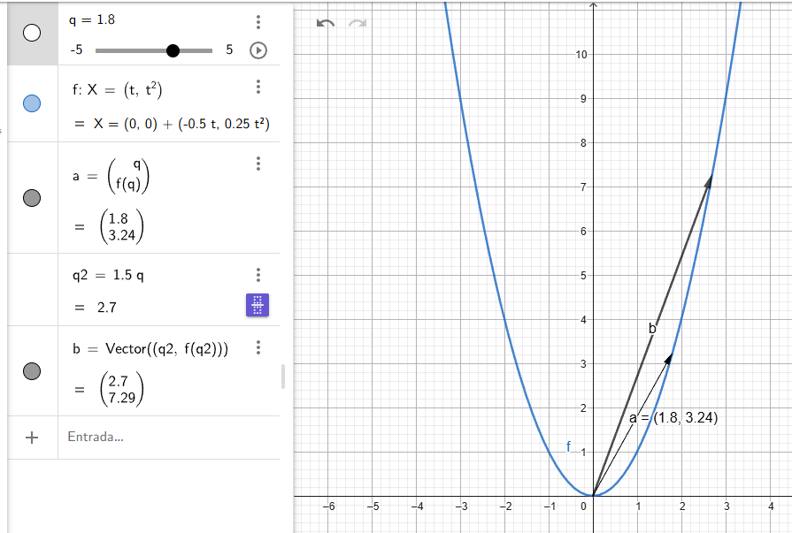
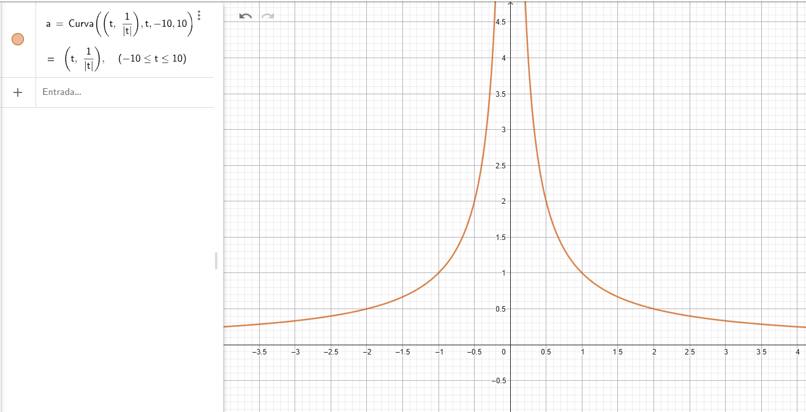
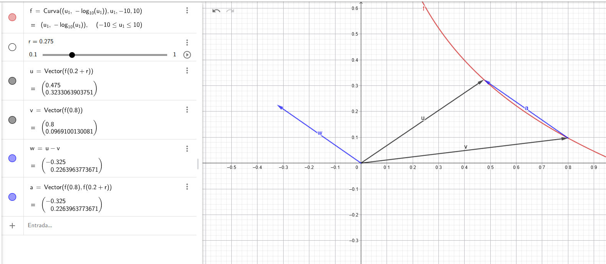
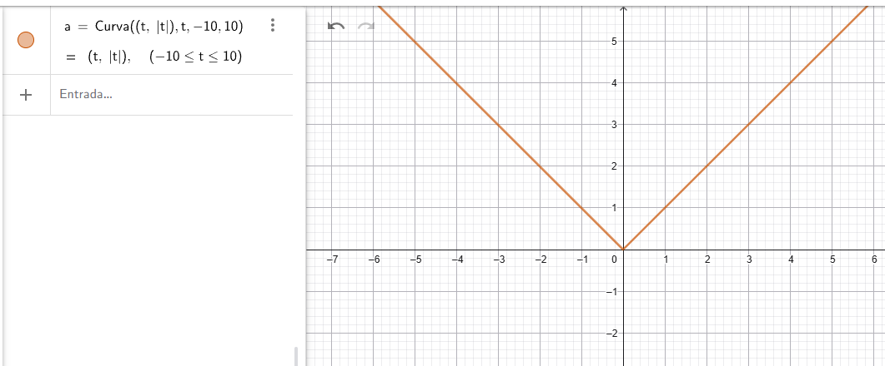
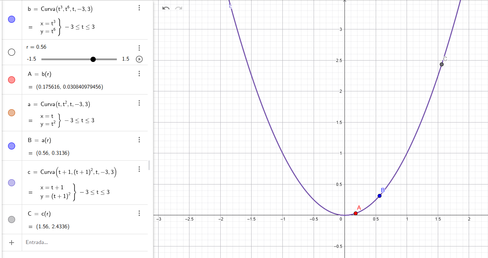

# Cálculo con funciones vectoriales

Como vimos anteriormente, podríamos escribir una recta como $x(t) = P + tA$, donde $t \in \mathbb{R}$ se llama parámetro y su recorrido es la recta. A su vez, se llama función vectorial de variable real, ya que

$$f: \mathbb{R} \to \mathbb{R}^n$$

es decir, la función transforma el escalar $t$ en un vector n-dimensional.

### Operaciones algebráicas

Las operaciones usadas de álgebra vectorial pueden aplicarse para combinar dos funciones vectoriales o una vectorial con una función real, veamos:

Sean $F$ y $G$ dos funciones vectoriales y $u$ una función real (es decir una funcion de $\mathbb{R} \to \mathbb{R}$)

- $(F + G)(t) = F(t) + G(t)$

- $(uF)(t) = u(t)F(t)$

- $(F \cdot G)(t) = F(t) \cdot G(t)$

Si $F(t)$ y $G(t) \in \mathbb{R}^3$ 

- $(F \times G)(t) = F(t) \times G(t)$

Todo esto quiere decir que podemos operar entre funciones antes de evaluarlas y el resultado va a ser equivalente, ya que estas operaciones se definen punto a punto. Y todo esto es válido porque ya tenemos todo definido para el álgebra vectorial, y en escencia las funciones vectoriales nos dan como resultado vectores, entonces podemos naturalmente heredar las propiedades. 

Es mas, al principio todo lo habíamos expresado como conjuntos. La idea de introducir las funciones es de alguna manera conveniencia y otra capa de abstracción, pero en el fondo, las imágenes de estas funciones son vectores.

### Composición de funciones

En este caso es importante resaltar que solo podemos componer funciones vectoriales con funciones reales, ya que, como vimos anteriormente el parámetro para las funciones vectoriales es un número real, y eso es precisamente lo que nos retornan las funciones reales. Por lo cual:

$$G(t) = f(u(t)) \forall t \in D_u$$

$D_u$ es el dominio de la función $u$. Siendo la función $u$ continua en $t$ y $F$ es continua en $u(t)$ entonces $G$ es continua en $t$

### Componentes

Si una función $F$ tiene sus valores en $V_n$ cada vector $f(t)$ tiene $n$ componentes y podemos escribir

$$F(t) = (f_1(t), f_2(t), \dots, f_n(t))$$

Es decir, cada función vectorial $F$ origina $n$ funciones reales $f_1, f_2, \dots, f_n$ cuyos valores en $t$ son los componentes de $f(t)$ 

### Limites

Me ha resultado mas dificil verlo, pero la intuición aqui es entender que estas funciones describen movimiento. Si imaginamos el parámetro t moviéndose, tenemos que imaginarnos al mismo tiempo el vector resultante moviéndose

Por lo tanto, siguiendo la intuición podemos movernos a la izquierda y la derecha de $t$, porque sabemos que $t$ es un número real. 

La pregunta es, ¿cómo se entiende el límite? en el ejemplo de la imagen tenemos la función vectorial

$$f(t) = (t, t^2)$$

que dibuja una bella parábola. Vemos que a medida que movemos el parámetro $t$ se empieza a dibujar la parábola de izquierda a derecha, y si dijeramos algo como "Calculemos el límite cuando $t$ tiende a 2" por ejemplo, al mismo tiempo estamos diciendo que el vector que dibuja la parábola **tiende también a algún vector** que también está siendo dibujado a medida que se mueve $t$, en este caso

$$\lim_{t \to 2}{f(t)} = (2,4)$$

Entonces la idea es que calculamos el límite en cada componente porque de esa manera sabemos si el vector tiende a otro vector límite, y así podemos afirmar que **el límite de cada componente del vector debe existir** para que el límite exista

En conclusión estamos moviendo el parámetro de la función y ver que pasa con el vector resultante. ¿Éste se acerca a otro vector? ¿el vector da un salto y el límite no existe? etc. Por lo tanto

$$\lim_{t \to p}{f(t)} = (\lim_{t \to p}{f_1(t)}, \dots, \lim_{t \to p}{f_n(t)})$$

¿Qué pasa si el límite de una de las componentes del vector no existe?, en ese caso algo pasa con la curva que describe la función y entran conceptos como continuidad etc.

### Continuidad

Como vimos en las funciones $f: \mathbb{R} \to \mathbb{R}$ pensabamos en la continuidad como dibujar la gráfica sin levantar la mano. Aquí aplica lo mismo, y podemos usar esta función para ejemplificar

$$f(t) = (t, \frac{1}{|t|})$$

si calculamos el límite por izquierda y por derecha

$$\lim_{t \to 0^-}{f(t)} = (-0, \infty)$$

$$\lim_{t \to 0^+}{f(t)} = (0, \infty)$$

La segunda componente diverge en ambos casos, por lo tanto el límite no existe

> Recordemos que en el contexto de límites $t$ **no es cero** sino que **tiende a cero**. Y también, que $\infty$ no es un número, sino un concepto

En este ejemplo vemos que los vectores resultantes en el límite son imposibles y el límite no existe. En resumen, se debe cumplir

$$\lim_{t \to a}{f(t)} = f(a)$$

El límite debe existir, la función en ese punto debe existir y ambos resultados tienen que coincidir. En ese caso decimos que es continua

### Derivada

Similarmente, como vimos en el caso de funciones reales la derivada se define igual para funciones vectoriales. Devido al parámetro $t \in \mathbb{R}$ podemos pensar la derivada como la recta que pasa sobre la curva entre los puntos $f(t+h) - f(t)$, en este caso son vectores, pero podemos tratarlos indistintamente en este contexto

Hay un video muy bueno donde se explica la idea detrás de la derivada y como ese límite dibuja una recta tangente en las funciones reales https://www.youtube.com/watch?v=_6-zwdrqD3U

Como estamos en funciones vectoriales, la derivada surge del límite de los vectores secantes, y ese límite define el vector director de la recta tangente

$$f'(t) = \lim_{h \to 0}{\frac{f(t+h) - f(t)}{h}}$$

Recordemos algo útil y es la diferencia de vectores, y la ley del paralelogramo, en la imagen puede verse como al acercar estos dos vectores, la diferencia $f(t+h) - f(t)$ se acerca a un único punto.

> Lo importante es que ese vector no es la derivada, solo dice "cuánto me moví" al variar $h$

De igual manera, operamos entre componentes porque seguimos con la idea de "el vector tiene un poquito de derivada en $x$ y otro poco en $y$", entonces a medida que la separación $h$ entre los vectores de ese límite se acercan aparecerá el vector director de la recta tangente. 

Ahora bien, dividimos entre $h$ por la idea de la velocidad. Aqui tenemos el ejemplo típico de un viaje a la playa. Vamos en un carro por una línea recta, a las 10:00 AM estamos en el km 100 $(p_1)$, a las 11:00 AM en el km 180 $(p_2)$

$$v = \frac{\text{distancia}}{\text{tiempo}} = \frac{\Delta p}{\Delta t}$$

Es justamente lo que estamos visualizando aquí. La separación $h$ de los vectores es nuestro $\Delta$

De hecho, la recta aparece cuando utilizamos lo que aprendimos antes de las rectas. Ejemplo:

sea r la función vectorial $r(t) = (t, t^2, sen(t))$ en $p = \frac{\pi}{2}$

su derivada es $r'(t) = (1, 2t, cos(t))$

entonces podemos escribir la recta tangente así

$L(s) = r(p) + s \cdot r'(p)$

$L(s) = (\frac{\pi}{2}, \frac{\pi^2}{4}, 1) + s(1, \pi, 0)$

La derivada de una función vectorial en un punto es un vector tangente a la curva en ese punto. Dicho vector surge como el límite del cociente incremental y permite construir la recta tangente mediante la ecuación $L(s) = r(p) + s \cdot r'(p)$

De igual manera se cumple todo lo que aprendimos para las funciones reales. Por ejemplo, para el valor absoluto en $0$ la derivada no existe

Con lo que acabamos de ver sobre la derivada reafirmamos la idea de que este tipo de funciones describen movimiento y su derivada la velocidad.

### Algunas propiedades y resultados para la derivada

#### Operaciones Algebráicas 

Si $F$ y $G$ son derivables en un intervalo

- $(F + G)'(t) = F'(t) + G'(t)$

- $(uF)' = u'F + uF'$

- $(F \cdot G)' = F' \cdot G + F \cdot G'$

Si $F$ y $G \in \mathbb{R}^3$ 

- $(F \times G)' = F' \times G + F \times G'$ Aquí es vital mantener el orden ya que el producto cruz no es conmutativo

por ejemplo para la propiedad del producto punto

$$\lim_{h \to 0} \frac{F(t+h) \cdot G(t+h) - F(t) \cdot G(t)}{h}$$

Sumamos cero:

$$\lim_{h \to 0} \frac{F(t+h) \cdot G(t+h) \mathbf{- F(t) \cdot G(t+h) + F(t) \cdot G(t+h)} - F(t) \cdot G(t)}{h}$$

$$\lim_{h \to 0} \left[ \left( \frac{F(t+h) - F(t)}{h} \right) \cdot G(t+h) + F(t) \cdot \left( \frac{G(t+h) - G(t)}{h} \right) \right]$$

Al aplicar el límite: $\frac{F(t+h) - F(t)}{h} \to F'(t)$ 

$G(t+h) \to G(t)$ (porque asumimos que es derivable y por tanto continua)

$\frac{G(t+h) - G(t)}{h} \to G'(t)$

Entonces: $F'(t) \cdot G(t) + F(t) \cdot G'(t)$

Todas estas propiedades se pueden demostrar usando la definción de la derivada, pero no lo vamos a hacer en este momento.

#### La norma constante

Si una función vectorial es derivable y es de longitud constante en un intervalo abierto $I$, entonces $F \cdot F' = 0$ en $I$, es decir $F'(t)$ es perpendicular a $F(t) \forall t \in I$ 

Si $\lVert F(t) \rVert  = c$, entonces $\lVert F(t) \rVert ^2 = c^2$

$\lVert F(t) \rVert ^2 = F(t) \cdot F(t)$

$(F(t) \cdot F(t))' = (c^2)'$

$F'(t) \cdot F(t) + F(t) \cdot F'(t) = 0$

$2(F(t) \cdot F'(t)) = 0 \implies F(t) \cdot F'(t) = 0$

Ejemplo

$r(t) = (cos(t), sen(t))$

$r'(t) = (-sen(t), cos(t))$

$\lVert r(t) \rVert = 1$

$r(t) \cdot r'(t) = (cos(t), sen(t)) \cdot (-sen(t), cos(t)) = 0$

#### Regla de la cadena

Si $u'(t)$ y $F'(t)$ existe $G'(t)$ y viene dada por la regla de la cadena 

$$G'(t) = F'(u(t)) u'(t)$$

Esto también es un resultado de aplicar la definción de derivada con la función constante así:

Sea $G(t) = F(u(t))$, donde $u: \mathbb{R} \to \mathbb{R}$ es una función escalar y $F: \mathbb{R} \to \mathbb{R}^n$ es una función vectorial. Entonces partimos de la definición de derivada

$$G'(t) = \lim_{h \to 0} \frac{G(t+h) - G(t)}{h} = \lim_{h \to 0} \frac{F(u(t+h)) - F(u(t))}{h}$$

Veamos este término que se introduce para demostrar

$$k = u(t+h) - u(t)$$

Este es el incremento de la función escalar, es decir, lo que tomaríamos como numerador para "derivar" la función $u$. Vamos a "multiplicar por $1$" utilizando esta expresión. Y también usaremos la versión $u(t) +k = u(t+h)$ en el numerador

$$G'(t) = \lim_{h \to 0} \left[ \frac{F(u(t) + k) - F(u(t))}{k} \cdot \frac{k}{h} \right]$$

Ahora analicemos esto separadamente, empecemos por la segunda parte. Vemos que cuando $h \to 0$ el cociente es $u'(t)$

$$\lim_{h \to 0} \frac{k}{h} = \lim_{h \to 0} \frac{u(t+h) - u(t)}{h} = u'(t)$$

Y para la primera parte. Observemos que anteriormente teníamos el límite para $h \to 0$ pero con la sustitución $k$ tiene sentido que cambiemos la variable de límite a $k$, ya que nuestra expresión se convierte en la variación de $F$ cuando movemos $k$, es decir, es prácticamente lo mismo que $h$ pero con otro nombre

$$\lim_{k \to 0} \frac{F(u(t) + k) - F(u(t))}{k} = F'(u(t))$$

Por lo tanto, si unimos ambos resultados tenemos la regla de la cadena

$$G'(t) = F'(u(t)) u'(t)$$

### Teorema fundamental del cálculo para funciones vectoriales

<!-- TODO: hacerlo luego -->

### Parametrización

Anteriormente vimos un ejemplo en el cuál poniamos la función que dibujaba una parábola. Veamos como llegamos a ese resultado, la expresión

$$y = x^2$$

dibuja una parábola en el plano. Sin embargo podemos escribir esto mismo como una función vectorial. De nuevo pensando en el movimiento podemos hacer una tabla de valores

| $x$  | $y$ |   | $t$  | $(t,t^2)$ |
|------|-----|---|------|-----------|
| $0$  | $0$ |   | $0$  | $(0,0)$   |
| $1$  | $1$ |   | $1$  | $(1,1)$   |
| $-1$ | $1$ |   | $-1$ | $(-1,1)$  |
| $2$  | $4$ |   | $2$  | $(2,4)$   |

si dibujamos ambas cosas vamos a ver la parábola, una dibujada como una función real y otra como una función vectorial. Practicamente esto es:

$$\delta: [a,b] \to \mathbb{R}^n$$

La función $\delta$ en el intervalo $[a, b]$ cuyos valores están en $\mathbb{R}^n$, es decir tomamos un numero real $t$ entre $a,b$ y la función devuelve un vector de $n$ dimensiones

$$t \to \delta(t) = (f_1(t), f_2(t), \dots, f_n(t))$$

Y a cada $t$ le asignamos un vector cuyas componentes son funciones reales. Es decir que escribimos $\delta$ como un vector de varias funciones reales

$$\delta(t) = (f_1(t), f_2(t))$$

En nuestro ejemplo de la parábola y como vimos con la tabla de valores podremos escribir

$$\delta(t) = (t, t^2)$$

De igual manera esto nos da la noción de movimiento, ya que el parámetro $t$ se mueve y los vectores que retorna la función dibujan el movimiento del vector en forma de parábola.

También podemos verlo así 

$x = t$ entonces $y=t^2$ por lo tanto escribimos la función asi mismo en base a las coordenadas $x,y$ como $\delta(t) = (t, t^2)$

Veamos otro ejemplo: Tenemos esta función que dibuja una elipse

$$\frac{x^2}{a^2} + \frac{y^2}{b^2} = 1$$

para parametrizar esto podemos seguir el mismo razonamiento

$x = t$

$y = b\sqrt{1 - \frac{x^2}{a^2}}$

osea que 

$$\delta(t) = (t, b\sqrt{1 - \frac{x^2}{a^2}})$$

Esta parametrización solo recorre la parte superior de la elipse y además tiene problemas en los extremos

Podemos hacer este "truco"...

① $\frac{x}{a} = cos(t)$

② $\frac{y}{b} = sen(t)$

porque 

$①^2 + ②^2 = 1$

entonces podemos escribir

$$\delta(t) = (a \cdot cos(t), b \cdot sen(t)) \text{  } \forall t \in [0, 2\pi]$$

La idea es encontrar un valor para $x$ y $y$ para construir la función vectorial.

#### Invarianza frente a un cambio de parámetro: funciones distintas pueden tener la misma gráfica

"Supongamos que $r$ es una función vectorial, continua definida en un intervalo $I$ y que $u$ es una función real derivable con $u' \neq 0$ en un intervalo $J$, y el recorrido de $u$ es $I$

Entonces la función $Y$ definida en $J$ por la ecuación 

$$Y(t) = X[u(t)]$$

Es una función vectorial continua, que tiene la misma gráfica que $X$. 

$X$ y $Y$ así relacionadas se llaman equivalentes, y proporcionan representaciones paramétricas distintas de la misma curva. La función $u$ define el cambio de parámetro" - Cálculo de Tom Apostol Vol 1 - pag 635

Veamos este ejemplo, tenemos dos parametrizaciones distintas para 

$$X(t) = (t, t^2)$$

1. $u_1(s) = s + 1$ entonces $X_1(t) = X(u_1(t)) = (t+1, (t+1)^2)$
2. $u_2(s) = s^3$ entonces $X_2(t) = X(u_2(t)) = (t^3, t^6)$

Primero que todo, es importante ver que la función y ambas parametrizaciones dibujan la misma trayectoria

Si ejecutamos la animación en geogebra vamos a observar algo interesante. Tenemos tres puntos que recorren la función original, la primera y la segunda parametrización. Cuando el punto correspondiente a la parametrización 1 y la función original recorren la curva, ambas parecen ir a la misma velocidad sobre todo el recorrido

PERO, la parametrización 2 no se comporta igual, cuando se empieza a acercar a $(0,0)$ se ve disminuyendo la velocidad

Calculemos la derivada de todo esto

0. $X'(t) = (1, 2t)$
1. $X_1'(t) = (1, 2(t+1))$
2. $X_2'(t) = (3t^2, 6t^5)$

Evaluamos en $0$

0. $X'(0) = (1, 0)$
1. $X_1'(0) = (1, 2)$
2. $X_2'(0) = (0, 0)$

¿que quiere decir todo esto? Bueno... $u' \neq 0$ significa que la curva es regular, es decir, el movimiento sobre la curva nunca se detiene, siempre tiene el vector tangente definido.

Esto impacta el movimiento, porque $X_2$ se detiene en $t = 0$, sin embargo para $X$ y $X_1$ esto no pasa, es decir, la curva se recorre sin detenerse, el vector tangente siempre está definido. Por eso decimos que tanto $X$ como $X_1$ son regulares

La parametrización define dos cosas distintas: la trayectoria geométrica de la curva y la manera (velocidad y sentido) en que esa curva es recorrida.

### Aplicaciones al movimiento curvilineo: Vector velocidad, velocidad y aceleración

Hemos visto que este tipo de funciones nos sirve para describir el movimiento. Suponiendo una partícula que se mueve en $\mathbb{R}^2$ o $\mathbb{R}^3$ de modo que su posición en el instante $t$ referida a cierto sistema coordenado venga dado por un vector $x(t)$.

Cuando varía $t$, el camino recorrido es la gráfica de $x$. Entonces llamamos a $x$ la función posición

Entonces, dada la función vectorial $x$:

1. $x'(t)$ es el vector velocidad en el instante $t$. Es el vector geométrico ligado a la curva $x(t)$ situado en la recta tangente
2. $\lVert x'(t) \rVert$ es la velocidad. La longitud del vector nos dice la rapidez con que la partícula se mueve en cada instante, y su dirección nos indica hacia donde va
3. $x''(t)$ es el vector aceleración. El vector velocidad cambiará si modificamos la rapidez o la dirección del movimiento. El vector aceleración es una medida de este cambio.

#### Movimiento rectilíneo

Ya sabemos como escribir una recta

$$r(t) = P + f(t)A$$

en este caso la función $f(t)$ describe la velocidad del movimiento "behind the sceens". Si $f(t) = t$ estaremos en el caso de movimiento rectilíneo uniforme. Veamoslo con un ejemplo

Supongamos que $P$ es el origen y $A$ cualquier vector $(a,b)$

Para $f(t) = t$ entonces $r(t) = tA$ 

- $r'(t) = A$
- $r''(t) = 0$

Es decir, la aceleración es cero, por lo tanto la velocidad es constante

Ahora probemos para $f(t) = t^2$ entonces $r(t) = t^2A$ 

- $r'(t) = 2tA$
- $r''(t) = 2A$

La aceleración es constante e igual a $2A$, lo que implica que la velocidad cambia linealmente con el tiempo. Es decir, en cada unidad de tiempo la velocidad aumenta en $2A$

En este tipo de movimiento si la velocidad ni la aceleración son el vector cero, podemos observar que ambos son paralelos ya que uno es múltiplo escalar del otro.

Esto que acabamos de hacer recuerda lo que vimos de la invarianza frente al cambio de parámetro. Aquí estamos componiendo la función de la recta con otra función para describir la velocidad. Veamos:

- Ecuación de la recta $L(s) = P + sA$
- Componemos con alguna función $f(t)$

Entonces

$$L(f(t)) = r(t) = P + f(t)A$$

derivemos la función compuesta con la regla de la cadena

$$r'(t) = L'(f(t))f'(t)$$

Sabemos que $L'(t) = A$ ya que la derivada con respecto a $s$ de $P + sA$ es $A$. Entonces

$$r'(t) = Af'(t)$$

Es decir, efectivamente la velocidad está dada por la función $f$ como mencionamos antes

#### Movimiento circular

Si un punto $(x,y) \in \mathbb{R}^2$ se representa con sus coordenadas polares, así como vimos antes en la parametrización. Entonces hacemos:

$x = r \cdot cos(\theta)$ $y = r \cdot sen(\theta)$

si $\theta = f(t)$ entonces

$$r(t) = a \cdot cos(f(t))i + a \cdot sen(f(t))j$$

$$r'(t) = -af'(t) \cdot sen(f(t))i + af'(t) \cdot cos(f(t))j$$

$$\lVert r'(t) \rVert = a|f'(t)|$$

El factor $|f'(t)| = |\frac{d\theta}{dt}|$ se llama velocidad angular de la partícula

También pasa que $f(t)$ se encarga de "decir" que tan rápido avanza la partícula. Osea, es el factor del cual depende la velocidad. Veamos dos ejemplos muy interesantes.

Con $f(t) = wt$ donde $w$ es una constante

- $r(t) = (a \cdot cos(wt), a \cdot sen(wt))$
- $r'(t) = (-aw \cdot sen(wt), aw \cdot cos(wt))$
- $r''(t) = (-aw^2 \cdot cos(wt), -aw^2 \cdot sen(wt))$

Como aprendimos antes, si hacemos $\lVert r(t) \rVert$ el resultado es constante, así que el vector posición y velocidad son perpendiculares. Además, el vector aceleración va en sentido contrario al vector posición, hacia el centro de la circunferencia, a esto se le llama aceleración centrípeta. Y el movimiento se da con velocidad constante ya que $\lVert r'(t) \rVert = |aw|$ es decir, no depende de $t$

Ahora con $f(t) = t^2$ 

- $r(t) = (a \cdot cos(t^2), a \cdot sen(t^2))$
- $r'(t) = (-2at \cdot sen(t^2), 2at \cdot cos(t^2))$
- $r''(t) = (-2a \cdot (sen(t^2) + 2t^2 \cdot cos(t^2)) , 2a \cdot (cos(t^2) - 2t^2 \cdot sen(t^2))) $

Aqui podemos ver que la velocidad se vuelve mas rápida a medida que $t$ es mas grande, es decir empieza a acelerar

#### Movimiento sobre una hélice

Si un punto $(x,y,z)$ gira alrededor del eje $z$ de manera que su componente $z$ es proporcional al ángulo girado, el camino resultante se llama hélice circular

- $x = a \cdot cos(\theta)$
- $y = a \cdot sen(\theta)$
- $z = b \theta$
- con $a, b \neq 0$

Este caso es interesante, si observamos las componentes $x, y$ vemos que ambas dibujan una circunferencia en el plano. Cuando introducimos el eje $z$ la circunferencia empieza a "estirarse hacia arriba" generando el cilindro circular recto.

Supongamos $\theta = wt$ y escribamoslo como una función vectorial

- $r(t) = (a \cdot cos(wt), a \cdot sen(wt), bwt)$
- $r'(t) = (-wa \cdot sen(wt), wa \cdot cos(wt), bw)$
- $r''(t) = (-w^2a \cdot cos(wt), -w^2a \cdot sen(wt), 0)$

### Vector tangente unitario, normal principal y plano osculador a una curva