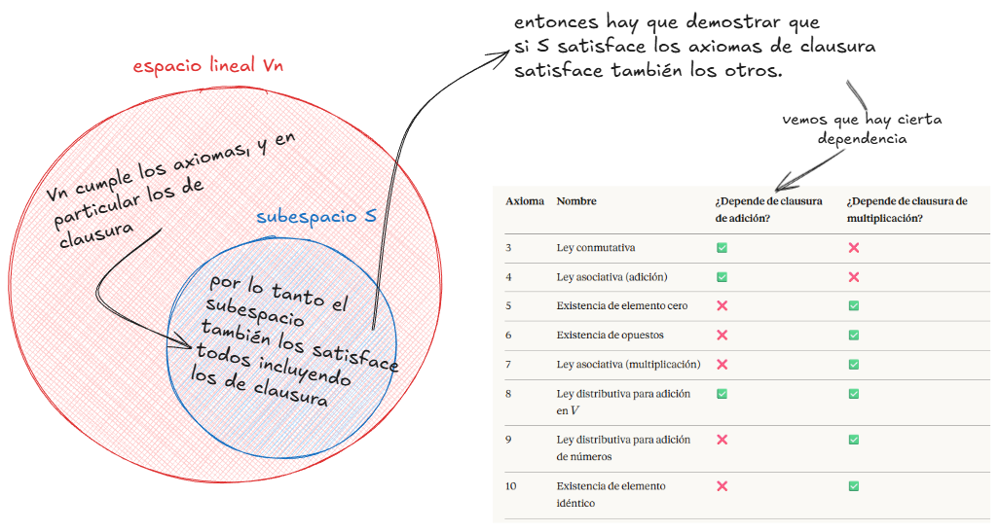

# Espacios lineales

Recordando algunos de los conceptos que tratamos en el capítulo de álgebra vectorial, teníamos varias forma de intepretarlos: Algebráicamente, geométricamente y axiomáticamente

En este capítulo nos concetrarémos en analizar elementos matemáticos axiomáticamente, es decir, no intentaremos ahondar en la "forma" ni las como se realizan operaciones entre estos elementos, sino que exigimos que las operaciones cumplan ciertas propiedades que tomamos como axiomas

Según la RAE:
> #### Axioma
>
> - Proposición tan clara y evidente que se admite sin demostración.
> - Cada uno de los principios indemostrables sobre los que, por medio de un razonamiento deductivo, se construye una teoría.

ok, entonces para redondear esto. Los axiomas son la receta **para las operaciones** que se pueden realizar sobre unos elementos cualquiera

## Definición de espacio lineal

"Sea $V$ un conjunto no vacío de objetos llamados *elementos*. El conjunto $V$ se llama espacio lineal si satisface los diez axiomas siguientes:"

#### Axiomas de clausura

1. **CLAUSURA RESPECTO DE LA ADICIÓN** A todo par de elementos $x$ y $y$ de $V$ corresponde un elemento **único** de $V$ llamado la suma $x$ y $y$, designado por $x + y$.

2. **CLAUSURA RESPECTO DE LA MULTIPLICACIÓN POR NÚMEROS REALES**. A todo $x$ de $V$ y todo número real $a$ corresponde un elemento de $V$ llamado producto de $a$ por $x$, designado por $ax$.

#### Axiomas para la adición

3. **LEY CONMUTATIVA** Para todo $x$ y todo $y$ de $V$, tenemos $x + y$ = $y + x$

4. **LEY ASOCIATIVA** Cualesquiera que sean $x$, $y$, $z$ de $V$, tenemos $(x + y) + z = x + (y + z)$.

5. **EXISTENCIA DE ELEMENTO CERO** Existe un elemento en $V$, designado con el símbolo $O$, tal que $x + O = x$ para todo $x$ de $V$.

6. **EXISTENCIA DE OPUESTOS** Para todo $x$ de $V$, el elemento $(-1)x$
tiene la propiedad $x + (-1)x = O$

#### Axiomas para la multiplicación por números

7. **LEY ASOCIATIVA** Para todo $x$ de $V$ y todo par de números reales $a$ y $b$, tenemos $a(bx) = (ab)x$

8. **LEY DISTRIBUTIVA PARA LA ADICIÓN EN $V$**. Para todo $x$ y todo
$y$ de $V$ y todo número real $a$, tenemos $a(x +y) = ax + ay$

9. **LEY DISTRIBUTIVA PARA LA ADICIÓN DE NÚMEROS** Para todo $x$ de $V$ y todo par de números reales $a$ y $b$, tenemos $(a + b)x = ax + bx$

10. **EXISTENCIA DE ELEMENTO IDÉNTICO** Para todo $x$ de $V$, tenemos $1x = x$.

Cálculo de Tom Apostol Vol 2 Pág 4.

El texto nos recalca que los axiomas funcionan indistintamente para escalares reales o complejos, y dependiendo los que usemos el espacio lineal toma el nombre (espacio lineal real/complejo). A veces también se puede llamar espacio vectorial lineal o espacio vectorial nada mas.

##### Algunos ejemplos que me gustaron

- [n-plas de numeros reales](ax_nplas.md)
- [polinomios](ax_pol.md)
- [Polinomios menor y igual a n](ax_pol_leq_n.md)
- [Funciones](ax_func.md)
- [Derivadas e integrales](ax_derivadas_integrales.md)

La idea central de todas estas demostraciones es la misma: como las operaciones en $V_n$ se definen componente a componente, heredamos directamente las propiedades del cuerpo $\mathbb{R}$. Entonces, ¿cómo se demuestran los axiomas de $\mathbb{R}$?, bueno... ese es un dilema, simplemente aceptamos que son verdaderos y los usamos para demostrar en otros contextos. No todo se puede demostrar

"Estos ejemplos y muchos otros hacen patente cómo el concepto de espacio
lineal está extendido por el Álgebra, la Geometría y el Análisis."

Ahora bien, uno de los aprendizajes importantes es que la validez de los axiomas no depende de los elementos del espacio sino del espacio mismo, es decir, aplicaron para polinomios, funciones etc. Y es por eso que podemos llegar a estas tres conclusiones a aprtir de los axiomas que utilizamos

---

Tomado de Calculo de Tom Apostol Vol 2 Pag 7

#### TEOREMA 1.1. UNICIDAD DEL ELEMENTO CERO. En cualquier espacio lineal existe un elemento cero y sólo uno.

*Demostración.* El axioma 5 nos asegura que existe por lo menos un elemento cero. Supongamos que existan dos, sean $O_1$ y $O_2$. Haciendo $x = O_1$ y $O = O_2$ en el axioma 5, obtenemos $O_1 + O_2 = O_1$. Análogamente, haciendo $x = O_2$ y $O = O_1$, encontramos $O_2 + O_1 = O_2$. Pero $O_1 + O_2 = O_2 + O_1$ por la ley conmutativa, así que $O_1 = O_2$.

#### TEOREMA 1.2. UNICIDAD DE ELEMENTOS OPUESTOS. En cualquier espacio lineal todo elemento tiene exactamente un opuesto. Esto es, para todo $x$ existe un $y$, y sólo uno tal que $x + y = O$

*Demostración.* El axioma 6 nos dice que cada $x$ tiene por lo menos un opuesto, a saber $(-1)x$. Supongamos que $x$ tenga dos opuestos, sean $y_1$ e $y_2$. Entonces $x + y_1 = O$ y $x + y_2 = O$. Sumando $y_2$ a los dos miembros de la primera igualdad y aplicando los axiomas 5, 4 y 3, obtenemos que

$$y_2 + (x + y_1) = y_2 + O = y_2 ,$$

y

$$y_2 + (x + y_1) = (y_2 + x) + y_1 = O + y_1 = y_1 + O = y_1 .$$

Por consiguiente $y_1 = y_2$, con lo que $x$ tiene exactamente un opuesto, el elemento $(-1)x$.

*Notación.* El opuesto de $x$ se designa por $-x$. La diferencia $y - x$ se define como la suma $y + (-x)$.

El teorema siguiente muestra un conjunto de propiedades que rigen los cálculos algebraicos elementales en un espacio lineal.

#### TEOREMA 1.3. En un espacio lineal, designemos con $x$ e $y$ dos elementos cualesquiera y con $a$ y $b$ dos escalares cualesquiera. Tenemos entonces las propiedades siguientes:

1. $0x = O$.
2. $aO = O$.
3. $(-a)x = -(ax) = a(-x)$.
4. *Si $ax = O$, entonces $a = 0$ o $x = O$, o los dos.*
5. *Si $ax = ay$ y $a \neq 0$ entonces $x = y$.*
6. *Si $ax = bx$ y $x \neq O$, entonces $a = b$.*
7. $-(x + y) = (-x) + (-y) = -x - y$.
8. $x + x = 2x$, $x + x + x = 3x$, *y en general,* $\sum_{i=1}^{n} x = nx$.

Demostraremos 1, 2 y 3 y dejamos como ejercicios las demostraciones de las otras propiedades.

*Demostración de 1.* Sea $z = 0x$. Deseamos demostrar que $z = O$. Sumando $z$ a sí mismo y aplicando el axioma 9, encontramos que

$$z + z = 0x + 0x = (0 + 0)x = 0x = z .$$

Sumemos ahora $-z$ a ambos miembros y obtenemos $z = O$.

*Demostración de 2.* Sea $z = aO$, sumar $z$ a sí mismo, y aplicar el axioma 8.

*Demostración de 3.* Sea $z = (-a)x$. Sumando $z$ a $ax$ y aplicando el axioma 9, encontramos que

$$z + ax = (-a)x + ax = (-a + a)x = 0x = O ,$$

así que $z$ es el opuesto de $ax$, $z = -(ax)$. Análogamente, si sumamos $a(-x)$ a $ax$ y aplicamos el axioma 8 y la propiedad 2, encontramos que $a(-x) = -(ax)$.

---

Esas demostraciones fundamentan mucho de lo que damos por sentado como cierto. Como vimos pudimos partir de los axiomas de $\mathbb{R}$ y apartir de ahí extender las propiedades hacia otros conjuntos. Se dice que solo hay necesidad de demostrar una vez y justamente eso pasa aqui, probamos para las funciones y los polinomios y cada vez nos vamos adentrando mas en casos particulares, los cuales no necesitan probar todos los axiomas porque los extendimos de casos mas generales, vamos a ver que solo se necesitan unos cuantos para ver si el espacio es lineal

## Subespacios

Si observamos el siguiente gráfico encontraremos que el subespacio $S$ es un subconjunto del espacio $V_n$:

El teorema dice:

Sea $S$ un subconjunto no vacío de un espacio lineal $V$. Tal subconjunto $S$ es un subespacio **si y solo si satisface las siguientes tres condiciones**:

1. $O \in S$ (el elemento cero pertenece a $S$)
2. Si $x \in S$ e $y \in S$, entonces $x + y \in S$ (clausura bajo la adición)
3. Si $x \in S$ y $a \in \mathbb{R}$, entonces $ax \in S$ (clausura bajo multiplicación por escalar)

Osea, queremos probar que validando solo estas tres condiciones todos los axiomas 3–10 son válidos automáticamente. Esto funciona porque esos axiomas se **heredan** del espacio mayor $V$: si una propiedad vale para todos los elementos de $V$, vale en particular para los de $S$.

De hecho esto es bastante útil, porque como vimos anteriormente muchos de los ejemplos que hicimos eran subespacios de $\mathbb{R}$, entonces con esta nueva herramienta no tendríamos que validar todos los axiomas sino solo estas tres condiciones.

¿Por qué exactamente estas tres condiciones y no otras?

**Las condiciones 2 y 3 (clausura) pueden fallar en un subconjunto.** Tomar dos elementos de $S$ y sumarlos podría producir un resultado que se sale de $S$ — el resultado existe en $V$, pero ya no está dentro de $S$. Eso es exactamente lo que vimos con los polinomios de grado exactamente $n$: la cancelación del término líder nos saca del conjunto. Por eso hay que verificarlas explícitamente.

**Los axiomas 3–10 no pueden fallar.** Son igualdades sobre cómo se comportan las operaciones — cosas como $x + y = y + x$ o $a(x + y) = ax + ay$. Estas valen para *todos* los elementos de $V$, entonces valen en particular para los de $S$. $S$ no define operaciones nuevas; usa exactamente las mismas que $V$.

**La condición 1 ($O \in S$) es consecuencia de las otras dos**, siempre que $S$ sea no vacío: si existe algún $x \in S$, entonces $0 \cdot x \in S$ por la condición 3 (clausura bajo multiplicación por escalar, con $a = 0$), y por el Teorema 1.3(a) sabemos que $0 \cdot x = O$. Se pone explícita porque sin ella el conjunto vacío $\emptyset$ cumpliría trivialmente las condiciones 2 y 3 — no hay elementos que violen nada — pero $\emptyset$ no es un subespacio.

#### Demostración de que los axiomas 5 y 6 se satisfacen en $S$

Tomado de Cálculo de Tom Apostol Vol 2 Pág 8.

Los 10 axiomas se dividen en dos tipos, y esa diferencia determina cuáles hay que probar en $S$ y cuáles no:

**Axiomas 3, 4 y 7–10 — son igualdades.** Dicen cosas como $x + y = y + x$ o $a(x+y) = ax + ay$. Si $x, y \in S$, entonces en particular $x, y \in V$ (ya que $S \subseteq V$), y la igualdad sigue siendo cierta porque $S$ no define operaciones nuevas — usa exactamente las mismas que $V$. Estas se heredan automáticamente, sin necesidad de probarlas.

**Axiomas 5 y 6 — son existenciales dentro del conjunto.** No dicen que algo sea igual a algo; dicen que cierto elemento **existe dentro de $S$**:

- Axioma 5: existe un $O$ **en $S$** tal que $x + O = x$
- Axioma 6: para cada $x \in S$, existe $(-1)x$ **en $S$** tal que $x + (-1)x = O$

Que $O$ exista en $V$ ya lo sabemos — pero podría no estar en $S$. Que $(-1)x$ exista en $V$ también lo sabemos — pero igualmente podría no estar en $S$. Por eso no se pueden heredar: hay que demostrar que esos elementos caen dentro de $S$.

Y se demuestra usando la clausura escalar, tomando valores concretos de $a$:

**Axioma 5 — Existencia del elemento cero en $S$:**

Sea $x$ un elemento cualquiera de $S$ (existe porque $S$ no es vacío). Por la condición 3, $ax \in S$ para todo escalar $a$. Tomando $a = 0$, resulta que $0x \in S$. Por el Teorema 1.3(a), $0x = O$, con lo cual $O \in S$.

**Axioma 6 — Existencia de opuestos en $S$:**

Tomando $a = -1$ en la condición 3, resulta que $(-1)x \in S$. Y la igualdad $x + (-1)x = O$ se hereda de $V$ (es una igualdad, no una afirmación de pertenencia). Por consiguiente el axioma 6 se satisface en $S$.

