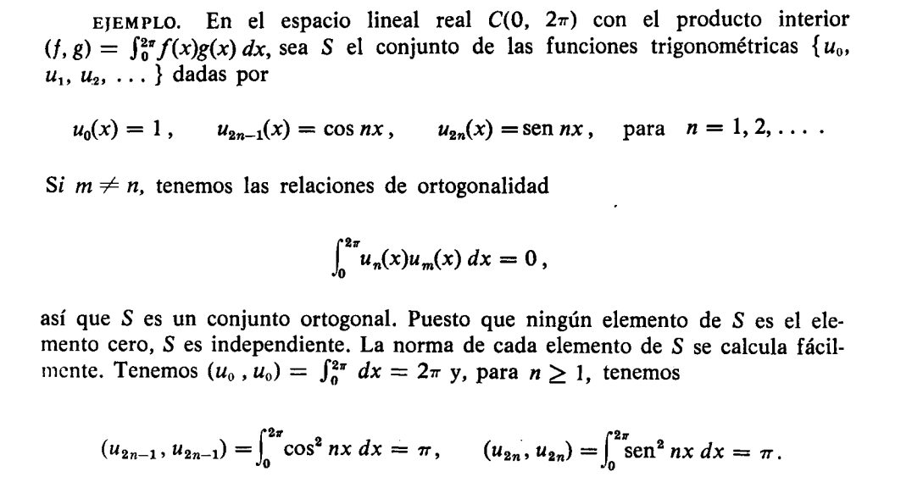
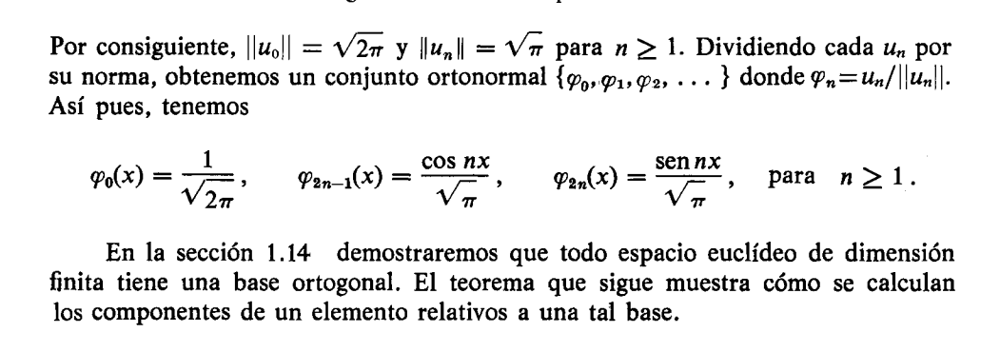
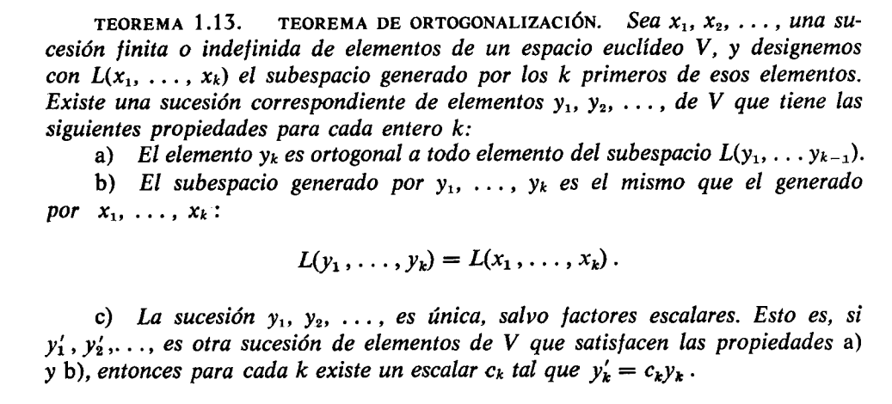

# Espacios lineales

Recordando algunos de los conceptos que tratamos en el capítulo de álgebra vectorial, teníamos varias forma de intepretarlos: Algebráicamente, geométricamente y axiomáticamente

En este capítulo nos concetrarémos en analizar elementos matemáticos axiomáticamente, es decir, no intentaremos ahondar en la "forma" ni como se realizan las operaciones entre estos elementos, sino que exigimos que las operaciones cumplan ciertas propiedades que tomamos como axiomas

Según la RAE:
> #### Axioma
>
> - Proposición tan clara y evidente que se admite sin demostración.
> - Cada uno de los principios indemostrables sobre los que, por medio de un razonamiento deductivo, se construye una teoría.

ok, entonces para redondear esto. Los axiomas son la receta **para las operaciones** que se pueden realizar sobre unos elementos cualquiera

## Definición de espacio lineal

"Sea $V$ un conjunto no vacío de objetos llamados *elementos*. El conjunto $V$ se llama espacio lineal si satisface los diez axiomas siguientes:"

#### Axiomas de clausura

1. **CLAUSURA RESPECTO DE LA ADICIÓN** A todo par de elementos $x$ y $y$ de $V$ corresponde un elemento **único** de $V$ llamado la suma $x$ y $y$, designado por $x + y$.

2. **CLAUSURA RESPECTO DE LA MULTIPLICACIÓN POR NÚMEROS REALES**. A todo $x$ de $V$ y todo número real $a$ corresponde un elemento de $V$ llamado producto de $a$ por $x$, designado por $ax$.

#### Axiomas para la adición

3. **LEY CONMUTATIVA** Para todo $x$ y todo $y$ de $V$, tenemos $x + y$ = $y + x$

4. **LEY ASOCIATIVA** Cualesquiera que sean $x$, $y$, $z$ de $V$, tenemos $(x + y) + z = x + (y + z)$.

5. **EXISTENCIA DE ELEMENTO CERO** Existe un elemento en $V$, designado con el símbolo $O$, tal que $x + O = x$ para todo $x$ de $V$.

6. **EXISTENCIA DE OPUESTOS** Para todo $x$ de $V$, el elemento $(-1)x$
tiene la propiedad $x + (-1)x = O$

#### Axiomas para la multiplicación por números

7. **LEY ASOCIATIVA** Para todo $x$ de $V$ y todo par de números reales $a$ y $b$, tenemos $a(bx) = (ab)x$

8. **LEY DISTRIBUTIVA PARA LA ADICIÓN EN $V$**. Para todo $x$ y todo
$y$ de $V$ y todo número real $a$, tenemos $a(x +y) = ax + ay$

9. **LEY DISTRIBUTIVA PARA LA ADICIÓN DE NÚMEROS** Para todo $x$ de $V$ y todo par de números reales $a$ y $b$, tenemos $(a + b)x = ax + bx$

10. **EXISTENCIA DE ELEMENTO IDÉNTICO** Para todo $x$ de $V$, tenemos $1x = x$.

Cálculo de Tom Apostol Vol 2 Pág 4.

El texto nos recalca que los axiomas funcionan indistintamente para escalares reales o complejos, y dependiendo los que usemos el espacio lineal toma el nombre (espacio lineal real/complejo). A veces también se puede llamar espacio vectorial lineal o espacio vectorial nada mas.

##### Algunos ejemplos que me gustaron

- [n-plas de numeros reales](ax_nplas.md)
- [polinomios](ax_pol.md)
- [Polinomios menor y igual a n](ax_pol_leq_n.md)
- [Funciones](ax_func.md)
- [Derivadas e integrales](ax_derivadas_integrales.md)

La idea central de todas estas demostraciones es la misma: como las operaciones en $V_n$ se definen componente a componente, heredamos directamente las propiedades del cuerpo $\mathbb{R}$. Entonces, ¿cómo se demuestran los axiomas de $\mathbb{R}$?, bueno... ese es un dilema, simplemente aceptamos que son verdaderos y los usamos para demostrar en otros contextos. No todo se puede demostrar

"Estos ejemplos y muchos otros hacen patente cómo el concepto de espacio
lineal está extendido por el Álgebra, la Geometría y el Análisis."

Ahora bien, uno de los aprendizajes importantes es que la validez de los axiomas no depende de los elementos del espacio sino del espacio mismo, es decir, aplicaron para polinomios, funciones etc. Y es por eso que podemos llegar a estas tres conclusiones **a partir de los axiomas** que utilizamos

---

Tomado de Calculo de Tom Apostol Vol 2 Pag 7

#### TEOREMA 1.1. UNICIDAD DEL ELEMENTO CERO. En cualquier espacio lineal existe un elemento cero y sólo uno.

*Demostración.* El axioma 5 nos asegura que existe por lo menos un elemento cero. Supongamos que existan dos, sean $O_1$ y $O_2$. Haciendo $x = O_1$ y $O = O_2$ en el axioma 5, obtenemos $O_1 + O_2 = O_1$. Análogamente, haciendo $x = O_2$ y $O = O_1$, encontramos $O_2 + O_1 = O_2$. Pero $O_1 + O_2 = O_2 + O_1$ por la ley conmutativa, así que $O_1 = O_2$.

#### TEOREMA 1.2. UNICIDAD DE ELEMENTOS OPUESTOS. En cualquier espacio lineal todo elemento tiene exactamente un opuesto. Esto es, para todo $x$ existe un $y$, y sólo uno tal que $x + y = O$

*Demostración.* El axioma 6 nos dice que cada $x$ tiene por lo menos un opuesto, a saber $(-1)x$. Supongamos que $x$ tenga dos opuestos, sean $y_1$ e $y_2$. Entonces $x + y_1 = O$ y $x + y_2 = O$. Sumando $y_2$ a los dos miembros de la primera igualdad y aplicando los axiomas 5, 4 y 3, obtenemos que

$$y_2 + (x + y_1) = y_2 + O = y_2 ,$$

y

$$y_2 + (x + y_1) = (y_2 + x) + y_1 = O + y_1 = y_1 + O = y_1 .$$

Por consiguiente $y_1 = y_2$, con lo que $x$ tiene exactamente un opuesto, el elemento $(-1)x$.

*Notación.* El opuesto de $x$ se designa por $-x$. La diferencia $y - x$ se define como la suma $y + (-x)$.

El teorema siguiente muestra un conjunto de propiedades que rigen los cálculos algebraicos elementales en un espacio lineal.

#### TEOREMA 1.3. En un espacio lineal, designemos con $x$ e $y$ dos elementos cualesquiera y con $a$ y $b$ dos escalares cualesquiera. Tenemos entonces las propiedades siguientes:

1. $0x = O$
2. $aO = O$
3. $(-a)x = -(ax) = a(-x)$
4. Si $ax = O$, entonces $a = 0$ o $x = O$, o los dos.
5. Si $ax = ay$ y $a \neq 0$ entonces $x = y$
6. Si $ax = bx$ y $x \neq O$, entonces $a = b$
7. $-(x + y) = (-x) + (-y) = -x - y$
8. $x + x = 2x$, $x + x + x = 3x$, *y en general,* $\sum_{i=1}^{n} x = nx$

Demostraremos 1, 2 y 3 y dejamos como ejercicios las demostraciones de las otras propiedades.

*Demostración de 1.* Sea $z = 0x$. Deseamos demostrar que $z = O$. Sumando $z$ a sí mismo y aplicando el axioma 9, encontramos que

$$z + z = 0x + 0x = (0 + 0)x = 0x = z .$$

Sumemos ahora $-z$ a ambos miembros y obtenemos $z = O$.

*Demostración de 2.* Sea $z = aO$, sumar $z$ a sí mismo, y aplicar el axioma 8.

*Demostración de 3.* Sea $z = (-a)x$. Sumando $z$ a $ax$ y aplicando el axioma 9, encontramos que

$$z + ax = (-a)x + ax = (-a + a)x = 0x = O ,$$

así que $z$ es el opuesto de $ax$, $z = -(ax)$. Análogamente, si sumamos $a(-x)$ a $ax$ y aplicamos el axioma 8 y la propiedad 2, encontramos que $a(-x) = -(ax)$.

---

Esas demostraciones fundamentan mucho de lo que damos por sentado como cierto. Como vimos pudimos partir de los axiomas de $\mathbb{R}$ y apartir de ahí extender las propiedades hacia otros conjuntos. Se dice que solo hay necesidad de demostrar una vez y justamente eso pasa aqui, probamos para las funciones y los polinomios y cada vez nos vamos adentrando mas en casos particulares, los cuales no necesitan probar todos los axiomas porque los extendimos de casos mas generales, vamos a ver que solo se necesitan unos cuantos para ver si el espacio es lineal

## Subespacios

Si observamos el siguiente gráfico encontraremos que el subespacio $S$ es un subconjunto del espacio $V_n$:

El teorema dice:

Sea $S$ un subconjunto no vacío de un espacio lineal $V$. Tal subconjunto $S$ es un subespacio **si y solo si satisface las siguientes tres condiciones**:

1. $O \in S$ (el elemento cero pertenece a $S$)
2. Si $x \in S$ e $y \in S$, entonces $x + y \in S$ (clausura bajo la adición)
3. Si $x \in S$ y $a \in \mathbb{R}$, entonces $ax \in S$ (clausura bajo multiplicación por escalar)

Osea, queremos probar que validando solo estas tres condiciones todos los axiomas 3–10 son válidos automáticamente. Esto funciona porque esos axiomas se **heredan** del espacio mayor $V$: si una propiedad vale para todos los elementos de $V$, vale en particular para los de $S$.

De hecho esto es bastante útil, porque como vimos anteriormente muchos de los ejemplos que hicimos eran subespacios de $\mathbb{R}$, entonces con esta nueva herramienta no tendríamos que validar todos los axiomas sino solo estas tres condiciones.

¿Por qué exactamente estas tres condiciones y no otras?

**Las condiciones 2 y 3 (clausura) pueden fallar en un subconjunto.** Tomar dos elementos de $S$ y sumarlos podría producir un resultado que se sale de $S$ — el resultado existe en $V$, pero ya no está dentro de $S$. Eso es exactamente lo que vimos con los polinomios de grado exactamente $n$: la cancelación del término líder nos saca del conjunto. Por eso hay que verificarlas explícitamente.

**Los axiomas 3–10 no pueden fallar.** Son igualdades sobre cómo se comportan las operaciones — cosas como $x + y = y + x$ o $a(x + y) = ax + ay$. Estas valen para *todos* los elementos de $V$, entonces valen en particular para los de $S$. $S$ no define operaciones nuevas; usa exactamente las mismas que $V$.

**La condición 1 ($O \in S$) es consecuencia de las otras dos**, siempre que $S$ sea no vacío: si existe algún $x \in S$, entonces $0 \cdot x \in S$ por la condición 3 (clausura bajo multiplicación por escalar, con $a = 0$), y por el Teorema 1.3(a) sabemos que $0 \cdot x = O$. Se pone explícita porque sin ella el conjunto vacío $\emptyset$ cumpliría trivialmente las condiciones 2 y 3 — no hay elementos que violen nada — pero $\emptyset$ no es un subespacio.

### Ejemplos

**Ejemplo 1 — $S$ sí es subespacio.**

Sea $V = \mathbb{R}^2$ y $S = \lbrace(x, 2x) : x \in \mathbb{R}\rbrace$ — la recta completa $y = 2x$, que pasa por el origen.

Importante: $S$ no es una lista fija de vectores. Es **todos** los vectores de la forma $(x, 2x)$ para cualquier $x \in \mathbb{R}$ — infinitos vectores.

1. $O \in S$: tomando $x = 0$ obtenemos $(0, 0) \in S$. ✓

2. Clausura bajo adición: sean $(x_1, 2x_1)$ y $(x_2, 2x_2)$ en $S$. Su suma es:

$$( x_1 + x_2,\ 2x_1 + 2x_2) = (x_1 + x_2,\ 2(x_1 + x_2))$$

El resultado tiene la forma $(t, 2t)$ con $t = x_1 + x_2$, por lo tanto **sí pertenece a $S$**. ✓

Numéricamente: $(1, 2) + (3, 6) = (4, 8)$. ¿Está $(4, 8)$ en $S$? Sí, porque $8 = 2 \cdot 4$. El vector sumado sigue sobre la recta $y = 2x$.

3. Clausura bajo multiplicación escalar: $a(x, 2x) = (ax, 2ax)$, que tiene la forma $(t, 2t)$ con $t = ax$, por lo tanto **sí pertenece a $S$**. ✓

Numéricamente: $3 \cdot (1, 2) = (3, 6)$. ¿Está $(3, 6)$ en $S$? Sí, porque $6 = 2 \cdot 3$.

Las tres condiciones se satisfacen, por lo tanto $S$ es un subespacio de $\mathbb{R}^2$.

---

**Ejemplo 2 — $S$ no es subespacio.**

Sea $V = \mathbb{R}^2$ y $S = \lbrace(x, 2x + 1) : x \in \mathbb{R}\rbrace$ — la recta $y = 2x + 1$, desplazada, que no pasa por el origen.

1. $O \in S$: necesitaríamos que $(0, 0)$ tenga la forma $(x, 2x+1)$, pero $2(0) + 1 = 1 \neq 0$. Por lo tanto $O \notin S$. ✗

Falla la primera condición. Para verlo también en la clausura:

2. Clausura bajo adición: $(0, 1) \in S$ (con $x=0$) y $(1, 3) \in S$ (con $x=1$). Su suma:

$$(0, 1) + (1, 3) = (1, 4)$$

¿Está $(1, 4)$ en $S$? Necesitaría que $4 = 2(1) + 1 = 3$. No cumple — el resultado se salió de $S$. ✗

La diferencia entre los dos ejemplos es geométricamente clara: la recta del ejemplo 1 pasa por el origen; la del ejemplo 2 no. Sumar dos puntos sobre una recta desplazada te lleva fuera de ella — el resultado "cae" sobre otra recta paralela. Un subespacio siempre debe contener el origen.

---

### Demostración de que los axiomas 5 y 6 se satisfacen en $S$

Tomado de Cálculo de Tom Apostol Vol 2 Pág 8.

Los 10 axiomas se dividen en dos tipos, y esa diferencia determina cuáles hay que probar en $S$ y cuáles no:

**Axiomas 3, 4 y 7–10 — son igualdades.** Dicen cosas como $x + y = y + x$ o $a(x+y) = ax + ay$. Si $x, y \in S$, entonces en particular $x, y \in V$ (ya que $S \subseteq V$), y la igualdad sigue siendo cierta porque $S$ no define operaciones nuevas — usa exactamente las mismas que $V$. Estas se heredan automáticamente, sin necesidad de probarlas.

**Axiomas 5 y 6 — son existenciales dentro del conjunto.** No dicen que algo sea igual a algo; dicen que cierto elemento **existe dentro de $S$**:

- Axioma 5: existe un $O$ **en $S$** tal que $x + O = x$
- Axioma 6: para cada $x \in S$, existe $(-1)x$ **en $S$** tal que $x + (-1)x = O$

Que $O$ exista en $V$ ya lo sabemos — pero podría no estar en $S$. Que $(-1)x$ exista en $V$ también lo sabemos — pero igualmente podría no estar en $S$. Por eso no se pueden heredar: hay que demostrar que esos elementos caen dentro de $S$.

Y se demuestra usando la clausura escalar, tomando valores concretos de $a$:

**Axioma 5 — Existencia del elemento cero en $S$:**

Sea $x$ un elemento cualquiera de $S$ (existe porque $S$ no es vacío). Por la condición 3, $ax \in S$ para todo escalar $a$. Tomando $a = 0$, resulta que $0x \in S$. Por el Teorema 1.3(a), $0x = O$, con lo cual $O \in S$.

**Axioma 6 — Existencia de opuestos en $S$:**

Tomando $a = -1$ en la condición 3, resulta que $(-1)x \in S$. Y la igualdad $x + (-1)x = O$ se hereda de $V$ (es una igualdad, no una afirmación de pertenencia). Por consiguiente el axioma 6 se satisface en $S$.

## Envolvente Lineal

Este tema fue tratado en el tutorial de algebra vectorial. En esa ocasión tomábamos los vectores coordenados unitarios y creábamos un conjunto que nos servia para luego generar todo el espacio de $\mathbb{R}^3$. Entonces, tomábamos cada vector unitario 

$i = (1,0,0)$ $j = (0,1,0)$ $k = (0,0,1)$ 

y los multiplicabamos por 3 escalares cualquiera $a,b,c$, y luego sumábamos los tres resultados; obteniendo así un nuevo vector $l \in \mathbb{R}^3$, así

$$l = ai + bj + ck$$

por lo tanto para generalizar y pensando axiomáticamente, podemos prescindir de la condición de que son vectores en $\mathbb{R}^3$ y simplemente decir que:

"Sea $S$ un subconjunto no vacío de un espacio lineal $V$. Un elemento $X$ de $V$ de la forma 

$$X = \sum_{i = 1}^{k} c_ix_i$$

en donde $x_1, \dots, x_n$ pertenecen todos a $S$ y $c_1, \dots, c_n$ son escalares se denomina **combinación lineal de elementos de $S$**.

El conjunto de todas las combinaciones
lineales finitas de elementos de $S$ satisface los axiomas de clausura y por tanto
es un subespacio de $V$. Decimos de ese subespacio que está generado por $S$, o
también le llamamos la envolvente lineal de $S$, y lo designamos por $L(S)$. Si $S$
es vacío, definimos $L(S)$ como $\lbrace O \rbrace$, el conjunto consta del elemento cero.
" Cálculo de Tom Apostol Vol 2 Pág 10

#### ¿Por qué $L(S)$ es subespacio de $V$?

Hay que verificar que $L(S)$ cumple los axiomas de clausura: cerrado bajo suma y cerrado bajo multiplicación por escalar.

###### Cerrado bajo suma

Tomamos dos elementos cualesquiera de $L(S)$. Por definición, cada uno es una combinación lineal de los vectores de $S$:

$$u = a_1 x_1 + a_2 x_2 + \dots + a_k x_k$$

$$v = b_1 x_1 + b_2 x_2 + \dots + b_k x_k$$

Si los sumamos:

$$u + v = (a_1 + b_1)x_1 + (a_2 + b_2)x_2 + \dots + (a_k + b_k)x_k$$

Esto sigue siendo una combinación lineal de los elementos de $S$ (con escalares $a_1 + b_1$, $a_2 + b_2$, etc.), así que $u + v \in L(S)$.

###### Cerrado bajo multiplicación por escalar

Tomamos $u \in L(S)$ y un escalar $c$:

$$c \cdot u = (c a_1)x_1 + (c a_2)x_2 + \dots + (c a_k)x_k$$

De nuevo, es una combinación lineal de los elementos de $S$, así que $c \cdot u \in L(S)$.

###### Vector cero

El vector cero también está en $L(S)$: basta tomar todos los escalares iguales a $0$.

$$0 \cdot x_1 + 0 \cdot x_2 + \dots + 0 \cdot x_k = \mathbf{0}$$

---

Veamos que $X$ es de $V$, no de $S$, porque la combinación lineal puede producir algo que no estaba en $S$.

Ejemplo:

$V = \mathbb{R}^2$, $S = \lbrace (1,0) \rbrace$ — un solo vector.

Eligiendo un escalar $a \in \mathbb{R}$ cualquiera se forma:

$$X = a \cdot (1,0) = (a, 0)$$

Cada valor de $a$ produce un $X$ distinto que vive en $V$:

- $a = 2 \Rightarrow X = (2,0) \in V$
- $a = -7 \Rightarrow X = (-7,0) \in V$
- $a = 0 \Rightarrow X = (0,0) \in V$

La colección de todos esos $X$ posibles forma $L(S)$, que resulta ser la recta horizontal — un subespacio de $V$. Los infinitos vectores de esa recta claramente no estaban en $S$.

La jerarquía es:

$$S \subseteq L(S) \subseteq V$$

- $S$ es el conjunto original (puede ser cualquier subconjunto, no necesariamente un subespacio)
- $L(S)$ es la envolvente lineal — todos los $X$ que se pueden formar combinando elementos de $S$
- $V$ es el espacio ambiente que contiene todo

Finalmente podemos ver que conjuntos distintos nos pueden generar el mismo subespacio, como vimos en el tutorial de algebra vectorial podíamos tener algo como $S = \lbrace i, j, i+j \rbrace$ y también podremos generar $\mathbb{R}^2$ aunque con algunas implicaciones

## Conjuntos dependientes e independientes en un espacio lineal

En el tutorial de geometria en $\mathbb{R}^n$ vimos varios ejemplos de conjuntos dependientes e independientes. 

Básicamente, el conjunto es linealmente dependiente si tomamos un conjunto finito de elementos distintos cualquiera de $S$ $x_1, \dots, x_n$

Y tomamos un conjunto de escalares cualquiera $c_1, \dots, c_n$ **NO TODOS CERO**, y al hacer la combinación lineal obtenemos

$$\sum_{i = 1}^{k} c_ix_i = 0$$

es decir, podemos generar $O$ mediante una combinación lineal de elementos del conjunto que no son la forma trivial de $O$, osea, **TODAS LAS CONSTANTES EN CERO**

Osea, cuando todas las constantes son cero para generar $O$ se dice que el conjunto es **linealmente independiente**

En el tutorial de geometría analítica vimos varios ejemplos, como dos vectores en la misma recta, los vectores directores de un plano, el producto cruz $A \times B = 0$ etc.

Si bien los ejemplos que vimos en el tutorial de geometría analítica se centraron en $\mathbb{R}^n$ aquí no nos enfocamos en un único tipo de elementos. Adicionalmente podemos pensar en un espacio funcional, por ejemplo

#### Ejemplo 1:

Sean $u_1(t) = cos^2 t$, $\ u_2(t) = sen^2 t$, $\ u_3(t) = 1$ para todo número real $t$. La identidad pitagórica prueba que $u_1 + u_2 - u_3 = O$, así que las tres funciones $u_1$, $u_2$, $u_3$ son dependientes.

#### Ejemplo 2:

Sea $u_k(t) = t^k$ para $k = 0, 1, 2, \ldots$, y $t$ real. El conjunto $S = \lbrace u_0, u_1, u_2, \ldots \rbrace$ es independiente. Para demostrar esto, basta demostrar que para cada $n$ los $n + 1$ polinomios $u_0, u_1, \ldots, u_n$ son independientes. Una relación de la forma $\sum c_k u_k = O$ significa que

$$\sum_{k=0}^{n} c_k t^k = 0$$

para todo real $t$. Cuando $t = 0$, encontramos que $c_0 = 0$. Repitiendo el proceso, encontramos que cada coeficiente $c_k$ es cero.
El ejemplo quiere demostrar que el conjunto infinito de funciones $S = \lbrace 1, t, t^2, t^3, \ldots \rbrace$ es **linealmente independiente**.

La estrategia es esta: si tomamos cualquier subconjunto finito de $n+1$ de esas funciones y suponemos que existe una combinación lineal igual a cero, es decir:

$$c_0 + c_1 t + c_2 t^2 + \cdots + c_n t^n = 0 \quad \text{para todo } t \text{ real}$$

entonces debemos demostrar que todos los $c_k$ son necesariamente cero.

Veamos el desarrollo, Evaluamos en $t = 0$:

$$c_0 + c_1(0) + c_2(0)^2 + \cdots = 0 \implies c_0 = 0$$

Ahora sabemos que la ecuación se reduce a $c_1 t + c_2 t^2 + \cdots + c_n t^n = 0$, que podemos factorizar como $t(c_1 + c_2 t + \cdots + c_n t^{n-1}) = 0$ para todo $t$.

El texto dice "repitiendo el proceso", que se puede interpretar de varias formas equivalentes. La más directa: derivamos la ecuación original y evaluamos en $t=0$ otra vez. La derivada nos da $c_1 + 2c_2 t + 3c_3 t^2 + \cdots = 0$, y al poner $t=0$ obtenemos $c_1 = 0$. Derivando de nuevo y evaluando en $t=0$, obtenemos $2c_2 = 0$, así que $c_2 = 0$. En general, la $k$-ésima derivada evaluada en cero da $k!\, c_k = 0$, lo que fuerza $c_k = 0$. Eso recuerda mucho al proceso de los polinomios de Taylor

La conclusión es que la única forma de que un polinomio sea idénticamente cero (para **todo** $t$) es que todos sus coeficientes sean cero. Eso es exactamente la definición de independencia lineal.

## Conjunto de $k + 1$ elementos de $L(S)$

Veamos esto con un ejemplo. Supongamos que tengo un conjunto $S = \lbrace (1,0,0),(0,1,0) \rbrace$ de $V = \mathbb{R}^3$

Podemos ver que este conjunto es independiente, porque si hacemos la combinación lineal la única forma de obtener el vector nulo es poniendo todas las constantes en cero.

También podemos ver que la envolvente lineal $L(S)$ está conformada por todos los vectores de la forma $(a,b,0)$.

Entonces lo que dice el teorema es que **si formamos cualquier conjunto de $k + 1$ elementos que pertenezcan a $L(S)$**, ese conjunto es necesariamente dependiente. En nuestro caso $k = 2$, así que cualquier conjunto de 3 elementos de $L(S)$ será dependiente. Si tomamos por ejemplo $(3,5,0) \in L(S)$ y formamos el conjunto $\lbrace (1,0,0),(0,1,0),(3,5,0) \rbrace$, cuyos tres elementos pertenecen a $L(S)$, entonces es dependiente, porque podemos obtener el vector nulo de forma no trivial:

$$3(1,0,0) + 5(0,1,0) + (-1)(3,5,0) = O$$

Esto tiene demostración pero no la vamos a hacer. Ver en cálculo Tom Apostol Vol 2 Pág 13

## Bases y dimensión

Un conjunto finito $S$ de elementos de un espacio lineal $V$ se llama base finita de $V$ si $S$ es independiente y genera $V$.

El espacio $V$ es de dimensión finita si tiene una base finita. De otro modo, $V$ es de infinitas dimensiones.

Este es el momento para aclarar algunas cosas importantes.
El enunciado de forma implicita nos dice que $S$ es un subconjunto de $V$, y es base cuando $S$ es linealmente independiente y genera $V$

Ahora, cuando dice que $S$ genera o engendra $V$ podemos hacer un procedimiento como antes, tomamos un elemento genérico $x$ de $V$, y mostrar que se puede expresar como combinación lineal de los elementos de $S$. Al tomar $x$ como un elemento arbitrario de $V$, sin asumir nada particular sobre él, cualquier cosa que demostremos vale para todos los elementos de $V$. Es decir **"engendra" o "genera" implicitamente nos está hablando del envolvente lineal**, osea, son dos formas de decir lo mismo: $S$ engendra $V$ y $V$ es la envolvente lineal de $S$ son equivalentes

> y **MUY IMPORTANTE!**, nos acabamos de dar cuenta que el envolvente lineal de una base $S$ es equivalente al espacio $V$

#### Ejemplos

**Ejemplo 1 — $S$ sí es base.**

Sea $V = \mathbb{R}^2$ y $S = \lbrace (1,0),\ (0,1) \rbrace$.

**Independencia:** suponemos que existe una combinación lineal igual a $O$:

$$c_1(1,0) + c_2(0,1) = (0,0)$$

$$(c_1,\ c_2) = (0,0)$$

Entonces $c_1 = 0$ y $c_2 = 0$. La única forma de obtener el vector nulo es con todos los escalares en cero, por lo tanto $S$ es **linealmente independiente**

**Genera $V$:** tomamos un elemento genérico $(a, b) \in \mathbb{R}^2$ y mostramos que se puede escribir como combinación lineal de los elementos de $S$:

$$a(1,0) + b(0,1) = (a,\ b)$$

Cualquier elemento de $\mathbb{R}^2$ se expresa así, por lo tanto $S$ **genera $V$**

Las dos condiciones se satisfacen, por lo tanto $S$ es una base de $\mathbb{R}^2$.

---

**Ejemplo 2 — $S$ no es base porque es dependiente.**

Sea $V = \mathbb{R}^2$ y $S = \lbrace (1,0),\ (0,1),\ (1,1) \rbrace$.

Este conjunto **no es independiente**: podemos obtener el vector nulo con escalares no todos cero:

$$1 \cdot (1,0) + 1 \cdot (0,1) + (-1) \cdot (1,1) = (1+0-1,\ 0+1-1) = (0,0)$$

Falla la primera condición. $S$ no puede ser base aunque genere $V$.

---

**Ejemplo 3 — $S$ no es base porque no genera $V$.**

Sea $V = \mathbb{R}^2$ y $S = \lbrace(1,0)\rbrace$.

$S$ sí es independiente: $c_1(1,0) = (0,0)$ implica $c_1 = 0$

Pero $S$ **no genera $\mathbb{R}^2$**: cualquier combinación lineal de sus elementos produce vectores de la forma $(a, 0)$, que solo cubre la recta horizontal. Un vector como $(0, 1)$ no se puede expresar como combinación lineal de $\lbrace(1,0)\rbrace$

Falla la segunda condición. $S$ no puede ser base aunque sea independiente.

---

Podemos ver que la condición de la independencia lineal nos garantiza un conjunto sin redundancia. Entonces, intiutivamente podríamos pensar la base como el conjunto mas "económico" que genera un espacio lineal $V$

### Número de elementos

En esta sección empezamos a analizar la importancia de la cantidad de elementos y encontramos esta definición y este teorema 

- Si un espacio lineal $V$ tiene una base de n elementos, el entero n se llama dimensión de $V$. Escribimos $n = dim V$

- Sea $V$ un espacio lineal de dimensión finita. Entonces toda base finita de $V$ tiene el mismo número de elementos"

La demostración propone tomar dos bases finitas $S$ y $T$ de $V$

- $S$ tiene $k$ elementos
- $T$ tiene $m$ elementos

Ambas al ser base son linealmente independientes y generan $V$. Anteriormente vimos que todo conjunto de $k + 1$ elementos de $V$ es dependiente, y ojo aqui podemos decir "de $V$" porque como vimos anteriormente como $S$ es base de $V$ y el envolvente es equivalente $L(S) = V$

Como $T$ es independiente entonces debe ser $m \leq k$. Osea, estamos descartando el caso $m \gt k$

El mismo razonamiento aplica con $S$ y $T$ intercambiadas, y prueba que $k \leq m$. Por lo tanto $k = m$

##### Ejemplo

Sea $V = \mathbb{R}^3$ y consideremos dos bases:

$$S = \lbrace (1,0,0), (0,1,0), (0,0,1) \rbrace$$

$$T = \lbrace (1,1,0), (1,0,1), (0,1,1) \rbrace$$

Ambas son bases de $V$, así que ambas son independientes y $L(S) = L(T) = V$.

Ahora apliquemos el razonamiento de la demostración. $S$ tiene $k = 3$ elementos, $T$ tiene $m = 3$ elementos.

**Primera dirección:** como $S$ es base con $k = 3$ elementos, el Teorema 1.5 dice que todo conjunto de 4 o más elementos de $V$ es dependiente. Como $T$ es independiente, debe tener a lo sumo 3 elementos, es decir $m \leq 3$.

**Segunda dirección:** como $T$ es base con $m = 3$ elementos, el mismo argumento dice que todo conjunto de 4 o más elementos de $V$ es dependiente. Como $S$ es independiente, debe tener a lo sumo 3 elementos, es decir $k \leq 3$.

Juntando: $m \leq k$ y $k \leq m$, por lo tanto $k = m = 3$.

Esto confirma que no importa qué base elijamos para $\mathbb{R}^3$, siempre tendrá exactamente 3 elementos. Por eso $\dim \mathbb{R}^3 = 3$.

##### Ejemplo de dimensión

El espacio $V$ tiene dimensión $n$. Una base es el conjunto de los $n$ vectores coordenados unitarios.

##### Finalmente

Sea $V$ un espacio lineal de dimensión finita con $\dim V = n$. Se tiene:

- Cualquier conjunto de elementos independiente de $V$ es un subconjunto de una cierta base para $V$.

- Cualquier conjunto de $n$ elementos independientes es una base para $V$.

## Componentes

Sea $V$ un espacio lineal de dimensión $n$ y consideremos una base cuyos elementos $e_1, \ldots, e_n$ se toman en un cierto orden. Una tal base ordenada la consideramos como una $n$-pla $(e_1, \ldots, e_n)$. Si $x \in V$, podemos expresar $x$ como una combinación lineal de esos elementos base:

$$x = \sum_{i=1}^{n} c_i e_i$$

> Aqui es interesante ver que aunque los elementos de la base también están contenidos en $V$, construimos los componentes a partir de la base porque ella nos garantiza que son únicos y no redundantes, por la propia definición de base.

Los coeficientes en la ecuación determinan una $n$-pla de números $(c_1, \ldots, c_n)$ que está **unívocamente determinada** por $x$.

**Demostración:** Si tuviéramos otra representación de $x$ como combinación lineal de $e_1, \ldots, e_n$, por ejemplo $x = \sum_{i=1}^{n} d_i e_i$, restando de encontramos que:

$$\sum_{i=1}^{n} (c_i - d_i) e_i = O$$

Pero ya que los elementos base son **linealmente independientes**, eso implica que $c_i = d_i$ para cada $i$, con lo cual:

$$(c_1, \ldots, c_n) = (d_1, \ldots, d_n)$$

Los componentes de la $n$-pla ordenada $(c_1, \ldots, c_n)$ determinada por $(1.5)$ se llaman **componentes de $x$ respecto a la base ordenada** $(e_1, \ldots, e_n)$.

##### Idea clave: la base y los escalares son objetos distintos

En la ecuación $x = \sum_{i=1}^{n} c_i e_i$ conviven dos cosas de naturaleza diferente:

- Los $e_i$ son **vectores** de $V$ (la base, que se fija una vez).
- Los $c_i$ son **escalares** (números del cuerpo, típicamente $\mathbb{R}$).

Una vez fijada la base, lo único que varía de un vector a otro es la $n$-pla de escalares. Por eso podemos "olvidarnos" de los vectores base y trabajar solo con listas de números.

##### Ejemplo: la base canónica de $\mathbb{R}^3$

Con la base canónica $\lbrace (1,0,0), (0,1,0), (0,0,1) \rbrace$, el vector $x = (1,2,3)$ se escribe:

$$1(1,0,0) + 2(0,1,0) + 3(0,0,1) = (1,2,3)$$

Los escalares $(1, 2, 3)$ **coinciden** con las entradas del vector. Por eso nunca notamos que hay una base detrás: los números "son los mismos". Esta es una particularidad de la base canónica, **no** algo que ocurra en general.

##### Ejemplo: cambio de base en $\mathbb{R}^3$

Consideremos la base $S = \lbrace(1,1,0), (1,0,1), (0,1,1) \rbrace$ de $\mathbb{R}^3$.

Para el **mismo** vector $x = (1, 2, 3)$, buscamos escalares $c_1, c_2, c_3$ tales que:

$$c_1(1,1,0) + c_2(1,0,1) + c_3(0,1,1) = (1,2,3)$$

Esto da el sistema:

$$c_1 + c_2 = 1$$

$$c_1 + c_3 = 2$$

$$c_2 + c_3 = 3$$

Resolviendo: $c_1 = 0$, $c_2 = 1$, $c_3 = 2$.

### Comparación

| Base | Componentes de $x = (1,2,3)$ |
|---|---|
| Canónica: $\lbrace (1,0,0), (0,1,0), (0,0,1) \rbrace$ | $(1, 2, 3)$ |
| $S = \lbrace (1,1,0), (1,0,1), (0,1,1) \rbrace$ | $(0, 1, 2)$ |

**El vector $x$ no cambió.** Lo que cambió es el "idioma" con el que lo describimos. Elegir la base adecuada puede transformar un problema difícil en uno fácil, supongo que lo veremos en ejemplos mas adelante, por ahora sabemos que esto existe y que funciona

## Productos interiores, espacios euclídeos, Normas

En la Geometría euclídea ordinaria, aquellas propiedades que cuentan con la posibilidad de **medir longitudes de segmentos rectilíneos y ángulos formados por rectas** se llaman propiedades métricas.

En nuestro estudio de $V_n$, definimos las longitudes y los ángulos en función del producto escalar. Resultados que salieron de aplicar el teorema de pitágoras para la norma, y la proyección de vectores para los ángulos.

Queremos ahora extender esas ideas a espacios lineales más generales. Primero introduciremos una generalización del producto escalar, que llamaremos producto interior, y luego definiremos la longitud y el Angulo en función de este producto interior

Anteriormente, para vectores definimos el producto escalar así

$$x \cdot y = \sum_{i=1}^{n} x_i y_i$$

En un espacio lineal general escribimos $(x,y)$ en lugar de $x \cdot y$ para los productos interiores y **definimos el producto axiomáticamente** y no mediante una fórmula

Entonces, **establecemos** unas propiedades que queremos que satisfagan los productos interiores y los tomamos como **axiomas**

> Es decir, en este punto estamos creando los productos interiores a nuestras necesidades

**DEFINICIÓN.** Un espacio lineal real $V$ tiene un producto interior si a cada par de elementos $x$ y $y$ de $V$ corresponde un número real único $(x, y)$ que satisface los siguientes axiomas cualesquiera que sean $x$, $y$, $z$ de $V$ y para todos los escalares reales $c$.

1. $(x, y) = (y, x)$ *(conmutatividad, o simetría).*
2. $(x, y + z) = (x, y) + (x, z)$ *(distributividad, o linealidad).*
3. $c(x, y) = (cx, y)$ *(asociatividad, u homogeneidad).* si $c = 0$ entonces $(O, y) = 0$
4. $(x, x) > 0$ si $x \neq 0$ *(positividad).*

Un espacio lineal con un producto interior se llama *espacio real euclídeo*. Nos interesan en este momento principalmnente los espacios euclídeos reales, pero todo esto aplica también para complejos.

#### Ejemplos

Dados $x = (x_1, x_2)$ y $y = (y_1, y_2)$ dos vectores de $V_2$ definimos $(x,y)$ mediante:

$$(x,y) = 2x_1y_1 + x_1y_2 + x_2y_1 + x_2y_2$$

Entonces hay que comprobar que los axiomas se cumplen

1. el primer axioma cumple ya que es igual calcularlo así $(y,x)=2y_1x_1 + y_1x_2 + y_2x_1 + y_2x_2$
2. Si introducimos otro vector $z  = (z_1, z_2)$

    Los vectores se suman componente a componente entonces $y + z = (y_1 + z_1, y_2 + z_2)$ entonces reemplazamos

    $(x, y + z) = (x, (y_1 + z_1, y_2 + z_2)) = 2x_1(y_1 + z_1) + x_1(y_2 + z_2) + x_2(y_1 + z_1) + x_2(y_2 + z_2)$

    y probamos 

    $(x,y) + (x,z) = 2x_1y_1 + x_1y_2 + x_2y_1 + x_2y_2 + 2x_1z_1 + x_1z_2 + x_2z_1 + x_2z_2$
    
    $(x,y) + (x,z) = 2x_1(y_1 + z_1) + x_1(y_2 + z_2) + x_2(y_1 + z_1) + x_2(y_2 + z_2)$

3. $c(x,y) = c(2x_1y_1 + x_1y_2 + x_2y_1 + x_2y_2) = c2x_1y_1 + cx_1y_2 + cx_2y_1 + cx_2y_2$

    y la forma alternativa

    $(cx,y) = 2cx_1y_1 + cx_1y_2 + cx_2y_1 + cx_2y_2$

4. $(x,x) = 2x_1x_1 + x_1x_2 + x_2x_1 + x_2x_2$
    
    $(x,x) = 2x_1^2 + 2x_1x_2 + x_2^2$

    $x_1^2 + (x_1^2 + 2x_1x_2 + x_2^2)$ completamos el cuadrado

    $x_1^2 + (x_1 + x_2)^2$ esto es una suma de cuadrados y los cuadrados son siempre positivos

---

Sea $C(a, b)$ el espacio lineal de todas las funciones reales continuas en un intervalo $[a, b]$. Definimos un producto interior de dos funciones $f$ y $g$ con la fórmula

$$
(f, g) = \int_a^b f(t)\,g(t)\,dt.
$$

Esta fórmula es análoga a la ecuación (1.6), que define el producto escalar de dos vectores en $V_n$. Los valores de las funciones $f(t)$ y $g(t)$ desempeñan el papel de los componentes $x_i$ e $y_i$, y la integración el de la suma.

Como estamos hablando de funciones reales $f(t)$ y $g(t)$ retornan un único valor, y como ambas son continuas entonces son integrables. Osea, esto actúa similar a un vector: a cada valor de $t$ se le asigna un $f(t)$  y $g(t)$ en el continuo $[a,b]$ y al final todo se suma

---

**TEOREMA 1.8.** En un espacio euclídeo $V$, todo producto interior satisface la desigualdad de Cauchy-Schwarz:

$$|(x, y)|^2 \leq (x, x)(y, y) \quad \text{para todo } x \text{ y todo } y \text{ en } V.$$

Además, el signo de igualdad es válido si y sólo si $x$ e $y$ son dependientes.

## La Norma

En anteriores capítulos sobre vectores vimos como la norma se definía con el teorema de pitágoras y nos daba la longitud del vector. En este caso vamos a generalizar el concepto, recordando que en este caso la notación $(x,y)$ es el producto interior en general

En un espacio euclídeo $V$, el número no negativo $\lVert x \rVert$ definido por la ecuación

$$\lVert x \rVert = (x,x)^{1/2}$$

se denomina la norma de $x$. Podemos expresar la desigualdad de Cauchy-Schwarz como Normas así:

$$|(x, y)| \leq \lVert x \rVert \lVert y \rVert \quad $$

El texto menciona acertadamente que es posible elegir diferentes diferentes productos interiores para la norma, ya que como vimos anteriormente desde que el producto interior cumpla los axiomas este es válido. El ejemplo es que tenemos una vara y su longitud física es la misma, pero podemos medirla en diferentes unidades (metros, centimetros, pulgadas etc) lo cual nos lleva a diferentes valores numéricos pero la vara sigue siendo la misma. Lo mismo pasa aquí, y el autor acontinuación menciona como la norma no depende de la elección del producto interior:

En un espacio euclídeo, toda norma tiene las propiedades siguientes para todos los elementos $x$ e $y$, y todos los escalares $c$:

1. $\lVert x \rVert  = 0$ si $x = O$.
2. $\lVert x \rVert  > 0$ si $x \neq O$ (positividad).
3. $\lVert cx \rVert  = |c| \, \lVert x \rVert$ (homogeneidad).
4. $\lVert x + y \rVert  \leq \lVert x \rVert  + \lVert y \rVert$ (desigualdad triangular).

El signo de igualdad es válido en la desigualdad triangular si y sólo si $x$ e $y$ son dependientes.

En un espacio euclídeo real $V$, el ángulo formado por dos elementos no nulos $x$ e $y$ se define como el número $\theta$ del intervalo $0 \leq \theta \leq \pi$ que satisface la ecuación

$$\cos \theta = \frac{(x, y)}{\lVert x \rVert \, \lVert y \rVert}$$

## Ortogonalidad de un espacio Euclídeo

Recordando el resultado que obtivimos de la desigualdad triangular en el capítulo de álgebra vectorial, encontramos una propiedad muy importante del producto punto, donde este era cero cuando los vectores eran perpendiculares

En esta ocasión ya sabemos que el producto punto es un producto interior, y para generalizar introducimos la ortogonalidad en los espacios euclídeos

"En un espacio euclídeo $V$, dos elementos $x$ y $y$ se llaman ortogonales si su producto interior es cero. 

Un subconjunto S de $V$ es un conjunto ortogonal si $(x, y) = O$ para todo par de elementos distintos $x$ y $y$ de $S$. Un conjunto ortogonal se llama ortonormal si cada uno de sus elementos tiene norma $1$. 

El elemento cero es ortogonal a todo elemento de $V$; es el único elemento ortogonal a sí mismo.
"

Ahora analicemos el siguiente teorema:

En un espacio euclídeo $V$, todo conjunto ortogonal de elementos no nulos es independiente.

> Es decir, en un subconjunto $S$ de un espacio lineal $V$ con producto interior todos los elementos $x$ y $y$ son ortogonales entre si, osea que es mas o menos intuitivo pensar que al ser ortogonales no son dependientes unos de otros

En particular, en un espacio euclídeo de dimensión finita con $dimV = n$, todo conjunto ortogonal que conste de n elementos no nulos es una base para $V$.

> Esto basados en el teorema que vimos anteriormente, donde Cualquier conjunto de $n$ elementos independientes es una base para $V$ siendo $V$ un espacio lineal de dimensión finita

Ambas cosas tienen demostración pero se basa en lo que acabamos de comentar

## Componentes de la base ortogonal / ortonormal

El siguiente resultado es algo similar a lo que encontramos en el texto de álgebra vectorial con las proyecciones entre vectores. De igual manera lo conversamos superficialmente en ese mismo episodio en la sección de independencia lineal

Sea $V$ un espacio euclídeo de dimensión finita $n$, y supongamos que $S = {e_1, \dots , e_N}$ es una base ortogonal para $V$. Si un elemento $x$ está
expresado como una combinación lineal de los elementos de la base, sea ésta

$$x = \sum_{i = 1}^{k} c_ie_i$$

entonces sus componentes relativos a la base ordenada $(e_1, \dots , e_n)$ vienen dados por las fórmulas, al hacer el producto interior con $e_j$ en ambos miembros y despejando

$$(x,ej)=(\sum_{i = 1}^{k} c_ie_i,ej)$$

$$(x,ej)= \sum_{i = 1}^{k} c_i(e_i,ej)$$

como la base es ortogonal, $(e_i,e_j)=0$ siempre que $i \neq j$. Entonces de todos los $n$ términos de la sumatoria, solo sobrevive el término donde $i = j$. Todos los demás son cero

$$(x,e_j)=c_j(e_j,e_j)$$

$$c_j = \frac{x \cdot e_j}{(e_j \cdot e_j)} \ \text{ para } j = 1,2, \dots , n$$

En particular, si $S$ es una base ortonormal, cada $e_j$ viene dada por

$$c_j = (x \cdot e_j)$$

ya que $(e_j, e_j) = 1$ ya que su norma es 1. Y finalmente, si sustitumos en la primera expresión podemos obtener

$$x = \sum_{i = 1}^{k}(x,e_i)e_i$$

## Construcción de conjuntos ortogonales: Método de Gram-Schmidt

Una primera cosa importante es que la notación aquí nos dice muchas cosas. Anteriormente definíamos un conjunto $S = \lbrace x_1, x_2, \ldots, x_k \rbrace$ y luego la envolvente lineal $L(S)$. Sin embargo aqui es diferente, en este contexto el conjunto es variable y se toman elementos iterativamente, es decir

- Para construir $y_1​$: nos interesa $L(x_1)$
- Para construir $y_2​$: nos interesa $L(x_1, x_2)$
- Para construir $y_3​$: nos interesa $L(x_1, x_2, x_3)$

El teorema en palabras mas simples, tenemos una sucesión de vectores $x_1, x_2, \ldots$ en un espacio euclídeo $V$. El teorema garantiza que podemos construir otra sucesión $y_1, y_2, \ldots$ que cumple tres cosas simultáneamente:

a. **Ortogonalidad progresiva:** Cada nuevo vector $y_k$​ es ortogonal a todos los anteriores $y_1, \ldots, y_{k-1}$​

b. **Mismo subespacio generado:**. En cada paso $k$, los vectores $y_1, \ldots, y_k$​ generan exactamente el mismo subespacio que $x_1, \ldots, x_k$​. Es decir, no se está "perdiendo" ni "ganando" información al pasar de los $x$ a los $y$. Geométricamente, el "plano" (o hiperplano) que cubren es el mismo.

c. **Unicidad salvo escalares:** La sucesión ortogonal es esencialmente única. Si encontramos otra sucesión $y_1', y_2', \ldots$ que también cumple a. y b., entonces cada $y_k'$​ es simplemente un múltiplo escalar de $y_k$​. Esto tiene sentido porque la "dirección ortogonal" al subespacio anterior es única — lo único que podemos elegir es la longitud y el signo del vector.

La demostración al mismo tiempo nos explica el proceso

Debemos construir los elementos $y_1, y_2, \dots$ y lo hacmeos por inducción. Entonces para iniciar el proceso tomamos el caso base 

$$y_1 = x_1$$

Ahora suponemos que ya tenemos $y_1, \dots, y_r$, osea cuando $k = r$, y en nuestro supuesto ya se satisfacen las condiciones a y b del teorema. Y para calcular el elemento $y_{r+1}$ usamos la siguiente expresión

$$y_{r+1} = x_{r+1} - \sum_{i=1}^{r} a_iy_i$$

donde los escalares tienen que determinarse. Aqui esto no nos dice mucho, tengamos paciencia. A continuación el autor propone aplicar el producto interior a ambos lados de $y_j$, para $j \leq r$

$$(y_{r+1}, y_j) = (x_{r+1}, y_j) - \sum_{i=1}^{r} a_i(y_i, y_j)$$

recordando algo que hicimos anteriormente, el producto interior $(y_i, y_j) = 0$ porque estamos bajo el supuesto de que se satisfizo la condición a. es decir, los elementos son ortogonales. Entonces solo queda $(y_j, y_j)$, osea:

$$(y_{r+1}, y_j) = (x_{r+1}, y_j) - a_j(y_j, y_j)$$

como queremos que $y_{r+1}$​ sea ortogonal a $y_j$​, imponemos que $(y_{r+1}, y_j)= 0$, siempre que $y_j \neq O$ ya que en el caso contrario estaríamos elijiendo $a_j = 0$ para que sea ortogonal. Entonces

$$0 = (x_{r+1}, y_j) - a_j(y_j, y_j)$$

$$a_j = \frac{(x_{r+1}, y_j)}{(y_j, y_j)}$$

Por lo tanto el elemento $y_{r+1}$ está bien definido y es ortogonal a cada uno de los elementos $y_1, \dots, y_r$, por lo tanto es ortogonal a todo elemento del subespacio $L(y_1, \dots, y_r)$. Osea que ya encontramos la forma de calcular las constantes entonces completemos la expresión original

$$y_1 = x_1$$

$$y_{r+1} = x_{r+1} - \sum_{i=1}^{r} \frac{(x_{r+1}, y_i)}{(y_i, y_i)} y_i$$

anteriormente pusimos el índice $j$ pero realmente es arbitrario, ya que estamos recorriendo los valores hasta $r$, osea que es indiferente usar $i$ o $j$. El resto de la demostración está clara en el texto así que no la incluiré aqui.

Para resumir de alguna manera, estamos restando cada vector del conjunto original con su proyección sobre el vector $y_i$. Veamos un ejemplo

Sea $V = \mathbb{R}^3$ con el producto interior usual. Tomemos los vectores

$$x_1 = (1, 1, 0), \quad x_2 = (1, 0, 1), \quad x_3 = (0, 1, 1)$$

Queremos construir un conjunto ortogonal $\{y_1, y_2, y_3\}$ aplicando el proceso de Gram-Schmidt.

#### Paso 1: $y_1 = x_1$

$$y_1 = (1, 1, 0)$$

Caso base, nada que calcular.

#### Paso 2: $y_2$

Aplicamos la fórmula

$$y_2 = x_2 - \frac{(x_2, y_1)}{(y_1, y_1)} y_1$$

Calculamos los productos interiores:

$$(x_2, y_1) = (1)(1) + (0)(1) + (1)(0) = 1$$

$$(y_1, y_1) = 1^2 + 1^2 + 0^2 = 2$$

Sustituimos:

$$y_2 = (1, 0, 1) - \frac{1}{2}(1, 1, 0) = \left(\frac{1}{2},\ -\frac{1}{2},\ 1\right)$$

**Verificación:** $(y_1, y_2) = (1)\left(\frac{1}{2}\right) + (1)\left(-\frac{1}{2}\right) + (0)(1) = 0$ ✓

#### Paso 3: $y_3$

Aplicamos la fórmula

$$y_3 = x_3 - \frac{(x_3, y_1)}{(y_1, y_1)} y_1 - \frac{(x_3, y_2)}{(y_2, y_2)} y_2$$

Calculamos los productos interiores:

$$(x_3, y_1) = (0)(1) + (1)(1) + (1)(0) = 1$$

$$(x_3, y_2) = (0)\left(\frac{1}{2}\right) + (1)\left(-\frac{1}{2}\right) + (1)(1) = \frac{1}{2}$$

$$(y_2, y_2) = \left(\frac{1}{2}\right)^2 + \left(-\frac{1}{2}\right)^2 + 1^2 = \frac{1}{4} + \frac{1}{4} + 1 = \frac{3}{2}$$

Sustituimos:

$$y_3 = (0, 1, 1) - \frac{1}{2}(1, 1, 0) - \frac{1/2}{3/2}\left(\frac{1}{2},\ -\frac{1}{2},\ 1\right)$$

$$y_3 = (0, 1, 1) - \left(\frac{1}{2},\ \frac{1}{2},\ 0\right) - \frac{1}{3}\left(\frac{1}{2},\ -\frac{1}{2},\ 1\right)$$

$$y_3 = (0, 1, 1) - \left(\frac{1}{2},\ \frac{1}{2},\ 0\right) - \left(\frac{1}{6},\ -\frac{1}{6},\ \frac{1}{3}\right)$$

$$y_3 = \left(-\frac{2}{3},\ \frac{2}{3},\ \frac{2}{3}\right)$$

**Verificación:**

$$(y_1, y_3) = (1)\left(-\frac{2}{3}\right) + (1)\left(\frac{2}{3}\right) + (0)\left(\frac{2}{3}\right) = 0 \quad \checkmark$$

$$(y_2, y_3) = \left(\frac{1}{2}\right)\left(-\frac{2}{3}\right) + \left(-\frac{1}{2}\right)\left(\frac{2}{3}\right) + (1)\left(\frac{2}{3}\right) = -\frac{1}{3} - \frac{1}{3} + \frac{2}{3} = 0 \quad \checkmark$$

El conjunto ortogonal es:

$$y_1 = (1, 1, 0), \quad y_2 = \left(\frac{1}{2},\ -\frac{1}{2},\ 1\right), \quad y_3 = \left(-\frac{2}{3},\ \frac{2}{3},\ \frac{2}{3}\right)$$

Se cumple que en cada paso $L(y_1, \ldots, y_k) = L(x_1, \ldots, x_k)$: no se gana ni se pierde información, solo se "enderezaron" las direcciones para que sean mutuamente perpendiculares.

#### Base ortonormal

Para obtener una base ortonormal dividimos cada $y_i$ por su norma:

$$\|y_1\| = \sqrt{1 + 1 + 0} = \sqrt{2} \quad \Rightarrow \quad e_1 = \frac{1}{\sqrt{2}}(1, 1, 0)$$

$$\|y_2\| = \sqrt{\frac{1}{4} + \frac{1}{4} + 1} = \sqrt{\frac{3}{2}} = \frac{\sqrt{6}}{2} \quad \Rightarrow \quad e_2 = \frac{2}{\sqrt{6}}\left(\frac{1}{2},\ -\frac{1}{2},\ 1\right) = \frac{1}{\sqrt{6}}(1, -1, 2)$$

$$\|y_3\| = \sqrt{\frac{4}{9} + \frac{4}{9} + \frac{4}{9}} = \sqrt{\frac{12}{9}} = \frac{2\sqrt{3}}{3} \quad \Rightarrow \quad e_3 = \frac{3}{2\sqrt{3}}\left(-\frac{2}{3},\ \frac{2}{3},\ \frac{2}{3}\right) = \frac{1}{\sqrt{3}}(-1, 1, 1)$$

Con esta base ortonormal, los componentes de cualquier vector $x$ se calculan simplemente como $c_j = (x, e_j)$.

## Complementos ortogonales y Proyecciones

Sean $V$ un espacio euclídeo y $S$ un subespacio de dimensión finita. El problema de aproximación consiste en: dado un elemento $x$ de $V$, encontrar el elemento de $S$ cuya distancia a $x$ sea lo más pequeña posible, donde la distancia entre dos elementos se define como la norma $\|x - y\|$.

Si $x \in S$, la solución es trivialmente $s = x$. Si $x \notin S$, el punto más próximo $s$ se obtiene trazando una perpendicular desde $x$ al subespacio $S$. Es decir, la diferencia $x - s$ resulta ser ortogonal a $S$.

Esto motiva la siguiente definición:

**Definición.** Sea $S$ un subconjunto de un espacio euclídeo $V$. Un elemento de $V$ es **ortogonal a $S$** si es ortogonal a todo elemento de $S$. El conjunto de todos los elementos ortogonales a $S$ se designa con $S^\perp$ y se llama el **complemento ortogonal** de $S$ (o «perpendicular a $S$»).

> Este tema se desarrollará con más detalle en una sección posterior. Por ahora basta con saber que la idea de proyectar perpendicularmente sobre un subespacio — que ya usamos implícitamente en Gram-Schmidt al restar las componentes a lo largo de cada $y_i$ — se formaliza aquí como un problema de aproximación óptima.