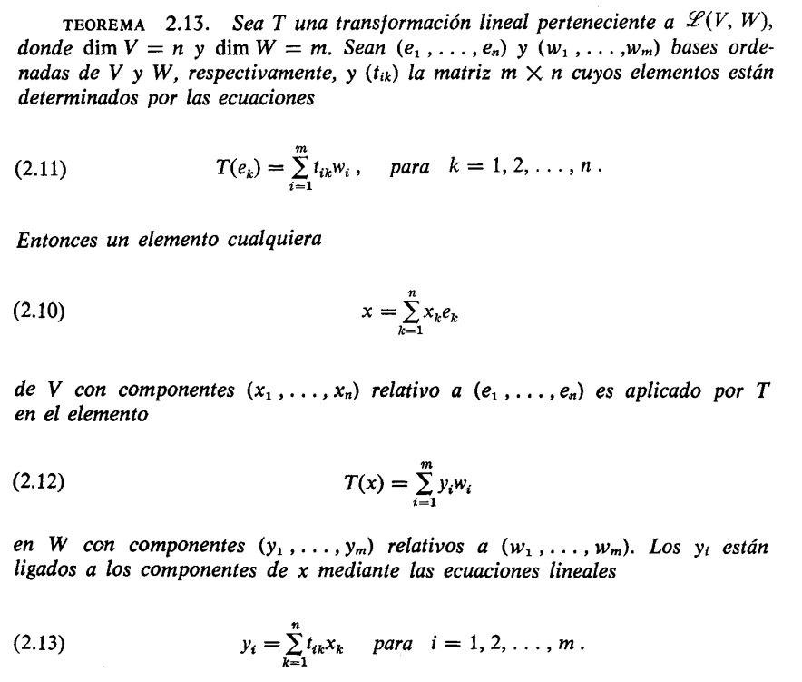

# Matrices

## Transformaciones lineales con valores asignados

Si $V$ es de dimensión finita, siempre podemos construir una transformación lineal $T: V \rightarrow W$ con valores asignados a los elementos base de $V$, como se explica en el teorema siguiente.

> **TEOREMA 2.12.** Sea $e_1, \dots, e_n$ una base para un espacio lineal $n$-dimensional $V$. Sean $u_1, \dots, u_n$, $n$ elementos arbitrarios de un espacio lineal $W$. Existe entonces una y sólo una transformación $T: V \rightarrow W$ tal que
> 
> $$(2.7) \quad T(e_k) = u_k \quad \text{para } k = 1, 2, \dots, n.$$

Esta transformación $T$ aplica un elemento cualquiera $x$ de $V$ del modo siguiente:

$$(2.8) \quad \text{Si } x = \sum_{k=1}^{n} x_k e_k, \text{ entonces } T(x) = \sum_{k=1}^{n} x_k u_k.$$

**Demostración.** Todo $x$ de $V$ puede expresarse en forma única como combinación lineal de $e_1, \dots, e_n$, siendo los multiplicadores $x_1, \dots, x_n$ los componentes de $x$ respecto a la base ordenada $(e_1, \dots, e_n)$. Si definimos $T$ mediante (2.8), conviene comprobar que $T$ es lineal. Si $x = e_k$ para un cierto $k$, entonces todos los componentes de $x$ son 0 excepto el $k$-ésimo, que es 1, con lo que (2.8) da $T(e_k) = u_k$, como queríamos.

Para demostrar que sólo existe una transformación lineal que satisface (2.7), sea $T'$ otra y calculemos $T'(x)$. Encontramos que

$$T'(x) = T' \left( \sum_{k=1}^{n} x_k e_k \right) = \sum_{k=1}^{n} x_k T'(e_k) = \sum_{k=1}^{n} x_k u_k = T(x).$$

Puesto que $T'(x) = T(x)$ para todo $x$ de $V$, tenemos $T' = T$, lo cual completa la demostración.


> Podría resumir todo esto con mis palabras así:
>
>Puedo asignarle valores arbitrarios del conjunto W a la aplicación de la transformación sobre los elementos de la base
>
>Y si un elemento x de V puede escribirse como una combinación lineal de los elementos de la base, la transformación de ese x se puede escribir como una como una combinación lineal de los valores asignados
>
**EJEMPLO 1** Definimos los valores en la base:

$$T(i)=2i \qquad T(j) = j$$
Eso es todo lo que necesitamos especificar. Para cualquier vector $x = x_1 i + x_2 j$:

$$T(x) = x_1 \cdot T(i) + x_2 \cdot T(j) = x_1(2i) + x_2(j) = (2x_1)i + (x_2)j$$

**EJEMPLO 2.** Determinar la transformación lineal $T: V_2 \rightarrow V_2$ que aplique los elementos base $i = (1, 0)$ y $j = (0, 1)$ del modo siguiente

$$T(i) = i + j, \quad T(j) = 2i - j.$$

**Solución.** Si $x = x_1 i + x_2 j$ es un elemento arbitrario de $V_2$, entonces $T(x)$ viene dado por

$$T(x) = x_1 T(i) + x_2 T(j) = x_1(i + j) + x_2(2i - j) = (x_1 + 2x_2)i + (x_1 - x_2)j.$$

## Representación matricial de las transformaciones lineales

Con el teorema de valores asignados pudimos ver que la transformación lineal $T: V \rightarrow W$ está determinada por su acción sobre un conjunto de elementos base $e_1, \dots, e_n$ mediante los valores asignados

Ahora supongamos que el espacio lineal $W$ es de dimensión finita y $dimW = m$ y tenemos una cierta base $w_1, \dots, w_m$ para $W$

> las dimensiones $n$ y $m$ pueden ser o no iguales

Como $T$ tiene los valores en $W$ podemos expresar los valores asignados de la siguiente manera 


$$T(e_k) = \sum_{i = 1}^{m} t_{ik}w_{i}$$


esto es una combinación lineal de los elementos de la base $w_1, \dots, w_m$  de $W$ con los escalares $t_{1k}, \dots, t_{mk}$

por ejemplo

$T(e_1) = t_{11}w_1 + t_{21}w_2 + \dots + t_{m1}w_m$

$T(e_2) = t_{12}w_1 + t_{22}w_2 + \dots + t_{m2}w_m$

cada uno de estos valores asignados se puede representar como un vector columna, de la siguiente manera:


ejemplo para $T(e_1)$

$$T(e_1) = \begin{pmatrix}
t_{11} \\
t_{21} \\
\vdots \\
t_{m1}
\end{pmatrix}$$

vemos que el primer subindice cambia, y es importante cuando escribimos todos los valores asignados $T(e_k)$ uno junto al otro

$$
\begin{pmatrix}
t_{11} & t_{12} & \cdots & t_{1n} \\
t_{21} & t_{22} & \cdots & t_{2n} \\
\vdots & \vdots & \ddots & \vdots \\
t_{m1} & t_{m2} & \cdots & t_{mn}
\end{pmatrix}
$$

vemos que el primer subindice indica la fila y el segundo la columna. También vemos que en la diagonal los subíndices son iguales.

Por lo tanto esto es una matriz de $m \times n$, $m$ filas y $n$ columnas

También podemos hacer referencia a un elemento directo de la matriz así: $t_{ik}$

#### Ejemplo informal pero poderoso

Aun sin ver la definición formal podemos intuir que, como en el ejemplo anterior, podemos armar una matriz con **dos espacios lineales $V$ y $W$** y con los valores asignados que vimos anteriormente. Por lo tanto, podemos tomar cualquier tipo de elementos que cumplan las caracteristicas que nos piden

Ya sabemos que tanto vectores como polinomios de grado $\leq n$ son espacios lienales, entonces armemos una transformación lineal y una matriz 

$T: V \to W$ con $V = \mathbb{R^2}$ y $W = P_3$ Y tenemos que definir las bases para cada conjunto y los valores asignados para cada elemento de la base de $V$, entonces:

- Base de $V$: $\lbrace (1,0), (0,1) \rbrace$
- Base de $W$: $\lbrace 1,x,x^2,x^3 \rbrace$

Y ahora definimos los valores asignados, PERO OJO 👀, si vemos el teorema de mas arriba no nos exige ni siquiera saber la base de $V$, solo necesitamos escribir los valores asignados para cada elemento así:

- $T(e_1)$ = $1 + x$
- $T(e_2)$ = $x^2 + x^3$

observemos que los valores asignados están en términos de los elementos de $W$, y ahora podemos armar la matriz ya que:

- $T(e_1)$ = $1 + x$ = $1 \cdot 1 + 1x + 0x^2 + 0x^3 \quad$ es decir, estamos encotrando los coeficientes para cada elemento de la base de $W$ después de establecer los valores asignados.

- $T(e_2)$ = $x^2 + x^3$ = $0 \cdot 1 + 0x + 1x^2 + 1x^3$

osea

$$T(e_1) = \begin{pmatrix}
1 \\
1\\
0 \\
0
\end{pmatrix}$$

$$T(e_2) = \begin{pmatrix}
0 \\
0\\
1 \\
1
\end{pmatrix}$$

entonces ya podemos armar la matriz

$$
\begin{pmatrix}
1 & 0 \\
1 & 0 \\
0 & 1 \\
0 & 1
\end{pmatrix}
$$

ahora calculemos un elemento puntual usando la transformación, recordando lo que vimos anteriormente, cualquier elemento de $V$ se puede escribir como $x = x_1e_1 + x_2e_2$, y por la linealidad terminaremos aplicando los valores asignados, entonces:

$$T((3,2)) = 3T(e_1) + 2T(e_2)$$
$$T((3,2)) = 3(1 + x) + 2(x^2 + x^3)$$

donde

$$T((3,2)) = 3 + 3x + 2x^2 + 2x^3$$

Lo cual nos da como resultado un polinomio de grado 3, pero eso no es lo mas sorprendente. Simplemente pudimos haber usado la matriz para calcular esto así:

```math
\begin{pmatrix} 1 & 0 \\ 1 & 0 \\ 0 & 1 \\ 0 & 1 \end{pmatrix}
\begin{pmatrix} 3 \\ 2 \end{pmatrix}
=
\begin{pmatrix} 3 \\ 3 \\ 2 \\ 2 \end{pmatrix}
```

Se que en este punto no conocemos el producto de matrices, pero veamos que esa operacion equivale al polinomio $3 + 3x + 2x^2 + 2x^3$

#### Sutilezas 

Antes de la definición formal podemos encontrar varios puntos sutiles

Como vimos anteriormente para armar la matriz introdujimos los valores asignados de como una combinación lineal de los valores de W, pero estos **no aparecen por ningún lado en la matriz resultante**. Y esto lo podemos interpretar de la siguiente manera 

recordando la forma en que se escriben los vectores, siempre hay una base canónica "por debajo", así:

$$3(1,0,0) + 2(0,1,0) + 4(0,0,1) = (3,2,4)$$

Pero podemos simplemente escribir el vector $(3,2,4)$ y obviar la base...

Lo mismo pasa con las matrices, solo vamos a encontrar los coeficientes en la matriz, pero debajo está la base. Y esto es muy importante porque la base es la que nos da el "orden" de como van a aparecer los elementos en la matriz. No es igual formarla tomando los valores asignados primero por el último elemento de la base de $V$ que por el primero.


También vale la pena resaltar que en el ejemplo anterior solamente puede exitir una transformación que actúe sobre los valores asignados de esta manera 

- $T(e_1)$ = $1 + x$
- $T(e_2)$ = $x^2 + x^3$

tal y como lo menciona el teorema de valores asignados.

---


"Así pues, toda transformación lineal $T$ de un espacio $n$-dimensional $V$ 
en un espacio $m$-dimensional $W$ da origen a una matriz $m \times n$ 
$(t_{ik})$ cuyas columnas son los componentes de $T(e_1), \ldots, T(e_n)$ 
relativos a la base $(w_1, \ldots, w_m)$. La llamamos **representación 
matricial** de $T$ relativa a unas bases ordenadas $(e_1, \ldots, e_n)$ de $V$ 
y $(w_1, \ldots, w_m)$ para $W$. 

Una vez conocida la matriz $(t_{ik})$, los 
componentes de un elemento cualquiera $T(x)$ con relación a la base 
$(w_1, \ldots, w_m)$ pueden determinarse como se explica en el teorema 
que sigue." - Cálculo Tom M. Apostol Vol 2 pag. 57


