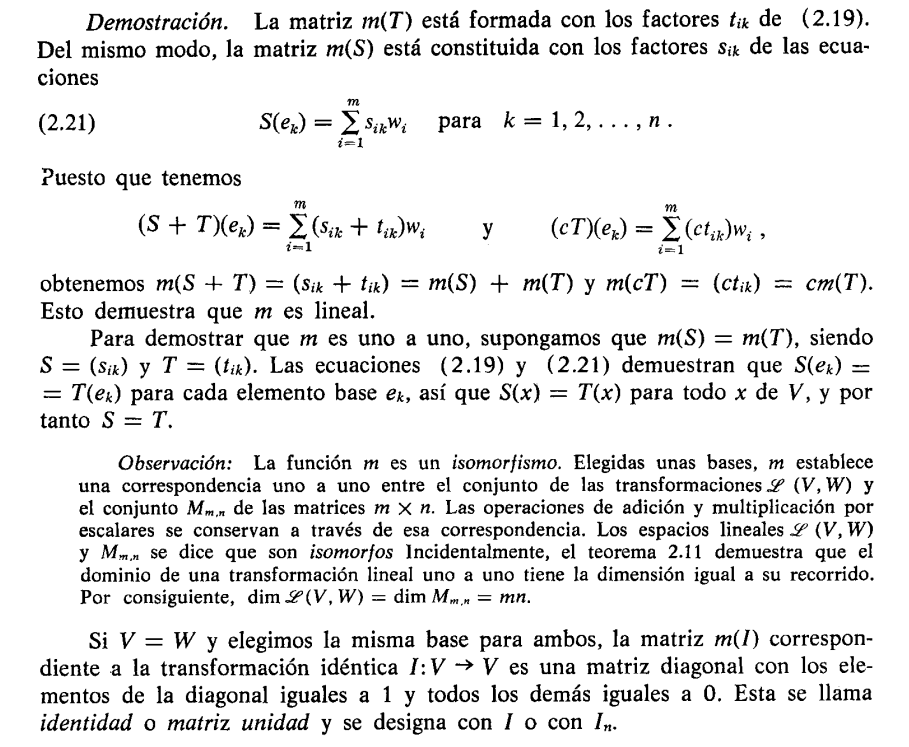
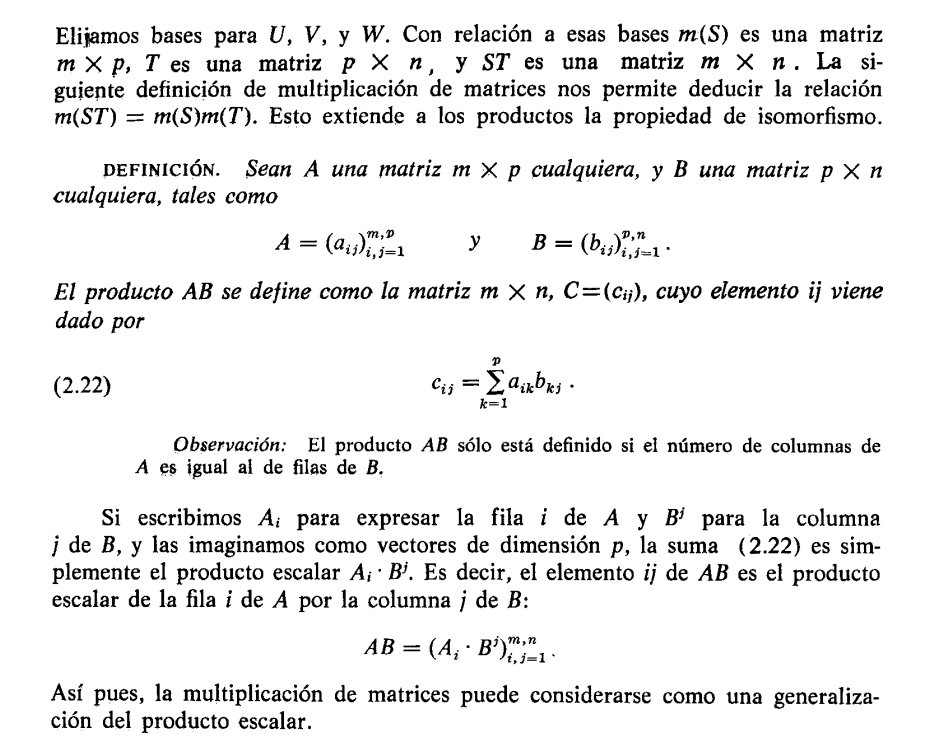
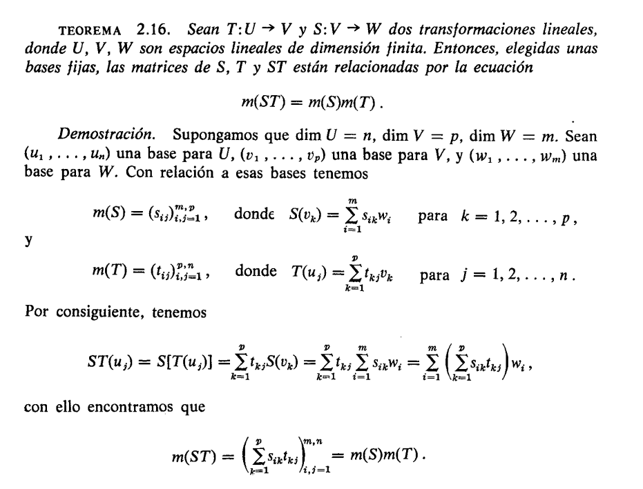

# Matrices

## Transformaciones lineales con valores asignados

Si $V$ es de dimensión finita, siempre podemos construir una transformación lineal $T: V \rightarrow W$ con valores asignados a los elementos base de $V$, como se explica en el teorema siguiente.

> **TEOREMA 2.12.** Sea $e_1, \dots, e_n$ una base para un espacio lineal $n$-dimensional $V$. Sean $u_1, \dots, u_n$, $n$ elementos arbitrarios de un espacio lineal $W$. Existe entonces una y sólo una transformación $T: V \rightarrow W$ tal que
> 
> $$(2.7) \quad T(e_k) = u_k \quad \text{para } k = 1, 2, \dots, n.$$

Esta transformación $T$ aplica un elemento cualquiera $x$ de $V$ del modo siguiente:

$$(2.8) \quad \text{Si } x = \sum_{k=1}^{n} x_k e_k, \text{ entonces } T(x) = \sum_{k=1}^{n} x_k u_k.$$

**Demostración.** Todo $x$ de $V$ puede expresarse en forma única como combinación lineal de $e_1, \dots, e_n$, siendo los multiplicadores $x_1, \dots, x_n$ los componentes de $x$ respecto a la base ordenada $(e_1, \dots, e_n)$. Si definimos $T$ mediante (2.8), conviene comprobar que $T$ es lineal. Si $x = e_k$ para un cierto $k$, entonces todos los componentes de $x$ son 0 excepto el $k$-ésimo, que es 1, con lo que (2.8) da $T(e_k) = u_k$, como queríamos.

Para demostrar que sólo existe una transformación lineal que satisface (2.7), sea $T'$ otra y calculemos $T'(x)$. Encontramos que

$$T'(x) = T' \left( \sum_{k=1}^{n} x_k e_k \right) = \sum_{k=1}^{n} x_k T'(e_k) = \sum_{k=1}^{n} x_k u_k = T(x).$$

Puesto que $T'(x) = T(x)$ para todo $x$ de $V$, tenemos $T' = T$, lo cual completa la demostración.


> Podría resumir todo esto con mis palabras así:
>
>Puedo asignarle valores arbitrarios del conjunto W a la aplicación de la transformación sobre los elementos de la base
>
>Y si un elemento x de V puede escribirse como una combinación lineal de los elementos de la base, la transformación de ese x se puede escribir como una como una combinación lineal de los valores asignados
>
**EJEMPLO 1** Definimos los valores en la base:

$$T(i)=2i \qquad T(j) = j$$
Eso es todo lo que necesitamos especificar. Para cualquier vector $x = x_1 i + x_2 j$:

$$T(x) = x_1 \cdot T(i) + x_2 \cdot T(j) = x_1(2i) + x_2(j) = (2x_1)i + (x_2)j$$

**EJEMPLO 2.** Determinar la transformación lineal $T: V_2 \rightarrow V_2$ que aplique los elementos base $i = (1, 0)$ y $j = (0, 1)$ del modo siguiente

$$T(i) = i + j, \quad T(j) = 2i - j.$$

**Solución.** Si $x = x_1 i + x_2 j$ es un elemento arbitrario de $V_2$, entonces $T(x)$ viene dado por

$$T(x) = x_1 T(i) + x_2 T(j) = x_1(i + j) + x_2(2i - j) = (x_1 + 2x_2)i + (x_1 - x_2)j.$$

## Representación matricial de las transformaciones lineales

Con el teorema de valores asignados pudimos ver que la transformación lineal $T: V \rightarrow W$ está determinada por su acción sobre un conjunto de elementos base $e_1, \dots, e_n$ mediante los valores asignados

Ahora supongamos que el espacio lineal $W$ es de dimensión finita y $dimW = m$ y tenemos una cierta base $w_1, \dots, w_m$ para $W$

> las dimensiones $n$ y $m$ pueden ser o no iguales

Como $T$ tiene los valores en $W$ podemos expresar los valores asignados de la siguiente manera 


$$T(e_k) = \sum_{i = 1}^{m} t_{ik}w_{i}$$


esto es una combinación lineal de los elementos de la base $w_1, \dots, w_m$  de $W$ con los escalares $t_{1k}, \dots, t_{mk}$

por ejemplo

$T(e_1) = t_{11}w_1 + t_{21}w_2 + \dots + t_{m1}w_m$

$T(e_2) = t_{12}w_1 + t_{22}w_2 + \dots + t_{m2}w_m$

cada uno de estos valores asignados se puede representar como un vector columna, de la siguiente manera:


ejemplo para $T(e_1)$

$$T(e_1) = \begin{pmatrix}
t_{11} \\
t_{21} \\
\vdots \\
t_{m1}
\end{pmatrix}$$

vemos que el primer subindice cambia, y es importante cuando escribimos todos los valores asignados $T(e_k)$ uno junto al otro

$$
\begin{pmatrix}
t_{11} & t_{12} & \cdots & t_{1n} \\
t_{21} & t_{22} & \cdots & t_{2n} \\
\vdots & \vdots & \ddots & \vdots \\
t_{m1} & t_{m2} & \cdots & t_{mn}
\end{pmatrix}
$$

vemos que el primer subindice indica la fila y el segundo la columna. También vemos que en la diagonal los subíndices son iguales.

Por lo tanto esto es una matriz de $m \times n$, $m$ filas y $n$ columnas

También podemos hacer referencia a un elemento directo de la matriz así: $t_{ik}$ o $(t_{ik})_{i,k = 1}^{m,n}$

#### Ejemplo informal pero poderoso

Aun sin ver la definición formal podemos intuir que, como en el ejemplo anterior, podemos armar una matriz con **dos espacios lineales $V$ y $W$** y con los valores asignados que vimos anteriormente. Por lo tanto, podemos tomar cualquier tipo de elementos que cumplan las caracteristicas que nos piden

Ya sabemos que tanto vectores como polinomios de grado $\leq n$ son espacios lienales, entonces armemos una transformación lineal y una matriz 

$T: V \to W$ con $V = \mathbb{R^2}$ y $W = P_3$ Y tenemos que definir las bases para cada conjunto y los valores asignados para cada elemento de la base de $V$, entonces:

- Base de $V$: $\lbrace (1,0), (0,1) \rbrace$
- Base de $W$: $\lbrace 1,x,x^2,x^3 \rbrace$

Y ahora definimos los valores asignados, PERO OJO 👀, si vemos el teorema de mas arriba no nos exige ni siquiera saber la base de $V$, solo necesitamos escribir los valores asignados para cada elemento así:

- $T(e_1)$ = $1 + x$
- $T(e_2)$ = $x^2 + x^3$

observemos que los valores asignados están en términos de los elementos de $W$, y ahora podemos armar la matriz ya que:

- $T(e_1)$ = $1 + x$ = $1 \cdot 1 + 1x + 0x^2 + 0x^3 \quad$ es decir, estamos encotrando los coeficientes para cada elemento de la base de $W$ después de establecer los valores asignados.

- $T(e_2)$ = $x^2 + x^3$ = $0 \cdot 1 + 0x + 1x^2 + 1x^3$

osea

$$T(e_1) = \begin{pmatrix}
1 \\
1\\
0 \\
0
\end{pmatrix}$$

$$T(e_2) = \begin{pmatrix}
0 \\
0\\
1 \\
1
\end{pmatrix}$$

entonces ya podemos armar la matriz

$$
\begin{pmatrix}
1 & 0 \\
1 & 0 \\
0 & 1 \\
0 & 1
\end{pmatrix}
$$

ahora calculemos un elemento puntual usando la transformación, recordando lo que vimos anteriormente, cualquier elemento de $V$ se puede escribir como $x = x_1e_1 + x_2e_2$, y por la linealidad terminaremos aplicando los valores asignados, entonces:

$$T((3,2)) = 3T(e_1) + 2T(e_2)$$
$$T((3,2)) = 3(1 + x) + 2(x^2 + x^3)$$

donde

$$T((3,2)) = 3 + 3x + 2x^2 + 2x^3$$

Lo cual nos da como resultado un polinomio de grado 3, pero eso no es lo mas sorprendente. Simplemente pudimos haber usado la matriz para calcular esto así:

```math
\begin{pmatrix} 1 & 0 \\ 1 & 0 \\ 0 & 1 \\ 0 & 1 \end{pmatrix}
\begin{pmatrix} 3 \\ 2 \end{pmatrix}
=
\begin{pmatrix} 3 \\ 3 \\ 2 \\ 2 \end{pmatrix}
```

Se que en este punto no conocemos el producto de matrices, pero veamos que esa operacion equivale al polinomio $3 + 3x + 2x^2 + 2x^3$

#### Sutilezas 

Antes de la definición formal podemos encontrar varios puntos sutiles

Como vimos anteriormente para armar la matriz introdujimos los valores asignados de $V$ como una combinación lineal de los valores de W, pero estos **no aparecen por ningún lado en la matriz resultante**. Y esto lo podemos interpretar de la siguiente manera 

recordando la forma en que se escriben los vectores, siempre hay una base canónica "por debajo", así:

$$3(1,0,0) + 2(0,1,0) + 4(0,0,1) = (3,2,4)$$

Pero podemos simplemente escribir el vector $(3,2,4)$ y obviar la base...

Lo mismo pasa con las matrices, solo vamos a encontrar los coeficientes en la matriz, pero debajo está la base. Y esto es muy importante porque la base es la que nos da el "orden" de como van a aparecer los elementos en la matriz. No es igual formarla tomando los valores asignados primero por el último elemento de la base de $V$ que por el primero.


También vale la pena resaltar que en el ejemplo anterior solamente puede exitir una transformación que actúe sobre los valores asignados de esta manera 

- $T(e_1)$ = $1 + x$
- $T(e_2)$ = $x^2 + x^3$

tal y como lo menciona el teorema de valores asignados.

---


"Así pues, toda transformación lineal $T$ de un espacio $n$-dimensional $V$ 
en un espacio $m$-dimensional $W$ da origen a una matriz $m \times n$ 
$(t_{ik})$ cuyas columnas son los componentes de $T(e_1), \ldots, T(e_n)$ 
relativos a la base $(w_1, \ldots, w_m)$. La llamamos **representación 
matricial** de $T$ relativa a unas bases ordenadas $(e_1, \ldots, e_n)$ de $V$ 
y $(w_1, \ldots, w_m)$ para $W$. 

Una vez conocida la matriz $(t_{ik})$, los 
componentes de un elemento cualquiera $T(x)$ con relación a la base 
$(w_1, \ldots, w_m)$ pueden determinarse como se explica en el teorema 
que sigue." - Cálculo Tom M. Apostol Vol 2 pag. 57


---

Ahora bien, el recíproco también es cierto. Podemos partir desde una disposición de $mn$ escalares que formen una matriz rectangular $t_{ik}$ y elegimos un par de bases ordenadas para $V$ y $W$ existe una transformación lineal que tiene esa representación matricial.

#### Por ejemplo

Construcción de una transformación lineal a partir de una matriz dada. Supongamos que disponemos de la matriz $2 \times 3$

```math
\begin{pmatrix} 3 & 1 & -2 \\ 1 & 0 & 4 \end{pmatrix}
```

Elijamos las bases usuales de vectores coordenados unitarios para $V_2$ y $V_3$. Entonces la matriz dada representa una transformación lineal $T: V_3 \to V_2$. que aplica un vector cualquiera $(x_1, x_2, x_3)$ de $V_3$ en el vector $(y_1, y_2)$ de $V_2$ de acuerdo con
las ecuaciones lineales:

$$y_1 = 3x_1 + x_2 - 2x_3$$

$$y_2 = x_1 + 0x_2 + 4x_3$$

Analicemos:

El texto nos propone esa matriz. Ya sabemos que cada columna fue producto de un valor asignado, y podemos ver que hay tres columnas entonces estamos hablando de una base de un espacio lineal de $dimV = 3$

Es muy importante recalcar la frase "**Elijamos las bases usuales**" ya que en otras palabras está diciendo que los valores asignados son solamente una combinación lineal así:

- $T(e_1) = 3(w_1) + 1(w_2)$
- $T(e_2) = 1(w_1) + 0(w_2)$
- $T(e_3) = -2(w_1) + 4(w_2)$

Donde $w_1 = (1,0) \quad w_2 = (0,1)$, osea que obtenemos los mismos vectores y armamos de nuevo la matriz.

Entonces para un vector cualquiera $x = (x_1, x_2, x_3)$ si aplicamos la transformación lo hacemos teniendo en cuenta la base, osea que escribimos el vector así

$$T(x_1e_1 + x_2e_2 + x_3e_3)$$

Y aplicamos la linealidad de la transformación

$$T(x_1e_1 + x_2e_2 + x_3e_3) = x_1T(e_1) + x_2T(e_2) + x_3T(e_3)$$

y finalmente reemplazamos los valores asignados

$T(x_1e_1 + x_2e_2 + x_3e_3) = x_1(3(w_1) + 1(w_2)) + x_2(1(w_1) + 0(w_2)) + x_3(-2(w_1) + 4(w_2))$

$T(x_1e_1 + x_2e_2 + x_3e_3) = x_1(3(1,0) + 1(0,1)) + x_2(1(1,0) + 0(0,1)) + x_3(-2(1,0) + 4(0,1))$

$T(x_1e_1 + x_2e_2 + x_3e_3) = x_1(3,1) + x_2(1,0) + x_3(-2, 4)$

$T(x_1e_1 + x_2e_2 + x_3e_3) = (3x_1 + x_2 - 2x_3, x_1 + 0x_2 + 4x_3)$


si tomamos ese ultimo resultado por cada componente obtenemos lo mismo de arriba

$$y_1 = 3x_1 + x_2 - 2x_3$$

$$y_2 = x_1 + 0x_2 + 4x_3$$

esto lo utilizaremsos mas adelante

#### Ejemplo 2

Ahora el texto nos propone un ejercicio muy interesante, tenemos:

- El espacio lineal $V$ con todos los polinomios reales $p(x)$ de grado $\leq 3$ de dimensión $4$, con la base $(1,x,x^2,x^3)$
- El operador $D$ de derivación que aplica cada polinomio $p(x)$ de $V$ en su derivada $p'(x)$. Podemos considerar $D$ como una transformación lineal de $V$ en $W$ 
- Por lo tanto el espacio lineal $W$ es el espacio lineal de todos los polinomios de grado $\leq 2$
- En $W$ exigimos la base $(1,x,x^2)$

Entonces, para encontrar la representación matricial de $D$ realitva a esas bases, transformamos (derivamos) cada elemento base de $V$ y lo representamos como una combinación lineal de los elemnetos de $W$


- $D(1) = 0 \cdot 1 + 0x + 0x^2$ 
- $D(x) = 1 \cdot 1 + 0x + 0x^2$ 
- $D(x^2) = 0 \cdot 1 + 2x + 0x^2$ 
- $D(x^3) = 0 \cdot 1 + 0x + 3x^2$ 


Como vimos anteriormente los coeficientes de (en este caso) cada polinimio representan los elementos de la matriz $3 \times 4$

```math
\begin{pmatrix} 0 & 1 & 0 & 0 \\ 0 & 0 & 2 & 0 \\ 0 & 0 & 0 & 3 \end{pmatrix}
```

¿para qué nos puede servir esta matriz? personalmente me pareció interesante lo siguiente:

Si hacemos el desarrollo para un elemento de $V$ cualquiera por ejemplo $x = 0 \cdot 1 + 0x + \frac{5}{3}x^2 + 7x^3$ y aplicamos la transformación obtenemos

$D(\frac{5}{3}x^2 + 7x^3) = \frac{5}{3}D(x^2) + 7D(x^3)$ y usamos los valores asignados

$D(\frac{5}{3}x^2 + 7x^3) = \frac{5}{3}(2x) + 7(3x^2)$ 

$D(\frac{5}{3}x^2 + 7x^3) = \frac{10}{3}x + 21x^2$ 

y vemos que obviamente vamos a obtener la derivada, ya que por la linealidad de la tranformación la aplicamos directamente en los valores asignados

ahora, si hacemos esta multiplicación matriz-vector

```math
\begin{pmatrix} 0 & 1 & 0 & 0 \\ 0 & 0 & 2 & 0 \\ 0 & 0 & 0 & 3 \end{pmatrix} \begin{pmatrix} 0 \\ 0 \\ 5/3 \\ 7\end{pmatrix} = \begin{pmatrix} 0 \\ 10/3 \\ 21\end{pmatrix}
```

lo cual corresponde con la derivada, ya que el resultado vive en $W$ y corresponde a la base $\lbrace 1, x, x^2 \rbrace$ de la siguiente manera

$$0 \cdot 1 + \frac{10}{3}x + 21x^2$$

Ahora para dejar en evidencia como la base es importante aunque no aparezca en el resultado visible de la matriz, invirtamos el orden de la base $(x^2,x,1)$ y generemosla 

- $D(1) = 0x^2 + 0x + 0 \cdot 1$
- $D(x) = 0x^2 + 0x + 1 \cdot 1 $
- $D(x^2) = 0x^2 + 2x + 0 \cdot 1$ 
- $D(x^3) = 3x^2 + 0x + 0 \cdot 1$ 


```math
\begin{pmatrix} 0 & 0 & 0 & 3 \\ 0 & 0 & 2 & 0 \\ 0 & 1 & 0 & 0 \end{pmatrix}
```

vemos que el resultado de la matriz también aparece en ornden inverso. Y si hacemos la multiplicación como antes 


```math
\begin{pmatrix} 0 & 0 & 0 & 3 \\ 0 & 0 & 2 & 0 \\ 0 & 1 & 0 & 0 \end{pmatrix} \begin{pmatrix} 0 \\ 0 \\ 5/3 \\ 7\end{pmatrix} = \begin{pmatrix} 21 \\ 10/3 \\ 0\end{pmatrix}
```

obtenemos el orden inverso, y eso está bien ya que la base también se invirtió entonces los escalares del resultado corresponden correctamente a la base. Es muy importante tener en cuenta que lo que cambió fue la base de $W$ pero no la de $V$ por eso el argumento sigue siendo el mismo.

#### Ejemplo 3 — una tercera representación de $D$ (ahora la base de $V$ no es canónica)

Ahora el texto nos propone calcular una **tercera** representación matricial del operador derivación $D$, pero con un una base diferente para $V$, tenemos entonces:

- El espacio lineal $V$ con todos los polinomios reales de grado $\leq 3$, pero ahora con la base $(1,\ 1+x,\ 1+x+x^2,\ 1+x+x^2+x^3)$
- El espacio lineal $W$ de los polinomios de grado $\leq 2$, con la base usual $(1, x, x^2)$
- El operador $D$ que aplica cada polinomio en su derivada

Llamemos a los elementos de la base de $V$ así:

- $e_1 = 1$
- $e_2 = 1+x$
- $e_3 = 1+x+x^2$
- $e_4 = 1+x+x^2+x^3$

Entonces, igual que antes, transformamos (derivamos) cada elemento base de $V$ y lo escribimos como combinación lineal de los elementos de $W$:

- $D(e_1) = D(1) = 0 = 0 \cdot 1 + 0x + 0x^2$
- $D(e_2) = D(1+x) = 1 = 1 \cdot 1 + 0x + 0x^2$
- $D(e_3) = D(1+x+x^2) = 1 + 2x = 1 \cdot 1 + 2x + 0x^2$
- $D(e_4) = D(1+x+x^2+x^3) = 1 + 2x + 3x^2 = 1 \cdot 1 + 2x + 3x^2$

Cada uno de estos valores asignados es un vector columna respecto a la base $(1, x, x^2)$ de $W$:

$$D(e_1) = \begin{pmatrix} 0 \\ 0 \\ 0 \end{pmatrix} \quad
D(e_2) = \begin{pmatrix} 1 \\ 0 \\ 0 \end{pmatrix} \quad
D(e_3) = \begin{pmatrix} 1 \\ 2 \\ 0 \end{pmatrix} \quad
D(e_4) = \begin{pmatrix} 1 \\ 2 \\ 3 \end{pmatrix}$$

Y poniendo las columnas una junto a la otra armamos la matriz $3 \times 4$:

```math
\begin{pmatrix} 0 & 1 & 1 & 1 \\ 0 & 0 & 2 & 2 \\ 0 & 0 & 0 & 3 \end{pmatrix}
```

que es exactamente la que muestra el libro.

> Comparemos con la representación canónica del Ejemplo 2:
> ```math
> \begin{pmatrix} 0 & 1 & 0 & 0 \\ 0 & 0 & 2 & 0 \\ 0 & 0 & 0 & 3 \end{pmatrix}
> ```
> Es la **misma transformación $D$**, pero la matriz cambió solo por haber cambiado la base de $V$. Esto refuerza lo que hemos visto durante este capítulo: la matriz no es "la transformación", es la transformación **vista a través de un par de bases**.

#### Verificación con un elemento concreto

Tomemos un polinomio cualquiera de $V$, por ejemplo:

$$p(x) = 5 + 4x + 2x^2 + x^3$$

Calculemos primero su derivada "a mano", que es lo que debería darnos al final:

$$D(p) = 4 + 4x + 3x^2$$

Ahora quiero obtener esto mismo con la multiplicación matriz-vector. Y aquí está **lo importante**: el vector columna que metemos NO son los coeficientes de los monomios de $p(x)$. Son las componentes de $p(x)$ **respecto a la base de $V$**, que ya no es canónica.

Es decir, tengo que encontrar los $c_1, c_2, c_3, c_4$ tales que:

$$p(x) = c_1 e_1 + c_2 e_2 + c_3 e_3 + c_4 e_4$$

Obtenemos esto 

$$p(x) = c_1(1) + c_2(1+x) + c_3(1+x+x^2) + c_4(1+x+x^2+x^3)$$

$$p(x) = (c_1 + c_2 + c_3 + c_4) + (c_2 + c_3 + c_4)x + (c_3 + c_4)x^2 + c_4 x^3$$

después tenemos que encontrar esas constantes igualando coeficiente a coeficiente con $p(x) = 5 + 4x + 2x^2 + x^3$, lo resolvemos "de arriba hacia abajo" empezando por el grado más alto:

- $x^3$: $c_4 = 1$
- $x^2$: $c_3 + c_4 = 2 \Rightarrow c_3 = 1$
- $x^1$: $c_2 + c_3 + c_4 = 4 \Rightarrow c_2 = 2$
- $x^0$: $c_1 + c_2 + c_3 + c_4 = 5 \Rightarrow c_1 = 1$

Entonces las componentes de $p(x)$ en la base de $V$ son $(1, 2, 1, 1)$, y **ese** es el vector que va en la columna:

```math
\begin{pmatrix} 0 & 1 & 1 & 1 \\ 0 & 0 & 2 & 2 \\ 0 & 0 & 0 & 3 \end{pmatrix}
\begin{pmatrix} 1 \\ 2 \\ 1 \\ 1 \end{pmatrix}
=
\begin{pmatrix} 4 \\ 4 \\ 3 \end{pmatrix}
```

El resultado vive en $W$ con la base $(1, x, x^2)$, así que se interpreta como:

$$4 \cdot 1 + 4x + 3x^2 = 4 + 4x + 3x^2$$

que coincide exactamente con la derivada que calculamos a mano. 🎯

#### La trampa (por qué la base de $V$ sí importa)

Aprovechando el mismo ejemplo donde antes mostré que la base de $W$ ordena el resultado, ahora la base de $V$ nos enseña otra cosa: **ordena la entrada**.

¿Qué hubiera pasado si, por descuido, hubiera metido los coeficientes de los monomios de $p(x) = 5 + 4x + 2x^2 + x^3$, o sea $(5, 4, 2, 1)$, como si la base de $V$ fuera la canónica?

```math
\begin{pmatrix} 0 & 1 & 1 & 1 \\ 0 & 0 & 2 & 2 \\ 0 & 0 & 0 & 3 \end{pmatrix}
\begin{pmatrix} 5 \\ 4 \\ 2 \\ 1 \end{pmatrix}
=
\begin{pmatrix} 7 \\ 6 \\ 3 \end{pmatrix}
\;\Rightarrow\; 7 + 6x + 3x^2
```

Eso **no es la derivada de $p(x)$**. Es un resultado completamente equivocado, porque le estoy dando a la matriz componentes que están en una base distinta a la que la matriz "espera".

Y esto cierra simétricamente la idea de los apuntes anteriores:

- La base de $W$ no aparece en la matriz, pero **ordena cómo se lee la salida**.
- La base de $V$ tampoco aparece en la matriz, pero **ordena cómo se debe escribir la entrada**.

La matriz es solo la tabla de coeficientes "desnuda". Las dos bases están por debajo, invisibles, una a cada lado, y son las que le dan sentido tanto a lo que entra como a lo que sale.

## Representación matricial en forma de diagonal

En el ejemplo anterior vimos que podemos usar una base diferente para generar la matriz. En esta sección vamos a hacer eso mismo, pero esta vez para generar una matriz que tiene solamente numeros $1$ en la diagonal desde la esquina superior izquierda hasta la esquina inferior derecha, el resto con números $0$, **siendo el número de unos igual al rango de la transformación**.

Osea que, Una matriz $(t_{ik})$ con todos los elementos $t_{ik} = O$ cuando $i \neq k$ se llama matriz diagonal. Y el teorema aparece así:


- Sean $V$ y $W$ dos espacios lineales de dimensión finita $dimV = n \quad$ $dimW = m$
- Supongamos que $T \in \mathscr{L}(V, W)$ 
- También que $r = dim T(V)$, el rango de $T$

existe entonces una base $(e_1, \dots, e_n)$ para $V$ y otra $(w_1, \dots, w_n)$ para $W$ tales que:

$$T(e_i) = w_i \quad para \quad i = 1,2, \dots, r$$

$$T(e_i) = 0 \quad para \quad i = r+1, \dots, n$$

Por consiguiente, la matriz t_{ik} de $T$ relativa a esas bases tiene todos los elementos cero excepto los $r$ elementos de la diagonal que valen

$$t_{11} = t_{22} = \dots = t_{rr} = 1$$

> Ver demostración en Cálculo de Tom M. Apostol Vol 2 - pág 60

#### Ejemplo del libro

Veamos un ejemplo de este teorema en acción. Retomemos el ejemplo de la transformación con la derivada.

- Esa transformación aplica el espacio $V$ de los plonomios de grado $\leq 3$ al espacio $W$ de los polinomios de grado $\leq 2$
- También el recorrido $T(V) = W$ (ya que al derivar un polinomio de grado $\leq 3$ el resultado siempre está en $W$)
- Tiene rango $3$, ya que $dimW = 3$, tomando la base canónica $(1,x,x^2)$

Entonces siguiendo la lógica del teorema hacemos los siguiente:

1. tomamos una base para $W$, en este caso $(1,x,x^2)$
2. un conjunto de polinomios de $V$ que se aplica sobre esos elementos es $(x, \frac{1}{2}x^2, \frac{1}{3}x^3)$, es decir, al derivar esos polinomios obtengo la base de $W$
3. tomo ese conjunto y le agrego el polinomio constante $1$, que es una base para el núcleo de $D$. Esto porque al derivar $1$ siempre me lleva al cero del conjunto de llegada, lo cual corresponde a la definición de núcleo
4. obtenemos el conjunto $(x, \frac{1}{2}x^2, \frac{1}{3}x^3, 1)$ la cual es una base para $V$


Entonces si usamos:

- La base para $V$ así: $(x, \frac{1}{2}x^2, \frac{1}{3}x^3, 1)$
- La base para $W$ así: $(1,x,x^2)$

y construímos la matriz:


- $T(e_1 = x) = 1 \cdot 1 + 0x + 0x^2$
- $T(e_2 = \frac{1}{2}x^2) = 0 \cdot 1 + 1x + 0x^2$
- $T(e_3 = \frac{1}{3}x^3) = 0 \cdot 1 + 0x + 1x^2$
- $T(e_4 = 1) = 0 \cdot 1 + 0x + 0x^2$

Por lo tanto queda así:


```math
\begin{pmatrix} 1 & 0 & 0 & 0 \\ 0 & 1 & 0 & 0 \\ 0 & 0 & 1 & 0 \end{pmatrix}
```

#### Ejemplo: proyección sobre un plano en $\mathbb{R}^3$

Define $T : \mathbb{R}^3 \to \mathbb{R}^3$ como la proyección sobre el plano $xy$:

$$T(x, y, z) = (x, y, 0)$$

Primero identificamos los datos:

- $\dim V = 3$, $\dim W = 3$
- $T(V) = \{(x, y, 0) \mid x, y \in \mathbb{R}\}$, que es el plano $xy$
- $r = \dim T(V) = 2$
- El núcleo de $T$ es $\{(0, 0, z) \mid z \in \mathbb{R}\}$, el eje $z$, con dimensión $1$

> **Verificación rango-nulidad:** $r + \dim(\text{núcleo}) = 2 + 1 = 3 = \dim V$

Ahora construimos las bases siguiendo la estrategia del teorema: primero la base de $T(V)$, luego levantamos preimágenes a $V$, y finalmente completamos con el núcleo.

**Paso 1.** Escogemos una base para $T(V)$:

$$(w_1, w_2) = \big((1,0,0),\ (0,1,0)\big)$$

**Paso 2.** Buscamos preimágenes en $V$. Necesitamos $e_1, e_2 \in \mathbb{R}^3$ tales que $T(e_i) = w_i$:

$$e_1 = (1, 0, 0) \quad \Rightarrow \quad T(e_1) = (1,0,0) = w_1$$

$$e_2 = (0, 1, 0) \quad \Rightarrow \quad T(e_2) = (0,1,0) = w_2$$

**Paso 3.** Completamos con una base del núcleo. El núcleo tiene dimensión $1$, así que necesitamos un solo vector. Cualquier vector de la forma $(0,0,z)$ con $z \neq 0$ sirve, tomamos el más simple:

$$e_3 = (0, 0, 1) \quad \Rightarrow \quad T(e_3) = (0,0,0)$$

**Paso 4.** La base para $V$ queda:

$$(e_1, e_2, e_3) = \big((1,0,0),\ (0,1,0),\ (0,0,1)\big)$$

> **OJO 👀** En este caso la base construida coincide con la canónica de $\mathbb{R}^3$, lo cual tiene sentido porque la transformación ya era "limpia" con esa base. Esto no siempre pasa.

Construimos la matriz expresando cada $T(e_i)$ en términos de la base $(w_1, w_2)$ de $W$:

- $T(e_1) = 1 \cdot w_1 + 0 \cdot w_2$
- $T(e_2) = 0 \cdot w_1 + 1 \cdot w_2$
- $T(e_3) = 0 \cdot w_1 + 0 \cdot w_2$

Por lo tanto queda así:

```math
\begin{pmatrix} 1 & 0 & 0 \\ 0 & 1 & 0 \end{pmatrix}
```

Los $r = 2$ unos en la diagonal, el resto cero. Exactamente lo que predice el teorema.

## Espacio lineal de matrices

Calculo de Tom M. Apostol Vol 2 - pag 65

Ya vimos como las matrices se presentan espontáneamente como representaciones de las transformaciones lineales. También se pueden considerar las matrices como elementos existentes con independencia de las tranformaciones lineales. Como tales elementos, forman otra clase de objetos matemáticos que pueden definirse por medio de las operaciones algebraicas que pueden realizarse con ellos. La relación con las transformaciones lineales da origen a esas definiciones, pero **tal relación será por el momento ignorada**.

Es decir en este punto se están definiendo las matrices desde otro enfoque, que si bien fueron inspiradas desde las tranformaciones lineales con valores asignados, en este momento se dispondrá solamente un cuadrado con filas y columnas que contienen elementos, así:

Sean $m$ y $n$ dos enteros positivos y sea $I_{m,n}$ el conjunto de todos los pares enteros $(i,j)$ tales que $1 \leq i \leq m$, $1 \leq j \leq n$. Cualquier **función** $A$ cuyo dominio sea $I_{m,n}$ se denimina matrix $m \times n$. El valor de la función $A(i,j)$ se llama elemento $i$ de la matriz y se designará también por $a_{ij}$. Ordinariamente se disponen todos los valores de la función en un rectángulo que consta de m filas y n columnas, del modo siguiente

```math
\begin{pmatrix} a_{11} & a_{12} & \dots & a_{1n} \\ a_{21} & a_{22} & \dots & a_{2n} \\ \vdots & \vdots & \vdots & \vdots \\ a_{m1} & a_{m2} &\dots &  a_{mn} \end{pmatrix}
```

Los elementos $a_{ij}$ pueden ser objetos arbitrarios de naturaleza cualquiera. Normalmente serán números reales o complejos, pero a veces conviene considerar matrices cuyos elementos son otros objetos, por ejemplo, funciones. También designaremos las matrices mediante la notación abreviada $A = (a_{ij})$

> Practicamente para resumir, en esta sección estamos viendo la matriz de esta manera $A: I_{m,n} \to \mathbb{R}$ (para el ejemplo ponemos $\mathbb{R}$ pero podrían ser complejos). La matriz se vuelve una "tabla de consulta por posicion $(i,j)$. Y también se le está dando el "estatus de objeto matemático independiente" con operaciones propias

Si $m = n$, la matriz se llama cuadrada. Una matriz $1 \times n$ se llama matriz fila; una matriz $m \times 1$ es una matriz columna.

Dos funciones son iguales si y sólo si tienen el mismo dominio y toman los
mismos valores en cada elemento del dominio. Puesto que **las matrices son funciones**, dos matrices $A = (a_{ij})$ y $B = (b_{ij})$ son iguales si y sólo si tienen el mismo número de filas, el mismo número de columnas, e iguales elementos $a_{ij} = b_{ij}$, para cada par $(i, j)$.


Supongamos ahora que los elementos son números (reales o complejos) y
definamos la adición de matrices y la multiplicación por escalares siguiendo el mismo método que para funciones reales o complejas cualesquiera.


Si $A = (a_{ij})$ y $B = (b_{ij})$ son matrices $m \times n$ y $c$ es un escalar:

$$A + B = (a_{ij} + b_{ij}), \qquad cA = (c \, a_{ij})$$

*importante*: la suma solo está definida cuando $A$ y $B$ tienen el mismo tamaño $m \times n$. Como las matrices son funciones, sumar dos funciones requiere que tengan el mismo dominio. 

Es exactamente $(f+g)(x) = f(x) + g(x)$, pero con $x = (i,j)$.

#### Ejemplo

```math
A = \begin{bmatrix} 1 & 2 & -3 \\ -1 & 0 & 4 \end{bmatrix}, \qquad B = \begin{bmatrix} 5 & 0 & 1 \\ 1 & -2 & 3 \end{bmatrix}
```

Entonces:

```math
A + B = \begin{bmatrix} 6 & 2 & -2 \\ 0 & -2 & 7 \end{bmatrix}, \qquad 2A = \begin{bmatrix} 2 & 4 & -6 \\ -2 & 0 & 8 \end{bmatrix}, \qquad (-1)B = \begin{bmatrix} -5 & 0 & -1 \\ -1 & 2 & -3 \end{bmatrix}
```


Ahora, definamos $O$ como la matriz $m \times n$ con todos sus elementos iguales a $0$ (el elemento nulo).

Con la suma y el producto por escalar de arriba, **el conjunto de todas las matrices $m \times n$ es un espacio lineal**, que se denota $M_{m,n}$:

- Elementos reales → espacio lineal real
- Elementos complejos → espacio lineal complejo

La verificación de los axiomas es inmediata, y la razón profunda es que **no hay nada que verificar de nuevo**: las matrices son funciones con valores en $\mathbb{R}$ (o $\mathbb{C}$), y ya sabemos que los espacios de funciones con operaciones punto a punto son espacios lineales. $M_{m,n}$ hereda todo gratis.

---
Una base de $M_{m,n}$ son las $mn$ matrices que tienen un $1$ en una posición y $0$ en todas las demás.

Para el caso $2 \times 3$, las seis matrices de la base son:

```math
\begin{bmatrix} 1 & 0 & 0 \\ 0 & 0 & 0 \end{bmatrix},
\begin{bmatrix} 0 & 1 & 0 \\ 0 & 0 & 0 \end{bmatrix},
\begin{bmatrix} 0 & 0 & 1 \\ 0 & 0 & 0 \end{bmatrix},
\begin{bmatrix} 0 & 0 & 0 \\ 1 & 0 & 0 \end{bmatrix},
\begin{bmatrix} 0 & 0 & 0 \\ 0 & 1 & 0 \end{bmatrix},
\begin{bmatrix} 0 & 0 & 0 \\ 0 & 0 & 1 \end{bmatrix}
```

Esa es la base canónica de $\mathbb{R}^{mn}$ disfrazada. Una matriz $2 \times 3$ es, en el fondo, una lista de 6 números acomodados en rectángulo. Cada matriz de la base "enciende" una sola casilla, igual que $e_i$ enciende una sola coordenada.

Comprobamos que las seis matrices de arriba realmente son base de $M_{2,3}$:

1. **Generan:** cualquier $A = (a_{ij})$ se escribe como combinación lineal usando sus propios elementos como coeficientes:

$$A = a_{11} E_{11} + a_{12} E_{12} + a_{13} E_{13} + a_{21} E_{21} + a_{22} E_{22} + a_{23} E_{23}$$

donde $E_{ij}$ es la matriz con $1$ en la posición $(i,j)$. Cada sumando aporta exactamente una casilla, así que la suma reconstruye $A$ casilla por casilla.

2. **Independencia lineal:** si $\sum c_{ij} E_{ij} = O$, entonces mirando la casilla $(i,j)$ del resultado obtengo $c_{ij} = 0$ para todo par. Solo la combinación trivial da la matriz cero.

## Isomorfismo entre transformaciones lineales y matrices

Retomemos la relación entre transformaciones lineales y matrices. Ya vimos que la intuición primera fue aplicarle valores asignados a la transormación, donde a cada elemento de la base se le pone una combinación lineal de los valores de la base de $W$. Tenemos entonces:

- Dos espaciones lineales $V$ y $W$ de dimensión finita con $dimV = n$ y $dim W = m$
- Una base $(e_1, \dots, e_n)$ para $V$ y otra $(w_1, \dots, w_m)$ para $W$ **AMBAS FIJAS**
- Recordando el espacio lineal de todas las tranformaciones lineales $\mathscr{L}(V, W)$ de $V$ en $W$

Entonces si $T \in \mathscr{L}(V, W)$, sea $m(T)$ la matriz de $T$ relativa a las bases dadas, recordando que 


$$T(e_k) = \sum_{i=1}^{m} t_{ik}w_i \quad para \quad k = 1, 2, \dots, n$$

Los multiplicadores escalares $t_{ik}$ son los elementos $ik$ de $m(T)$. Así pues  

$$m(T) = (t_{ik})_{i,k = 1}^{m,n}$$

**Tenemos nueva función** $m$ cuyo dominio es $\mathscr{L}(V, W)$ y sus valores son matrices de $M_{m,n}$ (el espacio lineal de todas las matrices de la sección anterior)

> Es decir a $m$ le metemos una trasnformación lineal y nos devuelve una matriz...

#### TEOREMA DE ISOMORFISMO

Para cualquiera $S$ y $T$ de $\mathscr{L}(V, W)$ y todos los escalares $c$ tenemos

$$m(S + T) = m(S) + m(T) \quad \text{y} \quad m(cT) = cm(T)$$

$$m(S) = m(T) \quad \text{implica} \quad S = T$$

así que $m$ es uno a uno en $\mathscr{L}(V, W)$




Ejemplo


```math
T(x, y) = (2x + y,\ \ x - 3y,\ \ 5x)
```

- En $W = \mathbb{R}^3$ seguimos con la base **canónica** $w_1, w_2, w_3$.
- En $V = \mathbb{R}^2$ usamos ahora una base **no canónica**:

```math
e_1' = (1, 1), \qquad e_2' = (1, -1)
```

(Son linealmente independientes, así que sí forman base.)

---

Aplicar $T$ a cada nuevo vector base

Misma receta de Apostol (ec. 2.19): aplico $T$ a cada $e_k'$ y escribo el
resultado como combinación lineal de la base de $W$. Como $W$ sigue siendo
canónica, las coordenadas son directamente las componentes del vector.

**Columna 1 — imagen de $e_1'$:**

```math
T(e_1') = T(1, 1) = (2+1,\ \ 1-3,\ \ 5) = (3,\ -2,\ 5)
```

**Columna 2 — imagen de $e_2'$:**

```math
T(e_2') = T(1, -1) = (2-1,\ \ 1+3,\ \ 5) = (1,\ 4,\ 5)
```

---

Armar la matriz

Cada imagen se vuelve una **columna**:

```math
m(T) = \begin{pmatrix} 3 & 1 \\ -2 & 4 \\ 5 & 5 \end{pmatrix}
```

Compárala con la de la base canónica en $V$:

```math
\underbrace{\begin{pmatrix} 2 & 1 \\ 1 & -3 \\ 5 & 0 \end{pmatrix}}_{\text{base canónica}}
\quad\longrightarrow\quad
\underbrace{\begin{pmatrix} 3 & 1 \\ -2 & 4 \\ 5 & 5 \end{pmatrix}}_{\text{base } \{e_1', e_2'\}}
```

> **OJO 👀** — Misma $T$, matriz totalmente distinta. $m(T)$ no es propiedad de
> $T$ sola, sino de la pareja $(T, \text{bases})$.

---

Verificación

Usemos $v = (3, 2)$. El resultado de $T(v)$ es **intrínseco**, no depende de
ninguna base:

```math
T(3,2) = (2\cdot3 + 2,\ \ 3 - 3\cdot2,\ \ 5\cdot3) = (8,\ -3,\ 15)
```

> 👀 — Cuando la base de $V$ **no** es canónica, la matriz **no**
> multiplica a $(3,2)$ directamente. Multiplica a las **coordenadas de $v$ en la
> nueva base**. Hay que calcularlas primero.

Buscamos $a, b$ tales que $v = a\,e_1' + b\,e_2'$:

```math
(3, 2) = a\,(1,1) + b\,(1,-1)
\ \Rightarrow\
\begin{cases} a + b = 3 \\ a - b = 2 \end{cases}
\ \Rightarrow\
a = \tfrac{5}{2},\quad b = \tfrac{1}{2}
```

El vector de coordenadas de $v$ en la base $\{e_1', e_2'\}$ es
$\left(\tfrac{5}{2}, \tfrac{1}{2}\right)$. Multiplicamos:

```math
\begin{pmatrix} 3 & 1 \\ -2 & 4 \\ 5 & 5 \end{pmatrix}
\begin{pmatrix} 5/2 \\ 1/2 \end{pmatrix}
=
\begin{pmatrix}
3\cdot\tfrac52 + 1\cdot\tfrac12 \\[4pt]
-2\cdot\tfrac52 + 4\cdot\tfrac12 \\[4pt]
5\cdot\tfrac52 + 5\cdot\tfrac12
\end{pmatrix}
=
\begin{pmatrix}
\tfrac{15}{2}+\tfrac12 \\[4pt]
-5 + 2 \\[4pt]
\tfrac{25}{2}+\tfrac{5}{2}
\end{pmatrix}
=
\begin{pmatrix} 8 \\ -3 \\ 15 \end{pmatrix} \ \checkmark
```

Coincide con $T(3,2) = (8,-3,15)$. La salida sale en coordenadas canónicas de
$W$ porque dejamos $W$ canónica.

---

**Moraleja: la matriz vive en el mundo de las coordenadas**

El diagrama mental correcto **no** es "vector $\to$ matriz $\to$ vector", sino:

```math
v
\ \xrightarrow{\;\text{coord. en base de } V\;}\
[v]_{\text{base}}
\ \xrightarrow{\;m(T)\;}\
[T(v)]_{\text{base de } W}
\ \xrightarrow{\;\text{decodificar}\;}\
T(v)
```

La matriz solo opera sobre **coordenadas**. Por eso el isomorfismo
$\mathcal{L}(V,W) \cong M_{m,n}$ está siempre amarrado a una elección de bases:
cambia las bases y obtienes otro "diccionario" de coordenadas, y por tanto otra
matriz para la misma transformación.

## Multiplicación de matrices

"Algunas transformaciones lineales pueden multiplicarse por medio de la composición. Definiremos ahora la multiplicación de matrices de manera que el producto de dos matrices corresponda a la composición de las transformaciones lineales que ellos representan"


- $T: U \to V$ una función con dominio en $U$ y valores en $V$
- $S: V \to W$ otra función con dominio en $V$ y valores en $W$

La función compuesta $ST: U \to W$ está definida por:

$$(ST)(x) = S[T(x)] \quad \text{ para todo } x \text{ en } U$$



#### ¿Por qué el producto de matrices se define así?

> **Idea central:** el producto de matrices no es una regla arbitraria ni una de muchas operaciones posibles. Es la **única** que cumple
> $$\text{matriz}(A\circ B) = \text{matriz}(A)\cdot\text{matriz}(B).$$
> Toda la fórmula —incluido el producto punto— sale de exigir eso. La definición está *ingeniería-inversa* a partir de la composición.

---

#### 1. El secreto: cómo una matriz codifica una transformación

> **Las columnas de una matriz son las imágenes de los vectores de la base.**

Si $B:\mathbb{R}^n\to\mathbb{R}^p$, entonces la columna $j$ de $B$ es $B(e_j)$:
$$B(e_j)=\sum_{k=1}^{p} b_{kj}\,u_k$$

y para $A:\mathbb{R}^p\to\mathbb{R}^m$, la columna $k$ de $A$ es $A(u_k)$:
$$A(u_k)=\sum_{i=1}^{m} a_{ik}\,w_i$$

Eso es **todo** lo que se necesita.

---

#### 2. La fórmula cae sola al componer

Queremos la columna $j$ del compuesto $A\circ B$, es decir $(A\circ B)(e_j)=A\big(B(e_j)\big)$:

$$
A\big(B(e_j)\big)
= A\!\left(\sum_{k} b_{kj}\,u_k\right)
\overset{\textbf{(★)}}{=} \sum_{k} b_{kj}\,A(u_k)
= \sum_{i}\underbrace{\left(\sum_{k} a_{ik}\,b_{kj}\right)}_{c_{ij}} w_i
$$

$$\boxed{\,c_{ij}=\sum_{k=1}^{p} a_{ik}\,b_{kj}\,}$$

El paso **(★)** es el único no trivial: sacar la suma fuera de $A$. Eso es **exactamente la linealidad** de $A$

---

#### 3. La precisión de los índices: $b_{kj}$ y $a_{ik}$

Regla única de notación, en cualquier entrada $m_{rc}$:

> **primer índice (fila) = destino / salida**
> **segundo índice (columna) = fuente / entrada**

(porque $(Mx)_i=\sum_j m_{ij}x_j$: la salida $i$ se arma combinando las entradas $j$).

Aplicándola:

| Entrada | destino (1er índice) | fuente (2º índice) |
|---|---|---|
| $b_{kj}$ | $k\in\mathbb{R}^p$ (salida de $B$) | $j\in\mathbb{R}^n$ |
| $a_{ik}$ | $i\in\mathbb{R}^m$ | $k\in\mathbb{R}^p$ (entrada de $A$) |

**👀 OJO — por qué $k$ cambia de lugar:** es el **mismo** índice del **mismo** espacio intermedio $\mathbb{R}^p$, pero es la **salida** de $B$ (→ destino → 1er índice) y la **entrada** de $A$ (→ fuente → 2º índice). Por eso queda **en el medio** y se comparte:
$$c_{ij}=\sum_k a_{i\boxed{k}}\,b_{\boxed{k}j}$$
El "índice interno compartido" es literalmente decir *"entrada de $A$ = salida de $B$"* → la dimensión interna debe coincidir. La coincidencia de dimensiones y el producto punto **son el mismo hecho** visto desde dos ángulos.

> Léelo de derecha a izquierda, como una función: $b_{kj}$ va "de $j$ a $k$", $a_{ik}$ va "de $k$ a $i$". El relevo es $j \to k \to i$.

este proceso se evidencia justo en esta sección



> ver ley asociativa y distributiva Pag 69

## Sistemas de ecuaciones lineales

