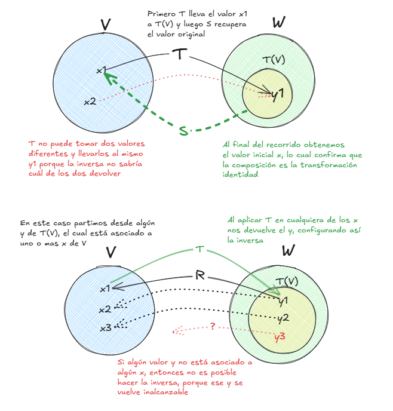
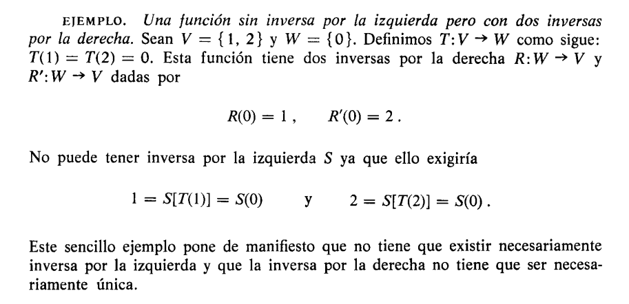

# Transformaciones lineales y matrices

Las transformaciones, aplicaciones y operadores son funciones cuyos dominios y recorridos son subconjuntos de espacios lineales. Aqui vamos a ver los ejemplos mas sencillos llamados transformaciones lineales

La notación que utilizamos mas comunmente para funciones cualquiera es 

$$T: V \to W$$

Entonces:

- T es una funcion
- V es el dominio
- W es la imagen

Para cada $x$ de $V$ el elemento $T(x)$ de $W$ se llama **imagen de $x$ a través de $T$**, y decimos que $T$ aplica $x$ en $T(x)$

Hasta aquí es lo que conocemos de toda la vida, tomar un $x$ pasarlo a través de una "máquina" y obtener un resultado. Sin embargo, nos estamos fijando mas en los conjuntos, veamos este gráfico

Podemos tener un subconjunto $A$ del dominio $V$, cuyas imágenes $T(x)$ para $x$ de $A$ están en $T(A)$. Podríamos tener que $A = V$ en ese caso $T(A) = T(V)$ la imagen del dominio $V$ es el recorrido de $T$

Para definir la transformación lineal el texto nos propone trabajar con el **mismo conjunto numérico de escalares** en ambos $V$ y $W$, por ejemplo $\mathbb{R}$ en ambos o complejos en ambos

**DEFINICIÓN**: Si $V$ y $W$ son dos espacios lineales, una función $T: V \to W$ se llama transformación lineal de $V$ en $W$, si tiene las propiedades siguientes

- $T(x + y) = T(x) + T(y)$ para cualquier $x$ y $y$ de $V$
- $T(cx) = cT(x)$ para todo $x$ de $V$ y cualquier escalar $c$

esto quiere decir que $T$ conserva la suma y la multiplicación por escalares. Podríamos combinar todo en una única fórmula

$$T(ax + by) = aT(x) + bT(y)$$

o lo que es lo mismo, escrito con sumas

$$T(\sum_{i=1}^{n} a_ix_i) = \sum_{i=1}^{n} a_iT(x_i)$$

para $n$ elementos cualesquiera $x_1, \dots, x_n$ de $V$, y $n$ escalares cualquiera $a_1, \dots, a_n$

#### Ejemplos

Sean $V = V_n$ y $W = V_m$. Dados $mn$ números reales $a_{ik}$, con $i = 1, 2, \ldots, m$ y $k = 1, 2, \ldots, n$, definimos $T: V_n \to V_m$ como:

$$y_i = \sum_{k=1}^{n} a_{ik} x_k \quad \text{para } i = 1, 2, \ldots, m$$

Queremos verificar que $T$ es una transformación lineal, es decir, que cumple:

- **a)** $T(x + x') = T(x) + T(x')$
- **b)** $T(cx) = cT(x)$

Para esto me parece importante resaltar que lo realmente importante aquí es ver si la transformación cumple con la definición, a través de su operación misma. Si bien la operación retorna un resultado, este no es tan relevante porque en este ejemplo es la sumatoria la que nos dice si se cumplen las propiedades, no el resultado de ella

Sean $x = (x_1, \ldots, x_n)$ y $x' = (x'_1, \ldots, x'_n)$ dos vectores de $V_n$.

Entonces:

$$x + x' = (x_1 + x'_1, \ldots, x_n + x'_n)$$

Aplicamos $T$ a la suma. La componente $i$-ésima del resultado es:

$$[T(x + x')]_i = \sum_{k=1}^{n} a_{ik}(x_k + x'_k)$$

Distribuimos $a_{ik}$:

$$= \sum_{k=1}^{n} (a_{ik} x_k + a_{ik} x'_k)$$

Separamos la sumatoria en dos:

$$= \sum_{k=1}^{n} a_{ik} x_k + \sum_{k=1}^{n} a_{ik} x'_k$$

$$= [T(x)]_i + [T(x')]_i$$

Como esto vale para todo $i = 1, \ldots, m$, concluimos:

$$T(x + x') = T(x) + T(x')$$

Ahora, sea $c$ un escalar y $x = (x_1, \ldots, x_n)$ un vector de $V_n$.

Entonces:

$$cx = (cx_1, \ldots, cx_n)$$

La componente $i$-ésima de $T(cx)$ es:

$$[T(cx)]_i = \sum_{k=1}^{n} a_{ik}(cx_k)$$

Sacamos $c$ de la sumatoria (es constante respecto a $k$):

$$= c \cdot \sum_{k=1}^{n} a_{ik} x_k$$

$$= c \cdot [T(x)]_i$$

Como vale para todo $i = 1, \ldots, m$, concluimos:

$$T(cx) = cT(x)$$

Ambas propiedades se cumplen, por lo tanto $T$ es una **transformación lineal**.

---

¿Por qué $f(x) = x^2$ no es una transformación lineal?

$$f(x + y) = (x + y)^2 = x^2 + 2xy + y^2$$

$$f(x) + f(y) = x^2 + y^2$$

El término $2xy$ que sobra hace que no sean iguales.

**Ejemplo numérico:** con $x = 2$, $y = 3$:

$$f(2 + 3) = f(5) = 25$$

$$f(2) + f(3) = 4 + 9 = 13$$

$$25 \neq 13 \quad \boldsymbol{\times}$$

Ahora cumple $f(cx) = cf(x)$?

$$f(cx) = (cx)^2 = c^2 x^2$$

$$cf(x) = cx^2$$

En general, $c^2 \neq c$.

**Ejemplo numérico:** con $c = 3$, $x = 2$:

$$f(3 \cdot 2) = f(6) = 36$$

$$3 \cdot f(2) = 3 \cdot 4 = 12$$

$$36 \neq 12 \quad \boldsymbol{\times}$$

Este es exactamente el mismo problema que ocurre con $T(x) = (x, x)$ (producto interior con $z = x$, no fijo).

Cuando la entrada aparece **dos veces** en la operación, escalar por $c$ produce $c^2$ en lugar de $c$. Fijar $z$ elimina esa duplicación: $z$ ya no depende de la entrada, así que $c$ solo entra una vez.

| Función | $f(cx)$ | $cf(x)$ | ¿Lineal? |
|---------|---------|---------|----------|
| $f(x) = x^2$ | $c^2 x^2$ | $cx^2$ | No |
| $T(x) = (x, x)$ | $c^2(x,x)$ | $c(x,x)$ | No |
| $T(x) = (x, z)$ con $z$ fijo | $c(x,z)$ | $c(x,z)$ | **Sí** |

---

Sea $V$ el espacio lineal de todas las funciones reales $f$ derivables en un intervalo abierto $(a, b)$.

Definimos el operador derivación $D: V \to W$ como:

$$D(f) = f'$$

donde $W$ contiene todas las derivadas $f'$.

$$D(f + g) = (f + g)'$$

Por la regla de la suma de derivadas:

$$= f' + g'$$

Ahora verifiquemos la multiplicacion por escalar

$$= D(f) + D(g) \quad \checkmark$$

$$D(cf) = (cf)'$$

Por la regla de la constante multiplicativa en derivadas:

$$= cf'$$

$$= cD(f) \quad \checkmark$$

El operador derivación $D$ es una **transformación lineal**.

La linealidad se deduce directamente de las reglas de derivación del cálculo:

- La derivada de una suma es la suma de las derivadas.
- La derivada de una constante por una función es la constante por la derivada.

## Núcleo y recorrido

Como vimos en el dibujo anterior $T(V)$ (recorrido de $T$) es un subconjunto de $W$. Veamos si es un subespacio, y si además $T$ aplica el elemento cero de $V$ en el de $W$

Recordando nuestra definición de subespacio, necesitamos que el subconjunto cumpla con los axiomas de clausura (suma y multiplicación por escalar). Entonces como hicimos en el tutorial de espacios lineales necesitamos tomar dos elementos $T(x)$ $T(y)$ del conjunto y ver si el resultado está también en el conjunto

$$T(x) + T(y) = T(x + y)$$

Esto porque ya definimos que la transformación lineal tiene la propiedad de la suma de esta manera. Entonces se cumple y el resultado está en $T(V)$

Lo mismo para cualquier escalar $c$, tenemos que $T(cx) = cT(x)$ porque así se define la transformación lineal, y el resultado también está en $T(V)$. Finalmente si tomamos $c = 0$ encontramos que $T(O) = O$

Ahora, el **núcleo** es el conjunto de todos los $V$ que $T$ aplica a $O$ se llama núcleo de $T$ y se designa por $N(T)$, osea

$$N(T) = \lbrace x | x \in V \quad \text{ y } \quad T(x) = O \rbrace$$

El **núcleo también es un subespacio de** $V$ ya que son los mismo valores que toma la transformación de $V$, y la demostración es similar

#### Ejemplos

Sea $T: \mathbb{R}^2 \to \mathbb{R}$ definida por:

$$T(x_1, x_2) = x_1 + x_2$$

Primero verificamos que es una transformación lineal:

**Suma:** Sean $x = (x_1, x_2)$ y $y = (y_1, y_2)$

$$T(x + y) = T(x_1 + y_1, x_2 + y_2) = (x_1 + y_1) + (x_2 + y_2) = (x_1 + x_2) + (y_1 + y_2) = T(x) + T(y) \quad \checkmark$$

**Multiplicación por escalar:** Sea $c$ un escalar

$$T(cx) = T(cx_1, cx_2) = cx_1 + cx_2 = c(x_1 + x_2) = cT(x) \quad \checkmark$$

Ahora hallamos el **núcleo**. Necesitamos todos los $(x_1, x_2)$ tales que $T(x_1, x_2) = 0$:

$$x_1 + x_2 = 0 \implies x_2 = -x_1$$

$$N(T) = \lbrace (x_1, -x_1) \mid x_1 \in \mathbb{R} \rbrace$$

Geométricamente es la recta $x_2 = -x_1$ en $\mathbb{R}^2$, y es un subespacio porque:

- $(x_1, -x_1) + (y_1, -y_1) = (x_1 + y_1, -(x_1 + y_1)) \in N(T) \quad \checkmark$
- $c(x_1, -x_1) = (cx_1, -cx_1) \in N(T) \quad \checkmark$

---

**Operador derivación**. El núcleo está formado por todas las funciones constantes en el intervalo dado.

---

Para resumir visualmente, el núcleo lo podemos entender de esta manera 

## Dimensión del núcleo y rango de la transformación

Nos interesa la relación entre las dimensiones de $V$, del núcleo $N(T)$ y del recorrido $T(V)$. Si $V$ es de dimensión finita, el núcleo también lo será por ser un subespacio de $V$

La dimensión de $T(V)$ se llama **rango** de $T$

**TEOREMA** Si $V$ es de dimensión finita, también lo es $T(V)$, y tenemos

$$dim N(T) + dim T(V) = dim V$$

Dicho de otro modo, la dimensión del núcleo más el rango de una transformación lineal es igual a la dimensión de su dominio.

Ver la Demostración en Cálculo de Tom Apostol Vol 2 Pág 43

## Operaciones algebráicas con transformaciones lineales

"Las funciones cuyos valores pertenecen a un espacio lineal dado $W$ pueden sumarse unas con otras y pueden multiplicarse por escalares de $W$ de acuerdo con la definición siguiente.

**DEFINICIÓN**. Sean $S:V \to W$ y $T: V \to W$ dos funciones con un dominio común $V$ y con valores pertenecientes a un espacio lineal $W$. Si e es un escalar cualquiera de W, definimos la suma S + $T$ y el producto $cT$ por las ecuaciones 

$$(S + T)(x) = S(x) + T(x) , (cT)(x) = cT(x)$$

para todo $x$ de $V$"

Verifiquemos con la fórmula combinada de linealidad:

$$(S + T)(ax + by) = S(ax + by) + T(ax + by)$$

Como $S$ y $T$ son lineales, cada una respeta la combinación lineal:

$$= aS(x) + bS(y) + aT(x) + bT(y)$$

Reagrupamos por escalar:

$$= a[S(x) + T(x)] + b[S(y) + T(y)]$$

$$= a(S + T)(x) + b(S + T)(y) \quad \checkmark$$

¿$cT$ sigue siendo lineal?

$$(cT)(ax + by) = cT(ax + by)$$

Como $T$ es lineal:

$$= c[aT(x) + bT(y)]$$

$$= a \cdot cT(x) + b \cdot cT(y)$$

$$= a(cT)(x) + b(cT)(y) \quad \checkmark$$

El conjunto $\mathscr{L}(V, W)$ de todas las transformaciones lineales de $V$ en $W$, es un espacio lineal con las operaciones de adición y multiplicación por escalar

Es decir, este conjunto que contiene todas las transformaciones lineales de $V$ en $W$, cumple los 10 axiomas, la mayoría de ellos con las operaciones con lo que acabamos de definir, y particularmente:

- El **elemento cero** es la transformación cero: $T_0(x) = O$ para todo $x$
- La **opuesta** de $T$ es $(-1)T$, es decir, $(-T)(x) = -T(x)$

Para resumir, nos armamos un conjunto con transformaciones lineales que cumplen los 10 axiomas, por lo tanto ese conjunto $\mathscr{L}(V, W)$ es un espacio lineal

### Composición de transformaciones lineales

Vamos a ver como se comporta la **composición o multiplicación** entre transformaciones lineales

- Supongamos tres conjuntos $U, V, W$
- $T: U \to V$ una función con dominio en $U$ y valores en $V$
- $S: V \to W$ otra función con dominio en $V$ y valores en $W$

La función compuesta $ST: U \to W$ está definida por:

$$(ST)(x) = S[T(x)] \quad \text{ para todo } x \text{ en } U$$

En el dibujo se ve bien, aplicamos primero $x$ mediante $T$ y luego $T(x)$ mediante $S$. 

Ahora, ¿qué pasa con el resultado de la composición? veamos varias cosas interesantes

#### La composición no es conmutativa

Veamos contraejemplo. Sean $T, S: \mathbb{R}^2 \to \mathbb{R}^2$ definidas por:

$$T(x_1, x_2) = (x_1 + x_2, \; 0) \qquad S(x_1, x_2) = (0, \; x_1)$$

Ambas son lineales (se verifica directamente con la definición). Para $x = (1, 1)$:

$$(ST)(1,1) = S(T(1,1)) = S(2, 0) = (0, 2)$$

$$(TS)(1,1) = T(S(1,1)) = T(0, 1) = (1, 0)$$

Como $(0, 2) \neq (1, 0)$, se tiene $ST \neq TS$. $\blacksquare$

#### Satisface la ley asociativa

Supongamos tres funciones 

- $T: U \to V$
- $S: V \to W$
- $R: W \to X$

y tenemos

$$R(ST) = (RS)T$$

Ambos lados de la ecuación tienen dominio $U$ y valores en $X$ (osea al hacer la "operación" para cualquier lado de la igualdad recorren de la misma manera el caminito en los conjuntos así como vimos en la imagen)

$$(R(ST))(x) = R((ST)(x)) = R(S(T(x)))$$

$$((RS)T)(x) = (RS)(T(x)) = R(S(T(x)))$$

como vemos nos da el mismo resultado. Se puede pensar de esta manera

$$x \xrightarrow{T} T(x) \xrightarrow{S} S[T(x)] \xrightarrow{R} R[S[T(x)]]$$

$$U \xrightarrow{T} V \xrightarrow{S} W \xrightarrow{R} X$$

osea, practicamente se toma la definicion de la composición, la cual se lee de izquierda a derecha y reescribimos de forma "desenrollada". EL orden es importante, el orden en que evaluamos no cambia por la posición de los paréntesis en la notación.

**DEFINICIÓN.** Sea $T: V \to V$ una función que aplica $V$ en sí mismo. Definimos inductivamente las potencias enteras de $T$ como sigue:

$$T^0 = I, \qquad T^n = TT^{n-1} \quad \text{para } n \geq 1.$$

Aquí $I$ representa la transformación idéntica. El lector puede comprobar que la ley asociativa implica la ley de exponentes $T^m T^n = T^{m+n}$ para todos los enteros no negativos $m$ y $n$. Esto lo dejo como comentario nada mas

> Transformación idéntica. La transformación $T: V \to V$, donde $T(x) = X$ para todo $x$ de $V$, se denomina transformación idéntica y se designa por $I$ o por $I_v$

Ahora viene algo interesante relacionado a la composición, dice que si componemos dos transformaciones lineales el resultado es también lineal, entonces supongamos:

- Tres espacios lineales $U, V, W$ con los mismos valores escalares
- $T: U \to V$ y $S: V \to W$ transformaciones lineales
- Entonces la composición $ST: U \to W$ también es lineal

$$(ST)(ax + by) = S[T(ax + by)] = S[aT(x) + bT(y)] = aST(x) + bST(y)$$

con lo cual también podemos observar que se cumple lo siguiente:

- $(S + T)R = SR + TR$ y $(cS)R = c(SR) $
- $R(S + T) = RS + RT$ y $R(cS) = c(RS) $

es importante notar que el orden en que se opera debe conservarse

## Inversas

Recordando las funciones reales monótonas, podíamos pensar la inversa como "dar vuelta a la máquina" de tal modo que la salida constituía la entrada de la máquina y se esperaba que lo que antes era la entrada sea ahora la salida

En este momento vamos a generalizar el concepto y plantear un método de inversión.

"Dada una función $T$, nuestro objetivo es encontrar, si es posible, otra función $S$ cuya composición con $T$ sea la transformación idéntica.

Puesto que la composición, en general, no es conmutativa, tenemos que distinguir $ST$ de $TS$. Por lo tanto introducimos dos tipos de inversas que llamamos inversa por la derecha e inversa por la izquierda
"

Entonces, dados dos conjuntos $V$ y $W$ y una función $T: V \to W$ se dice que 

- una función $S: T(V) \to V$ es inversa de $T$ por la izquierda si $S[T(x)] = x$ para todo $x$ de $V$, esto si $ST = I_V$
- una función $R: T(V) \to V$ es inversa de $T$ por la derecha si $T[R(y)] = y$ para todo $y$ de $T(V)$, esto si $TR = I_{T(V)}$

Ejemplo 2

Sean $V = \{0\}$ y $W = \{1, 2\}$. Definimos $T: V \to W$ como sigue:

$$T(0) = 1$$

Observemos que $T$ es **inyectiva** (no colapsa elementos), pero **no es sobreyectiva** sobre $W$ (el elemento $2 \in W$ no tiene preimagen).

##### Inversa por la izquierda ✅

Definimos $S: W \to V$ con:

$$S(1) = 0, \quad S(2) = 0$$

Verificamos:

$$S[T(0)] = S(1) = 0 \quad \Rightarrow \quad ST = I_V \checkmark$$

> **Nota:** El valor de $S(2)$ es irrelevante — lo único que importa es que $S(1) = 0$. Podríamos asignar $S(2)$ a cualquier elemento de $V$ (que en este caso solo es $0$).

##### Inversa por la derecha ❌

Necesitaríamos $R: W \to V$ tal que $T[R(y)] = y$ para todo $y \in W$.

Para $y = 1$: $T[R(1)] = 1$ exige $R(1) = 0$ (y efectivamente $T(0) = 1$). ✅

Para $y = 2$: $T[R(2)] = 2$ exigiría que algún elemento de $V$ se mapee a $2$ bajo $T$. Pero el único elemento de $V$ es $0$, y $T(0) = 1 \neq 2$. **Imposible.** ❌

Es importante resaltar que en nuestro ejemplo el dominio de $R$ es todo $W$, sin embargo tomar el dominio como $T(V)$ tiene una implicación importante y es que en ese caso la inversa por la derecha si existiría 

La inversa por la derecha se define como $R: T(V) \to V$ tal que $TR = I_{T(V)}$, es decir, solo necesita funcionar sobre la **imagen** de $T$, no sobre todo $W$.

En nuestro caso, $T(V) = \{1\}$. Definimos $R: T(V) \to V$ con:

$$R(1) = 0$$

Verificamos:

$$T[R(1)] = T(0) = 1 \quad \Rightarrow \quad TR = I_{T(V)} \checkmark$$

El siguiente texto describe esta situación:

$T: V \to W$ tiene por lo menos una inversa a la derecha

- cada $y$ de $T(V)$ tiene la forma $y = T(x)$ para al menos un $x$ de $V$
- elegimos uno de esos valores $x$ y definimos $R(y) = x$
- entonces $T[R(y)] =T(x) = y$ para cada $y$ de $T(V)$
- asi que $R$ es una inversa por la derecha

**TEOREMA** Una $T: V \to W$ puede tener a lo más una inversa por la izquierda. Si $T$ tiene inversa por la izquierda $S$, entonces $S$ es también inversa por la derecha.

Demostremos la primera parte. Suponemos que $T$ tiene dos inversas por la izquierda $S: T(V) \to V$ y $S': T(V) \to V$

Elejimos cualquier $y$ de $T(V)$, y necesitamos demostrar que $S(y) = S'(y)$

Como $y = T(x)$ para un cierto $x$ de $V$ tenemos $S[T(x)] = x$ y $S'[T(x)] = x$ porque ambas son inversas por la izquierda, y la definición de inversa lo que hace es devolverme el mismo $x$ que se usó den entrada en la función $T$

Por consiguiente $S(y) = x$ y $S'(y) = x$, con lo que $S(y) = S'(y)$ para todo $y$ de $T(V)$. Por lo tanto $S = S'$

Ahora demostremos la segunda parte para ver que toda inversa por la izquierda $S$ es también inversa por la derecha. 

Elijamos un elemento cualquiera $y$ en $T(V)$, y necesitamos demostrar que $T[S(y)] = y$

Como $y \in T(V)$, tenemos $y = T(x)$ para un cierto $x$ de $V$

Pero $S$ es inversa por la izquierda, así que $x = S[T(x)] = S(y)$

Aplicando $T$, llegamos a $T(x) = T[S(y)]$. Pero $y = T(x)$, con lo que $y = T[S(y)]$,
lo cual completa la demostración.

**TEOREMA**. Una función $T: V \to W$ tiene inversa por la izquierda si y sólo si $T$ aplica elementos distintos de $V$ en elementos distintos de $W$; esto es, si y sólo si, para cualesquiera $x$ y $y$ de $V$

$$x \neq y \quad \text{ implica } \quad T(x) \neq T(y)$$

o es equivalente decir 

$$T(x) \neq T(y) \quad \text{ implica } \quad x \neq y$$

> Si $T$ satisface cualquiera de estas condición entonces se denomina *uno a uno*

para demostrar esto supngamos que $S$ es la inversa por la izquierda de $T$, y que $T(x)=T(y)$, queremos demostrar que $x=y$, entonces:

$T(x)=T(y)$ aplicamos la inversa $S$

$S[T(x)] = S[T(y)]$

Sabemos que:

$S[T(x)] = x$ y que $S[T(y)] = y$

Entonces:

$x = y$

> Es muy importante ver que con esta demostración garantizamos la inyectividad, y ahora podemos continuar con el proceso usual

Demostremos ahora el recíproco. Supongamos que $T$ es uno a uno en $V$. Encontraremos una función $S: T(V) \to V$ que es inversa de $T$ por la izquierda. Si $y \in T(V)$, entonces $y = T(x)$ para un cierto $x$ de $V$. En virtud de (2.6), existe *exactamente un* $x$ en $V$ para el cual $y = T(x)$. Definamos $S(y)$ como ese $x$. Esto es, definamos $S$ en $T(V)$ como sigue:

$$S(y) = x \quad \text{implica que} \quad T(x) = y.$$

Tenemos entonces $S[T(x)] = x$ para cada $x$ de $V$, así que $ST = I_V$. Por consiguiente, la función $S$ así definida es inversa de $T$ por la izquierda.

Esto solo fue posible hacerlo porque en la primera parte de la demostración vimos que $T$ es inyectiva. Esto quiere decir que para cada elemento $x$ le corresponde un único elemento de $T(V)$, si fuera mas de un elemento al aplicar la inversa no sabríamos cuál de los dos devolver, por eso podemos asegurar que la segunda parte de la demostración se cumple, la cual corresponde al desarrollo de encontrar y aplicar la inversa con normalidad.

## Transformaciones lineales uno a uno

Recordando el espacio lineal $\mathscr{L}(V, W)$ que contiene todas las transformaciones lineales. Este al ser espacio lineal cumple los 10 axiomas

Tenemos entonces dos espacios lineales $V$ y $W$, y una transformación lineal $T: V \to W$ de $\mathscr{L}(V, W)$. La linealidad de $T$ nos permite expresar de varias maneras que una transformación lineal sea **uno a uno**

Hagamoslo con palabras sencillas:

> "Significa que la transformación no pierde información.
> 
> Si le das dos entradas distintas, siempre obtienes dos salidas distintas. Nunca "aplasta" dos cosas diferentes en el mismo resultado. Entonces si ves la salida, puedes saber sin ambigüedad de dónde vino — y por eso precisamente puedes invertirla.
> 
> Si no fuera uno a uno, dos entradas distintas podrían dar la misma salida, y al intentar regresar te quedarías preguntando "¿de cuál de las dos vino?" — que es exactamente lo que viste en tus notas sobre por qué la inversa no se puede definir sin inyectividad." - Claude code

literalmente es hacer esto

$$x_1 \to y_1$$

$$x_2 \to y_2$$

$$x_3 \to y_3$$

tener una correspondencia perfecta. Veamos el teorema

**TEOREMA**. Sea $T: V \to W$ una transformación lineal de $\mathscr{L}(V, W)$
Son equivalentes las siguientes proposiciones.

**a.** $T$ es uno a uno en V.

**b.** $T$ es invertible y su inversa $T^{-1}: T(V) \to V$ es lineal.

**c.** Para todo $x$ de $V$, $T(x) = O$ implica $x = O$. Esto es, el núcleo $N(T)$ contiene solamente el elemento cero de $V$

El texto nos propone demostrar esto de la siguiente manera $a \to b \to c$ es decir, las proposiciones se corresponden de esa manera, entonces probemos:

Supongamos que **a.** es cierta, esto quiere decir que $T$ tiene inversa como vimos en el teorema de mas arriba. Entonces tenemos que demostrar que $T^{-1}$ es lineal

Tomemos entonces dos elementos cualquiera $u$ y $v$ de $T(V)$. Entonces

$$u = T(x)$$

$$v = T(y)$$

para algún $x$ y algún $y$ de $V$. Para dos escalares cualesquiera a y b, tenemos

$$au + bv = aT(x) + bT(y) = T(ax + by)$$

eso lo podemos hacer por la propia definición de la transformación lineal. Ahora apliquemos $T^{-1}$ 

$$T^{-1}(au + bv) = ax + by = aT^{-1}(u) + bT^{-1}(v)$$

Esto porque la inversa nos recupera el valor original así

$$x = T^{-1}(u)$$

$$y = T^{-1}(v)$$

gracias a esto pudimos demostrar que la inversa $T^{-1}$ es lineal. Entonces **a.** implica **b.** Continuemos con la demostración

Supongamos que **b.** es cierta y probemos **c.** Tomemos un $x$ cualquiera de $V$ para el cual $T(x) = O$ y aplicamos $T^{-1}$

$$x = T^{-1}(O) = O$$

puesto que  $T^{-1}$ es lineal. Esto de $T^{-1}(O) = O$ lo confirmamos cuando vimos el núcleo y recorrido, tomando $T(cx) = cT(x)$ con $c = 0$. Entonces **b.** implica **c.**

Por último, supongamos cierta **c.**, Tomemos dos elementos cualesquiera $u$ y $v$ de $V$ siendo $T(u)=T(v)$. Por la linealidad, tenemos $T(u-v) = T(u)-T(v) = O$, así que $u - v = O$. Por consiguiente, $T$ es uno a uno en $V$, Y queda completada la demostración del teorema.

Es decir, si asumimos que la imagen tanto de $u$ como de $v$ es igual entonces estaríamos hablando de los mismos valores del conjunto de salida, es por eso que al hacer la diferencia nos da cero