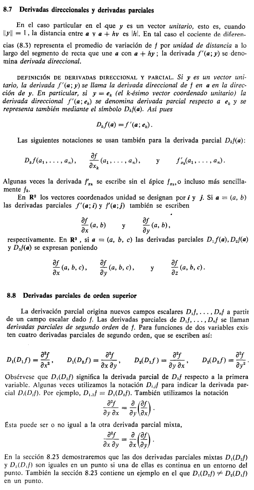

297-324

# CALCULO DIFERENCIAL EN CAMPOS ESCALARES Y VECTORIALES

En este punto ya conocemos bastantes cosas:

- Vimos funciones de $\mathbb{R}$ a $\mathbb{R^n}$ las cuales describian movimiento de particulas en el espacio y otros temas interesantes relacionados a vectores
- Vimos algo de la fundamentación de espacios lineales y transformaciones lineales

En este punto el autor nos propone tener transformaciones lineales $T: \mathbb{R^n} \to \mathbb{R^m}$ pero con la diferencia de que $T$ no sea lineal, apensar de que $V$ y $W$ si sean espacios lineales de dimensión finita

En particular cuando tenemos:

- Una función $T: \mathbb{R^n} \to \mathbb{R}$ le llamamos campo escalar
- Una función $T: \mathbb{R^n} \to \mathbb{R^m}$ le llamamos campo vectorial

El autor también propone utilizar el producto interior y norma así

$$x \cdot y = \sum_{k=1}^{n} x_{k} y_k$$

$$\lVert x \rVert = (x \cdot x)^{-1}$$

Investigando un poco y hablando con la IA me menciona lo siguiente

> Y aquí está la idea profunda: la linealidad no desaparece, se muda del nivel global al nivel local. Aunque $T$ globalmente sea curva, si haces zoom infinito alrededor de un punto $a$, la función se ve recta. Ese mapa lineal local que aproxima a $T$ cerca de $a$ es la derivada, $DT(a): \mathbb{R}^n \to \mathbb{R}^m$ y esa sí es una transformación lineal entre espacios vectoriales, representada por una matriz: la jacobiana. Toda la maquinaria de la Parte 1 reaparece, pero como modelo infinitesimal de la Parte 2.

Todo esto aparecerá en su momento, por ahora veamos lo fundamental de este tipo de funciones. Como vimos al inicio estas funciones se caracterizan por tener como argumento un vector de $ \mathbb{R^n}$ y eso tiene unas implicaciones importantes

## Bolas abiertas y conjuntos abiertos

Sean $a$ un punto dado en $\mathbf{R}^n$ y $r$ un número positivo dado. El conjunto de
todos los puntos $x$ de $\mathbf{R}^n$ tales que

$$\lVert x - a \rVert \lt r$$

se llama **$n$-bola abierta** de radio $r$ y centro $a$. Designamos este conjunto con $B(a; r)$.

recordando que la norma nos indica también la distancia al origen, por lo tanto si el centro de la bola es $a$ entonces si $x$ excede $r$ se considera que está fuera de ella

La bola $B(a; r)$ está constituida por los puntos cuya distancia a $a$ es menor
que $r$. En $\mathbf{R}^1$ es simplemente un intervalo abierto con punto medio en $a$. En $\mathbf{R}^2$
es un disco circular, y en $\mathbf{R}^3$ es un sólido esférico con centro en $a$ y radio $r$.

Esto es importante porque este tipo de funciones puede tener $n$ cantidad de coordenadas de entrada

**DEFINICIÓN DE PUNTO INTERIOR.** Sea $S$ un subconjunto de $\mathbf{R}^n$, y supongamos que $a \in S$. Se dice que $a$ es punto interior de $S$ si existe una $n$-bola abierta con centro en $a$, cuyos puntos pertenecen todos a $S$.

Es decir, todo punto $a$ interior de $S$ puede rodearse por una $n$-bola $B(a)$ tal
que $B(a) \subseteq S$. El conjunto de todos los puntos interiores de $S$ se llama el *interior*
de $S$ y se designa con $int S$. Un conjunto abierto que contenga un punto $a$ se llama
a veces *entorno* de $a$.

**DEFINICIÓN DE CONJUNTO ABIERTO.** Un conjunto $S$ de $\mathbf{R}^n$ se llama abierto si todos sus puntos son interiores. Es decir, $S$ es abierto si y sólo si $S = int S$.

En $\mathbf{R}^1$ el tipo más sencillo de conjunto abierto es un intervalo
abierto. La reunión de dos o más intervalos abiertos es también abierto. Un intervalo cerrado $[a, b]$ no es un conjunto abierto porque ninguno de los extremos del intervalo puede encerrarse en una 1-bola situada enteramente en el intervalo dado.

La 2-bola $S = B(O; 1)$ dibujada en la figura 8.1 es un ejemplo de conjunto
abierto en $\mathbf{R}^2$. Todo punto $a$ de $S$ es el centro de un disco situado por entero en $S$. Para algunos puntos el radio de este disco es muy pequeño.

**DEFINICIONES DE EXTERIOR Y FRONTERA.** Un punto $x$ se llama exterior al conjunto $S$ de $\mathbf{R}^n$ si existe una $n$-bola $B(x)$ que no contiene puntos de $S$. El conjunto de todos los puntos de $\mathbf{R}^n$ exteriores a $S$ se llama el exterior de $S$ y se designa con $\text{ext} S$. Un punto que no es interior ni exterior a $S$ se llama punto frontera de $S$. El conjunto de todos los puntos frontera de $S$ es la frontera de $S$ y se designa con $\partial S$.

Para el ejemplo $S = B(O; 1)$: El exterior de $S$ es el conjunto de todos los $x$ tales que $\lVert x \rVert > 1$. La frontera de $S$ la constituyen todos los $x$ con $\lVert x \rVert = 1$.

graficamente podemos verlo así 

## Límites y continuidad

Para definir esto nos podemos inspirar en el caso unidimensional. Es especialmente util pensar en los campos escalares para la visualización. Pero la definición aplica indistitamente para campos vectoriales también.

Consideremos una función $f: S \to \mathbb{R^m}$ donde $S$ es un subconjunto de $R^n$. Si $a \in \mathbb{R^n}$ y $b \in \mathbb{R^m}$ 

$$\lim_{x \to a}f(x) = b$$

Lo mismo de siempre: $f(x) \to b$ cuando $x \to a$. Y esto significa tambien

$$\lim_{\lVert x - a \rVert \to 0} \lVert f(x) - b \rVert = 0$$

Osea, la distancia al origen entre $x$ y $a$ tiende a cero y eso hace que la imagen $f(x)$ esté tan cerca a $b$ que al calcular la distancia, esta tiende a cero también

Sin embargo en esa expresión tenemos solamente $f(x)$, lo cual no obliga a que la función esté definida en $a$, por lo cual el autor propone reescribir de la siguiente manera, tomando $h = x - a$

$$\lim_{\lVert h \rVert \to 0} \lVert f(a + h) - b \rVert = 0$$

Pero la idea sigue siendo la misma, es solo otra forma de escribir.

Ahora...

Para los puntos de $\mathbb{R^2}$ escribimos $(x,y)$ para $x$. Escribimos $(a,b)$ para expresar $a$. Entonces todo queda así

$$\lim_{(x,y) \to (a,b)}f(x,y) = b$$

Y para  $\mathbb{R^3}$ así....

$$\lim_{(x,y,z) \to (a,b,c)}f(x,y,z) = b$$

Y como se estudió en el caso unidimensional, la continuidad está dada por

$$\lim_{x \to a}f(x) = f(a)$$

Todo eso tiene demostración pero no las incluiré aqui por ahora

> Ver algunos ejemplos en Cálculo de Tom Apostol Vol 2 - pág 304

#### Límites iterados

El problema en varias variables es que $x \to a$ admite **infinitos caminos** de aproximación. Una forma natural es acercarse primero por una variable y después por la otra. Eso da los **límites iterados**:

$$\lim_{x \to a}\left[\lim_{y \to b} f(x,y)\right] \qquad \text{y} \qquad \lim_{y \to b}\left[\lim_{x \to a} f(x,y)\right]$$

El orden importa. Aquí lo crucial:

- Si los dos iterados **existen y son distintos** $\Rightarrow$ el límite doble **no existe** (y por tanto $f$ no puede ser continua en ese punto).
- Si **coinciden** $\Rightarrow$ no se concluye nada. El límite doble podría existir o no.

Es decir, los iterados son una herramienta **para descartar**, no para confirmar.

##### Ejemplo de iterados distintos

$$f(x,y) = \frac{x^2 - y^2}{x^2 + y^2}, \qquad (x,y) \neq (0,0)$$

Primero fijo $x$ y hago $y \to 0$, luego $x \to 0$:

$$\lim_{x \to 0}\left[\lim_{y \to 0} \frac{x^2 - y^2}{x^2 + y^2}\right] = \lim_{x \to 0} \frac{x^2}{x^2} = 1$$

Cambiando el orden:

$$\lim_{y \to 0}\left[\lim_{x \to 0} \frac{x^2 - y^2}{x^2 + y^2}\right] = \lim_{y \to 0} \frac{-y^2}{y^2} = -1$$

Los iterados dan $1$ y $-1$. Por lo tanto el límite doble en $(0,0)$ no existe y $f$ no se puede extender continuamente al origen.

#### Coordenadas polares

Cuando $(x,y) \to (0,0)$ podemos sustituir $x = r\cos\theta$, $y = r\sin\theta$. Entonces $(x,y) \to (0,0)$ equivale a $r \to 0$, sin importar qué valor tome $\theta$ (cada $\theta$ fija una dirección de entrada al origen).

La idea es estudiar

$$\lim_{r \to 0} f(r\cos\theta, r\sin\theta)$$

y la regla práctica es:

> El límite doble existe y vale $L$ si se puede acotar
> $$|f(r\cos\theta, r\sin\theta) - L| \le g(r)$$
> con $g(r) \to 0$ cuando $r \to 0$, **uniformemente en $\theta$** (es decir, la cota $g(r)$ no depende de $\theta$).

La uniformidad es la pieza no negociable: si la cota dependiera de $\theta$, podría haber direcciones en las que el control falla y el límite por esa dirección sea distinto.

##### Ejemplo donde sí existe

$$f(x,y) = \frac{x^3}{x^2 + y^2}$$

Pasando a polares:

$$f(r\cos\theta, r\sin\theta) = \frac{r^3 \cos^3\theta}{r^2(\cos^2\theta + \sin^2\theta)} = r\cos^3\theta$$

Y la cota:

$$|r\cos^3\theta| \le r \cdot 1 = r \xrightarrow{r \to 0} 0$$

La cota $r$ no depende de $\theta$, así que el límite existe y vale $0$. Definiendo $f(0,0) = 0$, la función queda continua en el origen.

#### Ejemplo de cuidado: los caminos rectos pueden engañar

Este es el tipo de ejemplo que aparece en Apostol y que muestra por qué no basta con probar rectas.

$$f(x,y) = \frac{x^2 y}{x^4 + y^2}, \qquad (x,y) \neq (0,0)$$

**Iterados.** Fijando $x$ y haciendo $y \to 0$: $f(x,0) = 0$, así que $\lim_{x \to 0} 0 = 0$. Igual en el otro orden. **Ambos iterados dan $0$.** No descarta nada.

**Por rectas $y = mx$.**

$$f(x, mx) = \frac{x^2 (mx)}{x^4 + m^2 x^2} = \frac{m x^3}{x^2(x^2 + m^2)} = \frac{m x}{x^2 + m^2} \xrightarrow{x \to 0} 0$$

Por **toda recta** que pase por el origen el límite es $0$. Uno podría pensar "listo, el límite es $0$". **Pero no.**

**Por la parábola $y = x^2$.**

$$f(x, x^2) = \frac{x^2 \cdot x^2}{x^4 + x^4} = \frac{x^4}{2x^4} = \frac{1}{2}$$

Por este camino el límite es $\tfrac{1}{2}$. Como hay dos caminos con valores distintos, el **límite doble no existe** y $f$ no es continua en $(0,0)$ ni puede serlo redefiniéndola allí.

**Moraleja:** probar todas las rectas no es prueba de existencia. La aproximación puede ocurrir por curvas arbitrarias, y a veces es justamente una parábola (o algo peor) la que rompe la igualdad. Por eso la herramienta confiable para **demostrar** existencia es la acotación uniforme en polares, no la inspección por caminos.

#### Receta práctica para decidir continuidad

Juntando todo lo anterior, este es el orden en el que conviene atacar el problema:

1. **¿Es composición/álgebra de continuas y el punto está en el dominio?**
   Si $f$ se construye con sumas, productos, cocientes (denominador $\neq 0$), composiciones de funciones continuas conocidas (polinomios, $\sin$, $\cos$, $\exp$, $\log$, …), entonces es continua. **Fin.**

2. **¿Hay indeterminación en el punto (típicamente $0/0$)?**
   Calcula los **límites iterados** y prueba **dos o tres caminos sencillos** (ejes, $y = x$, $y = x^2$).
   - Si dos de ellos dan valores **distintos** $\Rightarrow$ el límite no existe, $f$ **no** es continua. **Fin.**
   - Si todos coinciden $\Rightarrow$ no concluye nada todavía, pasa al paso 3.

3. **Intenta demostrar la existencia.**
   Pasa a **coordenadas polares** o intenta una **acotación directa** $|f(x,y) - L| \le g(x,y)$.
   - Si consigues una cota que tiende a $0$ **uniformemente en $\theta$** (sin depender de la dirección) $\Rightarrow$ el límite existe y vale $L$. Si además $L = f(a)$, $f$ es continua.
   - Si no lo logras, vuelve al paso 2 con caminos más raros (parábolas, cúbicas) buscando el contraejemplo.

> El paso 2 sirve para **descartar**; el paso 3 sirve para **demostrar**. No los confundas: probar muchos caminos nunca demuestra existencia, y una acotación uniforme en polares nunca refuta.

#### Nota: el método universal $\varepsilon$-$\delta$

Por debajo de toda esta receta artesanal hay un método **definitivo** que siempre funciona. La definición formal de continuidad es:

$$f \text{ es continua en } \mathbf{a} \iff \forall \varepsilon > 0,\ \exists \delta > 0 : \lVert \mathbf{x} - \mathbf{a} \rVert < \delta \Rightarrow |f(\mathbf{x}) - f(\mathbf{a})| < \varepsilon$$

En palabras: dado cualquier margen de error $\varepsilon$ que se quiera en la imagen, debe existir un radio $\delta$ en el dominio tal que **todos** los puntos dentro de la bola $B(\mathbf{a}; \delta)$ caen dentro del margen $\varepsilon$ alrededor de $f(\mathbf{a})$.

Si construyes ese $\delta$ como función de $\varepsilon$, terminaste: la continuidad queda probada sin importar caminos, polares ni iterados.

De hecho, todos los atajos anteriores son formas implícitas de aplicar $\varepsilon$-$\delta$:

- Cuando en polares acotas $|f(r\cos\theta, r\sin\theta) - L| \le g(r)$ con $g(r) \to 0$, lo que haces es: dado $\varepsilon$, eliges $\delta$ tal que $g(\delta) < \varepsilon$. La uniformidad en $\theta$ es lo que garantiza que **el mismo** $\delta$ sirve para todos los puntos de la bola.
- Un equivalente útil es la **continuidad secuencial**: $f$ es continua en $\mathbf{a}$ sii para toda sucesión $\mathbf{x}_n \to \mathbf{a}$ se cumple $f(\mathbf{x}_n) \to f(\mathbf{a})$.

¿Por qué entonces no se usa siempre $\varepsilon$-$\delta$ directamente? Porque construir el $\delta$ explícito suele ser más tedioso que aplicar la receta práctica, sobre todo cuando la función es complicada. Pero conviene tener presente que el método existe, es universal, y es el respaldo formal de todo lo que se hace por atajos.

## Derivada de un campo escalar respecto a un vector

Aqui se expone la derivada con respecto a un vector solamente para campos escalares

como se ve en la imagen podemos estar parados en un punto del campo escalar, y dependiendo en la dirección en que nos movamos la temperatura varía

"Sea $f$ un campo escalar definido en un conjunto $S$ de $\mathbb{R^n}$ , y sea $a$ un punto interior de $S$. Deseamos estudiar la variación del campo cuando nos desplazamos desde $a$ a un punto próximo."

Supongamos que se representa esa dirección mediante otro vector y. Esto
es, supongamos que nos movemos desde $a$ hacia otro punto $a + y$, siguiendo el
segmento de recta que une a con $a + y$.

Puesto que $\boldsymbol{a}$ es un punto interior de $S$, existe una $n$-bola $B(\boldsymbol{a}; r)$ situada enteramente en $S$. Si $h$ se elige de manera que $|h|\,\|\boldsymbol{y}\| < r$, el segmento desde $\boldsymbol{a}$ hasta $\boldsymbol{a} + h\boldsymbol{y}$ estará en $S$. (Ver figura 8.4) Mantengamos $h \neq 0$ pero lo bastante pequeño para que $\boldsymbol{a} + h\boldsymbol{y} \in S$ y construyamos el cociente de diferencias

$$
\tag{8.3}
\frac{f(\boldsymbol{a} + h\boldsymbol{y}) - f(\boldsymbol{a})}{h}.
$$

El numerador de este cociente pone de manifiesto el cambio de la función cuando nos desplazamos desde $\boldsymbol{a}$ a $\boldsymbol{a} + h\boldsymbol{y}$. El cociente se denomina a su vez el *promedio de variación* de $f$ en el segmento de recta que une $\boldsymbol{a}$ con $\boldsymbol{a} + h\boldsymbol{y}$. Nos interesa el comportamiento de ese cociente cuando $h \to 0$.

Aquí es muy importante recordar la importancia que tiene cada elemento en ese cociente. Si bien el numerador expresa el moviento que se hace evaluando la función con el incremento $hy$, y luego la diferencia con el valor original $f(a)$, el denominador juega un papel crucial en ese cociente

si pensamos en la división de numeros reales, lo que nos indica es que vamos a formar grupos de igual tamaño tomando el numerador como la cantidad de elementos disponibles y el denominador como la indicación de la cantidad de grupos, ejemplo:

$6 / 2 = 3 \quad$ me quedan $2$ grupos de igual tamaño, $3$ elementos

$6 / 3 = 2 \quad$ me quedan $3$ grupos de igual tamaño, $2$ elementos

Ahora bien, es muy util pensar en que solo existe el numero $1$, y es mas facil visualizar la división

$6 / 3 = \frac{1 + 1 + 1 + 1 + 1 + 1}{3} = 2 \quad$ y cada grupo queda con tres unos

Entonces lo que hace la derivada es dividir entre $h$ que es un numero muy pequeño, pero idea es la misma, ya que siempre podemos multiplicar por una constante "arriba y abajo" en el cociente, entonces si $h$ es muy pequeño (y para seguir con nuestro esquema mental de sumar solamente numeros uno) podríamos hacer lo siguiente para resolver algo como $6/0.5$, multiplicamos entre $10$ y obtenemos 

$6/0.5 = 60 / 5 = (1 + 1 + \dots + 1) / 5 = 12$

> se puede ver mejor en la animación

Esto nos lleva a la siguiente definición.

**DEFINICIÓN DE LA DERIVADA DE UN CAMPO ESCALAR RESPECTO A UN VECTOR.** *Dado un campo escalar $f \colon S \to \mathbf{R}$, donde $S \subseteq \mathbf{R}^n$. Sean $\boldsymbol{a}$ un punto interior a $S$ e $\boldsymbol{y}$ un punto arbitrario de $\mathbf{R}^n$. La derivada de $f$ en $\boldsymbol{a}$ con respecto a $\boldsymbol{y}$ se representa con el símbolo $f'(\boldsymbol{a}; \boldsymbol{y})$ y se define*

$$
\tag{8.4}
f'(\boldsymbol{a}; \boldsymbol{y}) = \lim_{h \to 0} \frac{f(\boldsymbol{a} + h\boldsymbol{y}) - f(\boldsymbol{a})}{h}
$$

*cuando tal límite existe.*

> ver los ejemplos de pág 309

---

Para estudiar el comportamiento de $f$ sobre la recta que pasa por $\mathbf{a}$ y $\mathbf{a} + \mathbf{y}$ para $\mathbf{y} \neq \mathbf{O}$ introducimos la función

$$g(t) = f(\mathbf{a} + t\mathbf{y}).$$

El teorema que sigue relaciona las derivadas $g'(t)$ y $f'(\mathbf{a} + t\mathbf{y}; \mathbf{y})$.

**TEOREMA 8.3.** Si $g(t) = f(\mathbf{a} + t\mathbf{y})$ y si una de las derivadas $g'(t)$ o $f'(\mathbf{a} + t\mathbf{y}; \mathbf{y})$ existe, entonces también existe la otra y coinciden,

$$g'(t) = f'(\mathbf{a} + t\mathbf{y}; \mathbf{y}). \tag{8.5}$$

En particular, cuando $t = 0$ tenemos $g'(0) = f'(\mathbf{a}; \mathbf{y})$.

*Demostración.* Formando el cociente de diferencias para $g$, tenemos

$$\frac{g(t + h) - g(t)}{h} = \frac{f(\mathbf{a} + t\mathbf{y} + h\mathbf{y}) - f(\mathbf{a} + t\mathbf{y})}{h}$$

Haciendo que $h \to 0$ obtenemos (8.5).

##### Ejemplo

calcular $f'(\mathbf{a};\mathbf{y})$ para $f(\mathbf{x}) = \|\mathbf{x}\|^2$, con $\mathbf{x} \in \mathbb{R}^n$.

La derivada direccional se reduce a una derivada ordinaria de una variable definiendo

$$g(t) = f(\mathbf{a} + t\mathbf{y}), \qquad f'(\mathbf{a};\mathbf{y}) = g'(0).$$

Aquí $\mathbf{a}$ (punto) y $\mathbf{y}$ (dirección) están **fijos**; la única variable es $t$.

**1. Escribir $g(t)$.** Como $\|\mathbf{x}\|^2 = \mathbf{x}\cdot\mathbf{x}$:

$$g(t) = (\mathbf{a}+t\mathbf{y})\cdot(\mathbf{a}+t\mathbf{y}).$$

**2. Expandir** (el producto punto es bilineal y simétrico):

$$g(t) = \mathbf{a}\cdot\mathbf{a} + 2t\,(\mathbf{a}\cdot\mathbf{y}) + t^2\,(\mathbf{y}\cdot\mathbf{y}).$$

Es una parábola en $t$: los coeficientes $\mathbf{a}\cdot\mathbf{a}$, $\mathbf{a}\cdot\mathbf{y}$, $\mathbf{y}\cdot\mathbf{y}$ son escalares.

**3. Derivar respecto a $t$:**

$$g'(t) = 2\,(\mathbf{a}\cdot\mathbf{y}) + 2t\,(\mathbf{y}\cdot\mathbf{y}).$$

**4. Evaluar en $t = 0$:**

$$f'(\mathbf{a};\mathbf{y}) = g'(0) = 2\,\mathbf{a}\cdot\mathbf{y}.$$

$$\boxed{\,f'(\mathbf{a};\mathbf{y}) = 2\,\mathbf{a}\cdot\mathbf{y}\,}$$

> la función $g$ se usa para reescribir la derivada de $f$ como una derivada ordinaria de una variable, lo que sirve tanto para simplificar cálculos como —sobre todo— para reutilizar los teoremas del cálculo de una variable en el contexto multivariable

**Teorema 8.4 — Teorema del valor medio para derivadas de campos escalares** Supongamos que existe la derivada $f'(\mathbf{a}+t\mathbf{y};\mathbf{y})$ para cada $t$ en el intervalo $0 \le t \le 1$. Entonces, para un cierto número real $\theta$ en el intervalo abierto $0 < \theta < 1$, tenemos

$$f(\mathbf{a}+\mathbf{y}) - f(\mathbf{a}) = f'(\mathbf{z};\mathbf{y}), \qquad \text{donde } \mathbf{z} = \mathbf{a}+\theta\mathbf{y}.$$

Pongamos $g(t) = f(\mathbf{a}+t\mathbf{y})$. Aplicando el teorema del valor medio uni-dimensional a $g$ en el intervalo $[0,1]$ tenemos

$$g(1) - g(0) = g'(\theta), \qquad \text{donde } 0 < \theta < 1.$$

Puesto que $g(1) - g(0) = f(\mathbf{a}+\mathbf{y}) - f(\mathbf{a})$ y $g'(\theta) = f'(\mathbf{a}+\theta\mathbf{y};\mathbf{y})$, esto completa la demostración.

Este teorema es el ejemplo paradigmático del **transporte de teoremas**: aquí $g$ deja de ser una "comodidad de cálculo" y se vuelve imprescindible, porque es el único modo de aplicar un teorema que solo existe para una variable.

##### El teorema de partida (una variable)

El valor medio de cálculo I dice: si $g$ es derivable en $[0,1]$, existe un punto interior $\theta$ tal que

$$g(1) - g(0) = g'(\theta)\,(1-0) = g'(\theta).$$

El factor $(1-0)=1$ desaparece, por eso queda tan limpio. Esto **solo** vale para funciones de una variable; no hay versión directa para $f:\mathbb{R}^n\to\mathbb{R}$.

Con $g(t) = f(\mathbf{a}+t\mathbf{y})$ se recorre el segmento de $\mathbf{a}$ (en $t=0$) a $\mathbf{a}+\mathbf{y}$ (en $t=1$). Ahora $g$ es una función de una variable en $[0,1]$ y se le puede aplicar el teorema anterior.

El teorema da $g(1) - g(0) = g'(\theta)$. Cada pieza se traduce con la definición de $g$:

**Extremo derecho:**
$$g(1) = f(\mathbf{a} + 1\cdot\mathbf{y}) = f(\mathbf{a}+\mathbf{y}).$$

**Extremo izquierdo:**
$$g(0) = f(\mathbf{a} + 0\cdot\mathbf{y}) = f(\mathbf{a}).$$

Juntas: $g(1) - g(0) = f(\mathbf{a}+\mathbf{y}) - f(\mathbf{a})$.

**Derivada en el punto intermedio**

usando el Teorema 8.3, $g'(t) = f'(\mathbf{a}+t\mathbf{y};\mathbf{y})$

$$g'(\theta) = f'(\mathbf{a}+\theta\mathbf{y};\,\mathbf{y}).$$

$$f(\mathbf{a}+\mathbf{y}) - f(\mathbf{a}) = f'(\mathbf{a}+\theta\mathbf{y};\,\mathbf{y}).$$

Llamando $\mathbf{z} = \mathbf{a}+\theta\mathbf{y}$:

$$\boxed{\,f(\mathbf{a}+\mathbf{y}) - f(\mathbf{a}) = f'(\mathbf{z};\,\mathbf{y}), \qquad \mathbf{z}=\mathbf{a}+\theta\mathbf{y}\,}$$

Es la versión multivariable del valor medio. Sirve de apoyo más adelante para condiciones de diferenciabilidad y para resultados del tipo "si todas las derivadas direccionales son cero en una región conexa, entonces $f$ es constante".

## Derivadas direccionales y derivadas parciales

Algunos comentarios

#### 1. Derivada direccional con $\mathbf{y}$ unitario

Es el **mismo objeto** de antes, $f'(\mathbf{a};\mathbf{y})$; no cambia la definición. Lo que cambia es la **interpretación** al pedir $\|\mathbf{y}\| = 1$.

Cuando $\mathbf{y}$ es unitario, el parámetro $h$ mide la **distancia real** recorrida:

$$\lVert \mathbf{a}+h\mathbf{y} - \mathbf{a}\rVert = \lVert h\mathbf{y} \rVert = |h|\,\lVert\mathbf{y}\rVert = |h|.$$

Por eso el cociente de diferencias

$$\frac{f(\mathbf{a}+h\mathbf{y}) - f(\mathbf{a})}{h}$$

es un promedio de variación **por unidad de distancia**. Si $\mathbf{y}$ no fuera unitario, $h$ seguiría siendo válido como parámetro, pero quedaría escalado por $\|\mathbf{y}\|$ y la tasa estaría inflada o reducida. De ahí que para hablar de *derivada direccional* en sentido estricto se pida $\mathbf{y}$ unitario.

#### 2. Derivada parcial como caso $\mathbf{y} = \mathbf{e}_k$

$\mathbf{e}_k$ es el $k$-ésimo vector coordenado unitario: un $1$ en la posición $k$ y ceros en el resto.

$$\mathbf{e}_k = (0, \dots, 0, \underbrace{1}_{k}, 0, \dots, 0), \qquad \|\mathbf{e}_k\| = 1.$$

Por definición, la derivada parcial es la direccional en esa dirección:

$$D_k f(\mathbf{a}) = f'(\mathbf{a};\mathbf{e}_k) = \lim_{h\to 0}\frac{f(\mathbf{a}+h\,\mathbf{e}_k) - f(\mathbf{a})}{h}.$$

El vector $h\,\mathbf{e}_k$ tiene $h$ en la posición $k$ y ceros en el resto:

$$h\,\mathbf{e}_k = (0, \dots, 0, \underbrace{h}_{k}, 0, \dots, 0).$$

Por eso la suma $\mathbf{a} + h\,\mathbf{e}_k$ **solo toca la coordenada $k$**:

$$\mathbf{a} + h\,\mathbf{e}_k = (a_1, \dots, a_{k-1},\ a_k + h,\ a_{k+1}, \dots, a_n).$$

Todas las coordenadas quedan **congeladas** excepto la $k$-ésima, así que el límite

$$D_k f(\mathbf{a}) = \lim_{h\to 0}\frac{f(a_1,\dots,a_k+h,\dots,a_n) - f(a_1,\dots,a_k,\dots,a_n)}{h}$$

es la derivada ordinaria de $f$ vista como función de una sola variable (la $k$-ésima), tratando las demás como constantes. Es la receta usual de "derivar parcialmente respecto a $x_k$":

$$D_k f = \frac{\partial f}{\partial x_k}.$$

No es una definición nueva: es el caso particular de la derivada direccional cuando la dirección es uno de los **ejes coordenados**.

#### Conexión con $g(t)$

Aplica el mismo truco de colapsar a una variable. Si

$$g(t) = f(\mathbf{a}+t\,\mathbf{e}_k), \qquad \text{entonces} \qquad D_k f(\mathbf{a}) = g'(0).$$

La diferencia es que ahora la "recta" por la que te mueves es paralela al eje $x_k$.

#### Ejemplo de derivada parcial

