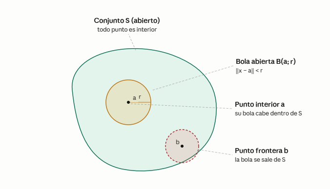
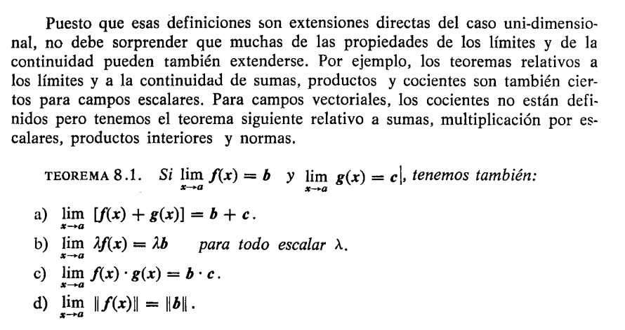
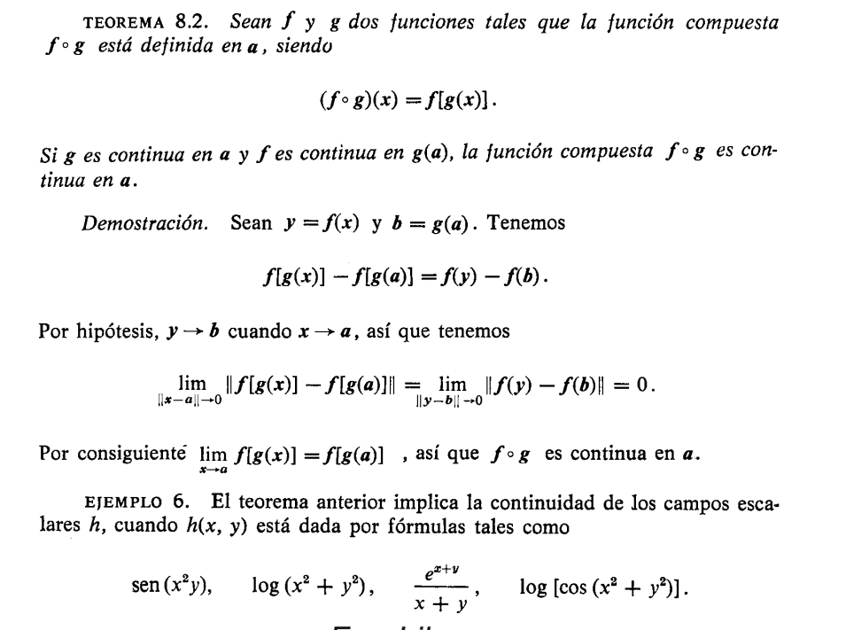
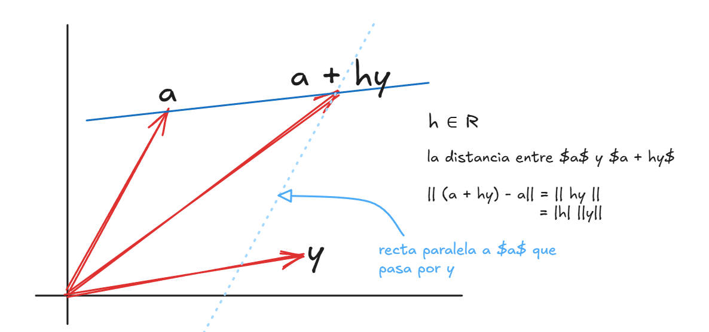
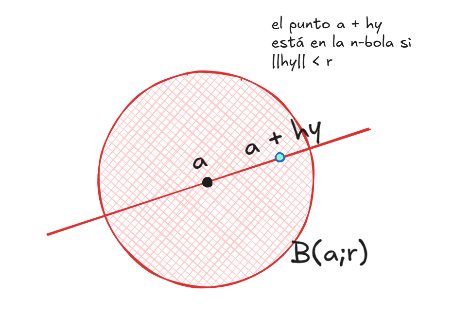

297-324

# CALCULO DIFERENCIAL EN CAMPOS ESCALARES Y VECTORIALES

En este punto ya conocemos bastantes cosas:

- Vimos funciones de $\mathbb{R}$ a $\mathbb{R^n}$ las cuales describian movimiento de particulas en el espacio y otros temas interesantes relacionados a vectores
- Vimos algo de la fundamentación de espacios lineales y transformaciones lineales

En este punto el autor nos propone tener transformaciones lineales $T: \mathbb{R^n} \to \mathbb{R^m}$ pero con la diferencia de que $T$ no sea lineal, apensar de que $V$ y $W$ si sean espacios lineales de dimensión finita

En particular cuando tenemos:

- Una función $T: \mathbb{R^n} \to \mathbb{R}$ le llamamos campo escalar
- Una función $T: \mathbb{R^n} \to \mathbb{R^m}$ le llamamos campo vectorial

El autor también propone utilizar el producto interior y norma así

$$x \cdot y = \sum_{k=1}^{n} x_{k} y_k$$

$$\lVert x \rVert = (x \cdot x)^{-1}$$

Investigando un poco y hablando con la IA me menciona lo siguiente

> Y aquí está la idea profunda: la linealidad no desaparece, se muda del nivel global al nivel local. Aunque $T$ globalmente sea curva, si haces zoom infinito alrededor de un punto $a$, la función se ve recta. Ese mapa lineal local que aproxima a $T$ cerca de $a$ es la derivada, $DT(a): \mathbb{R}^n \to \mathbb{R}^m$ y esa sí es una transformación lineal entre espacios vectoriales, representada por una matriz: la jacobiana. Toda la maquinaria de la Parte 1 reaparece, pero como modelo infinitesimal de la Parte 2.

Todo esto aparecerá en su momento, por ahora veamos lo fundamental de este tipo de funciones. Como vimos al inicio estas funciones se caracterizan por tener como argumento un vector de $ \mathbb{R^n}$ y eso tiene unas implicaciones importantes

## Bolas abiertas y conjuntos abiertos

Sean $a$ un punto dado en $\mathbf{R}^n$ y $r$ un número positivo dado. El conjunto de
todos los puntos $x$ de $\mathbf{R}^n$ tales que

$$\lVert x - a \rVert \lt r$$

se llama **$n$-bola abierta** de radio $r$ y centro $a$. Designamos este conjunto con $B(a; r)$.

recordando que la norma nos indica también la distancia al origen, por lo tanto si el centro de la bola es $a$ entonces si $x$ excede $r$ se considera que está fuera de ella

La bola $B(a; r)$ está constituida por los puntos cuya distancia a $a$ es menor
que $r$. En $\mathbf{R}^1$ es simplemente un intervalo abierto con punto medio en $a$. En $\mathbf{R}^2$
es un disco circular, y en $\mathbf{R}^3$ es un sólido esférico con centro en $a$ y radio $r$.

Esto es importante porque este tipo de funciones puede tener $n$ cantidad de coordenadas de entrada

**DEFINICIÓN DE PUNTO INTERIOR.** Sea $S$ un subconjunto de $\mathbf{R}^n$, y supongamos que $a \in S$. Se dice que $a$ es punto interior de $S$ si existe una $n$-bola abierta con centro en $a$, cuyos puntos pertenecen todos a $S$.

Es decir, todo punto $a$ interior de $S$ puede rodearse por una $n$-bola $B(a)$ tal
que $B(a) \subseteq S$. El conjunto de todos los puntos interiores de $S$ se llama el *interior*
de $S$ y se designa con $int S$. Un conjunto abierto que contenga un punto $a$ se llama
a veces *entorno* de $a$.

**DEFINICIÓN DE CONJUNTO ABIERTO.** Un conjunto $S$ de $\mathbf{R}^n$ se llama abierto si todos sus puntos son interiores. Es decir, $S$ es abierto si y sólo si $S = int S$.

En $\mathbf{R}^1$ el tipo más sencillo de conjunto abierto es un intervalo
abierto. La reunión de dos o más intervalos abiertos es también abierto. Un intervalo cerrado $[a, b]$ no es un conjunto abierto porque ninguno de los extremos del intervalo puede encerrarse en una 1-bola situada enteramente en el intervalo dado.

La 2-bola $S = B(O; 1)$ dibujada en la figura 8.1 es un ejemplo de conjunto
abierto en $\mathbf{R}^2$. Todo punto $a$ de $S$ es el centro de un disco situado por entero en $S$. Para algunos puntos el radio de este disco es muy pequeño.

**DEFINICIONES DE EXTERIOR Y FRONTERA.** Un punto $x$ se llama exterior al conjunto $S$ de $\mathbf{R}^n$ si existe una $n$-bola $B(x)$ que no contiene puntos de $S$. El conjunto de todos los puntos de $\mathbf{R}^n$ exteriores a $S$ se llama el exterior de $S$ y se designa con $\text{ext} S$. Un punto que no es interior ni exterior a $S$ se llama punto frontera de $S$. El conjunto de todos los puntos frontera de $S$ es la frontera de $S$ y se designa con $\partial S$.

Para el ejemplo $S = B(O; 1)$: El exterior de $S$ es el conjunto de todos los $x$ tales que $\lVert x \rVert > 1$. La frontera de $S$ la constituyen todos los $x$ con $\lVert x \rVert = 1$.

graficamente podemos verlo así 

## Límites y continuidad

Para definir esto nos podemos inspirar en el caso unidimensional. Es especialmente util pensar en los campos escalares para la visualización. Pero la definición aplica indistitamente para campos vectoriales también.

Consideremos una función $f: S \to \mathbb{R^m}$ donde $S$ es un subconjunto de $R^n$. Si $a \in \mathbb{R^n}$ y $b \in \mathbb{R^m}$ 

$$\lim_{x \to a}f(x) = b$$

Lo mismo de siempre: $f(x) \to b$ cuando $x \to a$. Y esto significa tambien

$$\lim_{\lVert x - a \rVert \to 0} \lVert f(x) - b \rVert = 0$$

Osea, la distancia al origen entre $x$ y $a$ tiende a cero y eso hace que la imagen $f(x)$ esté tan cerca a $b$ que al calcular la distancia, esta tiende a cero también

Sin embargo en esa expresión tenemos solamente $f(x)$, lo cual no obliga a que la función esté definida en $a$, por lo cual el autor propone reescribir de la siguiente manera, tomando $h = x - a$

$$\lim_{\lVert h \rVert \to 0} \lVert f(a + h) - b \rVert = 0$$

Pero la idea sigue siendo la misma, es solo otra forma de escribir.

Ahora...

Para los puntos de $\mathbb{R^2}$ escribimos $(x,y)$ para $x$. Escribimos $(a,b)$ para expresar $a$. Entonces todo queda así

$$\lim_{(x,y) \to (a,b)}f(x,y) = b$$

Y para  $\mathbb{R^3}$ así....

$$\lim_{(x,y,z) \to (a,b,c)}f(x,y,z) = b$$

Y como se estudió en el caso unidimensional, la continuidad está dada por

$$\lim_{x \to a}f(x) = f(a)$$

Todo eso tiene demostración pero no las incluiré aqui por ahora

> Ver algunos ejemplos en Cálculo de Tom Apostol Vol 2 - pág 304

TODO: poner los limites iterados y las coordenadas polares y el ejemplo 7 (pag 306)

## Derivada de un campo escalar respecto a un vector

Aqui se expone la derivada con respecto a un vector solamente para campos escalares

como se ve en la imagen podemos estar parados en un punto del campo escalar, y dependiendo en la dirección en que nos movamos la temperatura varía

"Sea $f$ un campo escalar definido en un conjunto $S$ de $\mathbb{R^n}$ , y sea $a$ un punto interior de $S$. Deseamos estudiar la variación del campo cuando nos desplazamos desde $a$ a un punto próximo."

Supongamos que se representa esa dirección mediante otro vector y. Esto
es, supongamos que nos movemos desde $a$ hacia otro punto $a + y$, siguiendo el
segmento de recta que une a con $a + y$.

