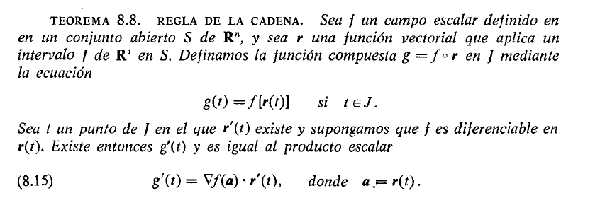
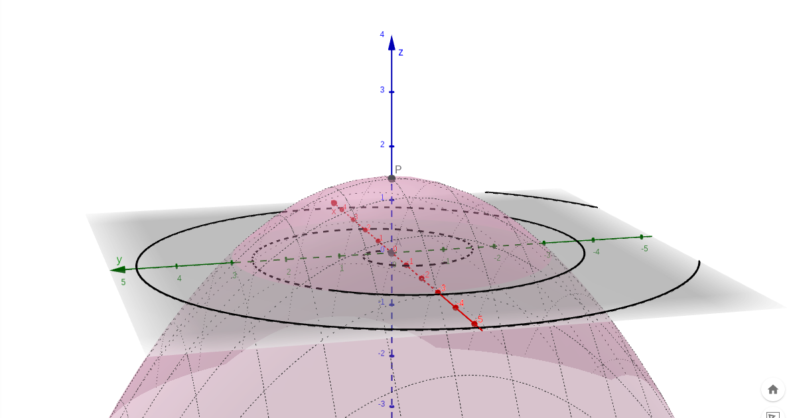
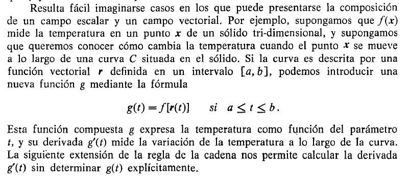
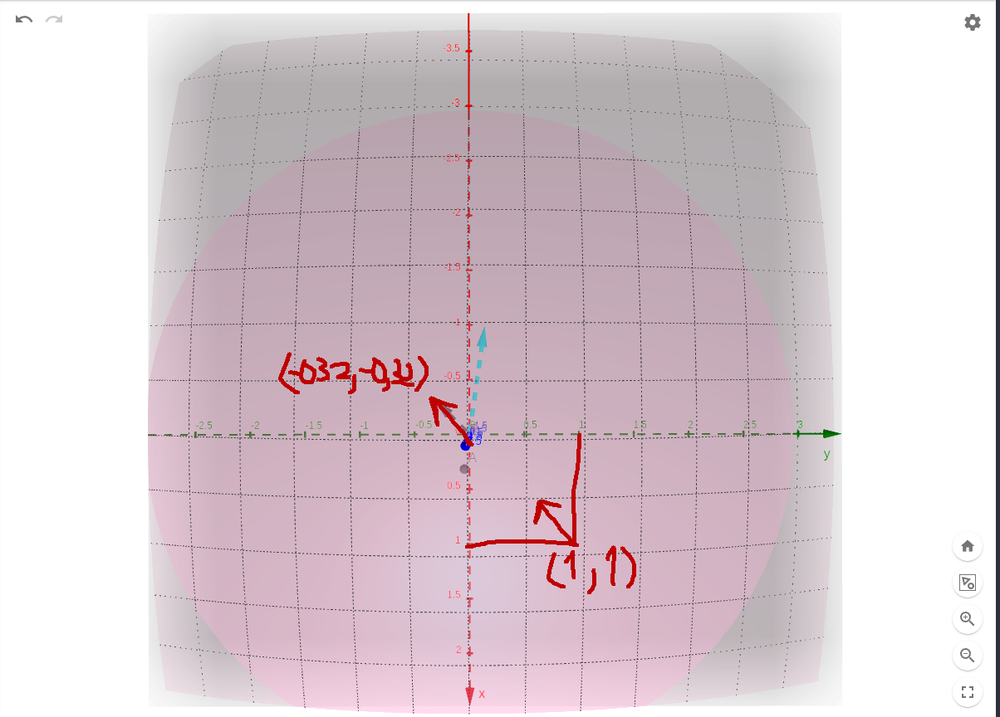
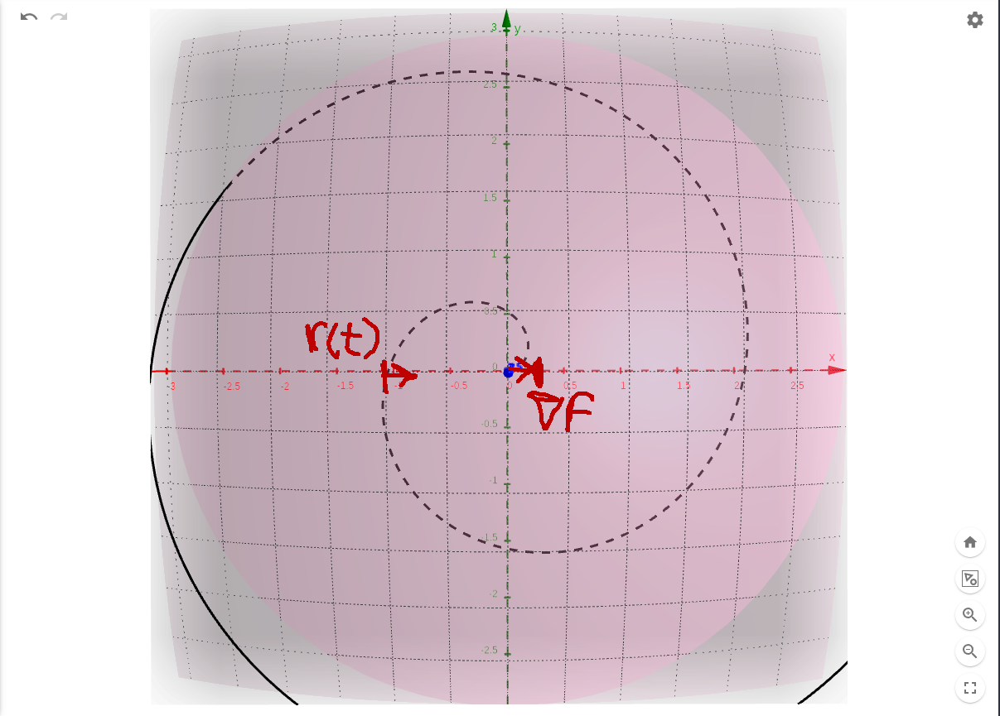
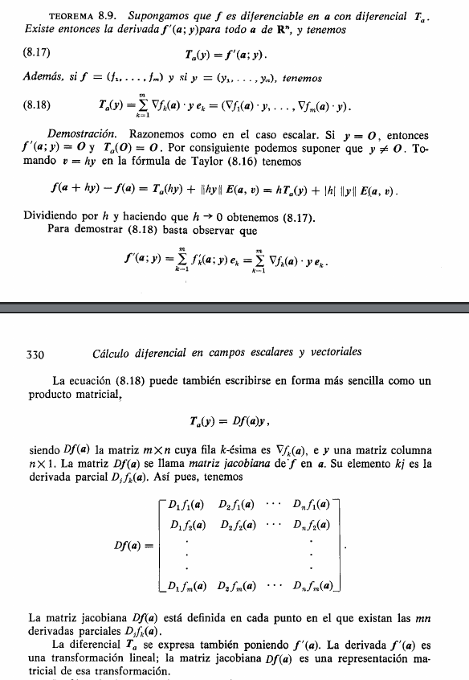
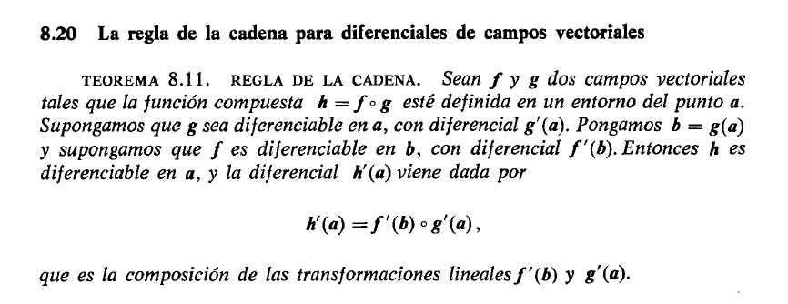
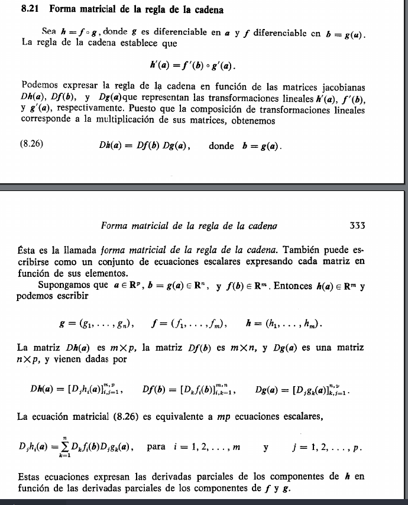
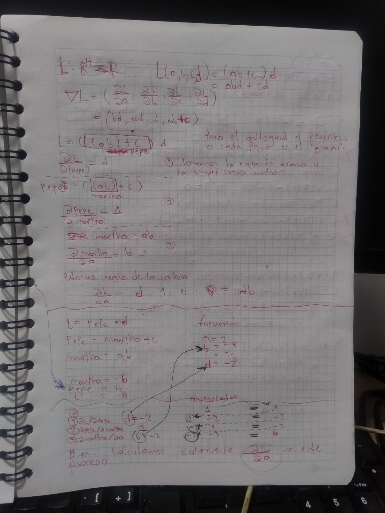
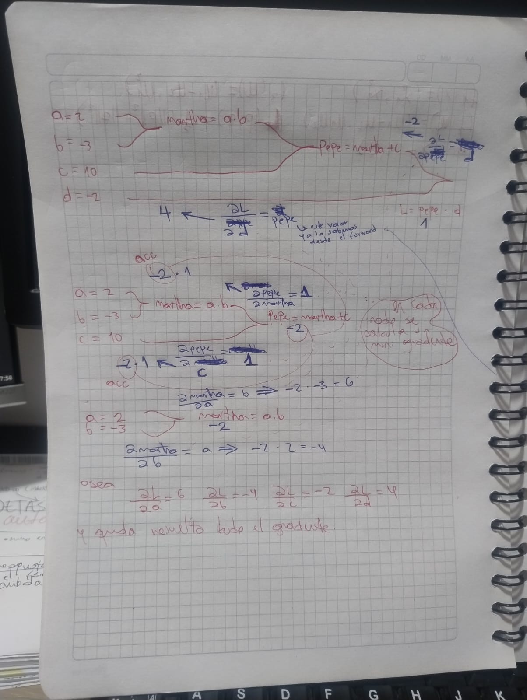

En nuestra exploración de las funciones de varias variables comentamos bastantes aspectos efocándonos en los campos escalares; aquí vamos a ver tanto campos escalares como vectoriales y con particular atención la regla de la cadena en ambos casos

> ver demostración Cálculo Tom M. Apostol vol 2 Pág 214

Ya hemos explorado bstante la teoría. Veamos un ejemplo muy bello

## Ejemplo donde vamos a aplicar muchas cosas

Tenemos un campo escalar y una función vectorial

$$f(x,y) = 1.4-0.16(x^2+y^2) \qquad r(t) = (t\cos(3t), t\sin(3t))$$

esto nos dibuja una cúpula y una espiral en el plano $xy$

para empezar podemos hacer varios analisis. Tal y como dice el teorema 8.8 podemos armarnos una función nueva $g(t)$ la cual representa la composción del campo escalar con la función vectorial, y todo esto es posible porque el resultado de la función vectorial corresponde con la entrada que el campo escalar espera

por lo tanto hacer

$$g(t) = f[r(t)]$$

hace que cuando el parámetro $t$ cambia estamos "surfeando" la cupula siguiendo la trayectoria de la espiral que está dibujada en el plano $xy$, y de ahí salen varios razonamientos, que de hecho el autor del libro comenta

Entonces imaginemos eso, estamos analizando la temperatura de esa cúpula a medida que bajamos siguiendo esa trayectoria con forma de espiral. Pongamos algunos valores de ese movimiento

| $t$   | $r(t)$              | $f[r(t)]$ |
|-------|---------------------|-----------|
| $0$   | $(0, 0)$           | $1.40$    |
| $0.5$ | $(0.035, 0.499)$   | $1.36$    |
| $1$   | $(-0.990, 0.141)$  | $1.24$    |
| $1.5$ | $(-0.316, -1.466)$ | $1.04$    |
| $2$   | $(1.920, -0.559)$  | $0.76$    |

Ahora bien, esto al mismo tiempo nos dice la temperatura en un punto dado de la superficie. Entonces volvemos al mismo análisis de siempre, como medimos la variación de la temperetura en un punto? ahí es donde aparece la derivada

Recientemente vimos el gradiente, veamos primero qué es lo que hace en la práctica

$$\frac{\partial f}{\partial x} = -0.32x \quad \frac{\partial f}{\partial y} = -0.32y$$

$$\nabla f = (-0.32x, -0.32y)$$

Tomemos $(x,y) = (1,1)$

$$\nabla f(1,1) = (-0.32\cdot 1, -0.32\cdot 1) = (-0.32, -0.32)$$

la altura de la cúpula ahí es

$$f(1,1) = 1.4 - 0.16(1^2+1^2) = 1.08$$

Qué significa esto en la cúpula de temperatura:

- Estás parado en el punto $(1,1)$ de la superficie, donde la temperatura es $1.08$
- El vector $(-0.32,-0.32)$ vive en el plano $xy$ (no en 3D) y nos dice: si caminamos en esa dirección, la temperatura sube lo más rápido posible. Como $x=y=1$ y el vector apunta hacia $(-1,-1)$, tiene sentido: la cúpula es más caliente en el centro $(0,0)$, así que "subir" en temperatura es caminar hacia el centro

- La magnitud $|\nabla f(1,1)| = \sqrt{0.32^2+0.32^2} \approx 0.4525$ es la tasa máxima de cambio (por unidad de distancia) que se siente parado ahí
- Si camináramos en la dirección opuesta $(1,1)$ (alejándonos del centro), la temperatura bajaría a esa misma tasa
- Si camináramos perpendicular al gradiente, por ejemplo en dirección $(1,-1)$, la temperatura no cambiaría instantáneamente, nos moveríamos sobre una curva de nivel

Entonces para recapitular, tomamos un punto arbitrario $(1,1)$ e hicimos el análisis. Que pasa entonces con la composición? retomemos el ejemplo original con algunos valores

$$f(x,y) = 1.4-0.16(x^2+y^2) \qquad r(t) = (t\cos(3t), t\sin(3t))$$

$$\nabla f = (-0.32x, -0.32y)$$

tomemos un punto arbitrario **sobre la espiral**

$a = r(\frac{\pi}{3}) = (-\frac{\pi}{3}, 0)$

$\nabla f(a) = (0.335103, 0)$

osea, pudimos componer $f$ con $r$ y cuando una particula se mueve sobre $r$ podemos calcular el gradiente sobre esa trayectoria y en cada punto obtenemos la dirección de mayor crecimiento

finalmente apliquemos la regla de la cadena, porque queremos obtener la variación de temperatura en el tiempo $t$, o que tan rapido cambia la temperatura en $t$

recordemos el teorema 8.8

$$g'(t) = \nabla f(a) \cdot r'(t) \quad \text{donde } a = r(t)$$

necesitamos entonces $r'(t)$

$$r'(t) = (\cos 3t - 3t\sin 3t, \sin 3t + 3t\cos 3t)$$

evaluamos en el mismo punto de antes, $t=\pi/3$

$$r'(\pi/3) = (-1, -\pi)$$

y aplicamos la fórmula, usando $\nabla f(a) = (0.335103, 0)$ que ya calculamos

$$g'(\pi/3) = (0.335103, 0)\cdot(-1, -\pi) = -0.335103$$

qué significa esto: en el instante $t=\pi/3$, mientras la partícula recorre la espiral sobre la cúpula, la temperatura está *disminuyendo* a una tasa de $0.335$ por unidad de $t$. Esto coincide con la tabla: entre $t=1$ ($f=1.24$) y $t=1.5$ ($f=1.04$) la temperatura va bajando en ese tramo, justo donde cae $t=\pi/3\approx1.047$

y lo más bonito de todo: pudimos calcular $g'(t)$ sin construir explícitamente $g(t)=f[r(t)]$ y derivarla directamente — eso es justo lo que promete el teorema 8.8, calcular la derivada de la composición a partir del gradiente del campo escalar y la derivada de la función vectorial

# Caso para campos vectoriales

En nuestro estudio pasado vimos como funciona esto para campos escalares, vimos de donde sale la diferencial por medio del polinomio de taylor de grado 1, vimos como aparece el gradiente etc. El caso de campos vectoriales es muy similar y sin ahondar mucho en la teoría veamoslo mas bien con un ejemplo

### Caso escalar $f:\mathbb{R}^2\to\mathbb{R}$

$$f(x,y)=x^2 y.$$

Gradiente:

$$\nabla f=\big(2xy, x^2 \big)$$

Derivada como producto escalar (fórmula 8.9 / caso escalar):

$$f'(a;y)=\nabla f(a)\cdot y=\sum_{k=1}^{n} D_k f(a)y_k$$

Aquí $T_a:\mathbb{R}^2\to\mathbb{R}$ y su "matriz" es la única fila $\nabla f(a)$. El resultado es **un escalar**.

### Caso vectorial $F:\mathbb{R}^2\to\mathbb{R}^2$

Se extiende $f$ pegándole una segunda componente de salida, dejando la primera idéntica:

$$F(x,y)=\big(\underbrace{x^2 y}_{F_1},\underbrace{x+y^2}_{F_2}\big)$$

Aqui calculamos dos gradientes:

$$\nabla F_1=\big(2xy, x^2\big),\qquad \nabla F_2=\big(1, 2y\big)$$

Derivada como apilamiento de $m$ productos escalares (fórmula 8.18):

$$F'(a;y)=\big(\nabla F_1(a)\cdot y, \nabla F_2(a)\cdot y\big)=\sum_{k=1}^{m}\big(\nabla F_k(a)\cdot y\big)e_k.$$

El resultado es **un vector de $\mathbb{R}^m$**.

### Compactación vía Jacobiana

Las filas de la Jacobiana son los gradientes de cada componente:

$$
D_F(a)=\begin{pmatrix}
\nabla F_1(a) \\
\nabla F_2(a)
\end{pmatrix}
\qquad
F'(a;y)=D_F(a)y
$$

entonces queda

$$
D_F(a)=\begin{pmatrix}
2xy & x^2 \\
1 & 2y
\end{pmatrix}
$$

tal y como dice el teorema

### Jacobiana en un punto

Igual que hicimos con el gradiente, evaluemos $D_F$ en un punto concreto, $(x,y)=(1,1)$

$$
D_F(1,1)=\begin{pmatrix} 2\cdot1\cdot1 & 1^2 \\ 1 & 2\cdot1 \end{pmatrix}
=
\begin{pmatrix} 2 & 1 \\ 1 & 2 \end{pmatrix}
$$

Ahora veamos qué hace $D_F(1,1)$ como transformación lineal, aplicándola sobre los vectores de la base $e_1=(1,0)$ y $e_2=(0,1)$

$$
D_F(1,1)\begin{pmatrix} 1 \\ 0 \end{pmatrix}=\begin{pmatrix} 2 \\ 1 \end{pmatrix}
\qquad
D_F(1,1)\begin{pmatrix} 0 \\ 1 \end{pmatrix}=\begin{pmatrix} 1 \\ 2 \end{pmatrix}
$$

esto no es casualidad: las columnas de $D_F(a)$ **son** las imágenes de $e_1$ y $e_2$, es decir $\partial F/\partial x$ y $\partial F/\partial y$ evaluadas en $a$. Multiplicar por $D_F(a)$ es preguntar "si me muevo una unidad en $x$, o una unidad en $y$, ¿a dónde va a parar la salida de $F$?"

### El gradiente y $r'(t)$ ya eran Jacobianas

Con esto podemos releer todo lo que hicimos arriba con la cúpula y la espiral: nunca salimos del concepto de Jacobiana, solo estábamos en casos particulares donde una de las dimensiones es $1$

- $f:\mathbb{R}^2\to\mathbb{R}$ (la cúpula) tiene $m=1$, entonces $D_f(a)$ es una matriz de $1\times2$: una sola fila, que es exactamente $\nabla f(a)$
- $r:\mathbb{R}\to\mathbb{R}^2$ (la espiral) tiene $n=1$, entonces $D_r(t)$ es una matriz de $2\times1$: una sola columna, que es exactamente $r'(t)$

## La regla de la cadena campos vectoriales

y es la misma idea que antes, tomamos el resultado de $g$ para componer $f$ haciendo énfasis en la suposición de que ambas son diferenciables en su respectivo dominio

> La diferencial es una transformación lineal, y componer transformaciones lineales equivale a multiplicar sus matrices

---

### Entonces esto queda así para campos escalares

Volvamos a las dos funciones que veníamos componiendo desde el principio del documento, la cúpula y la espiral

$$f:\mathbb{R}^2\to\mathbb{R} \qquad f(x,y) = 1.4-0.16(x^2+y^2)$$

$$r:\mathbb{R}\to\mathbb{R}^2 \qquad r(t) = (t\cos 3t, t\sin 3t)$$

su composición es $g = f\circ r:\mathbb{R}\to\mathbb{R}$, la que llamamos $g(t)=f[r(t)]$ desde el principio. El teorema 8.8 que usamos para calcular $g'(\pi/3)$ no es un caso aislado, es la instancia más chica posible de la regla de la cadena general

$$D_{G\circ F}(a) = D_G\big(F(a)\big)\cdot D_F(a)$$

donde en general $F:\mathbb{R}^p\to\mathbb{R}^n$ y $G:\mathbb{R}^n\to\mathbb{R}^m$. Decimos que este caso es "el más chico" porque $p=1$ (el dominio de $r$ es solo $t$) y $m=1$ (la salida de $f$ es un escalar, la temperatura). Las dimensiones $p$ y $m$ son justo las que sí pueden crecer en el caso general — como en el ejemplo con $g:\mathbb{R}^2\to\mathbb{R}^3$ y $f:\mathbb{R}^3\to\mathbb{R}^2$ más abajo — pero aquí ambas valen $1$, por eso el resultado termina siendo un número y no una matriz

reescribamos lo que ya calculamos en forma matricial para verlo, sustituyendo $F=r$ y $G=f$ en la fórmula

$$
D_f(a)=\nabla f(a)=(0.335103, 0) \quad (1\times2)
\qquad
D_r(\pi/3)=r'(\pi/3)=\begin{pmatrix} -1 \\ -\pi \end{pmatrix} \quad (2\times1)
$$

$$
D_{f\circ r}(\pi/3) = D_f(a)\cdot D_r(\pi/3)
= (0.335103, 0)\begin{pmatrix} -1 \\ -\pi \end{pmatrix}
= -0.335103
$$

que es el mismo $g'(\pi/3)$ que ya habíamos obtenido. La dimensión intermedia $n=2$ (la salida de $r$, que es la misma entrada que espera $f$) es sobre la que se suma en el producto matricial: con $n=2$ términos, multiplicar una matriz $1\times2$ por una $2\times1$ da una matriz $1\times1$, o sea un escalar, y el producto matricial colapsa exactamente al producto punto que usamos en el teorema 8.8

### Y así para campos vectoriales

Ejemplo con dos campos vectoriales, calculado por dos rutas para comprobar que coinciden: multiplicando Jacobianas vs. componiendo y derivando directamente.

Se toma un espacio intermedio de dimensión distinta para que las matrices no sean cuadradas y se aprecie el "encaje":

$$g:\mathbb{R}^2\to\mathbb{R}^3,\qquad g(s,t)=\big(s+t, st, s^2\big)$$

$$f:\mathbb{R}^3\to\mathbb{R}^2,\qquad f(x,y,z)=\big(x+yz, xy-z\big)$$

La composición $h=f\circ g:\mathbb{R}^2\to\mathbb{R}^2$. Aquí $p=2$, $n=3$, $m=2$.

#### Ruta 1: multiplicar las Jacobianas

**Jacobiana de $g$** (tamaño $3\times 2$), derivando cada componente respecto a $s$ y $t$:

$$
Dg(a)=\begin{pmatrix}
1 & 1 \\
t & s \\
2s & 0
\end{pmatrix}
$$

**Jacobiana de $f$** (tamaño $2\times 3$), respecto a $x,y,z$:

$$
Df=\begin{pmatrix}
1 & z & y \\
y & x & -1
\end{pmatrix}
$$

Paso clave: hay que evaluar $Df$ en $b=g(a)$, es decir sustituir $x=s+t, y=st, z=s^2$ osea metemos los valores en las casillas donde esté cada una de las variables $x$, $y$ o $z$ asi: 

$$
Df(b)=\begin{pmatrix}
1 & s^2 & st \\
st & s+t & -1
\end{pmatrix}
$$

Producto $Dh(a)=Df(b)Dg(a)$, que es $(2\times 3)(3\times 2)=2\times 2$. La dimensión interna $n=3$ es sobre la que se suma:

$$
Dh(a)=
\begin{pmatrix} 1 & s^2 & st \\ st & s+t & -1 \end{pmatrix}
\begin{pmatrix} 1 & 1 \\ t & s \\ 2s & 0 \end{pmatrix}
=
\begin{pmatrix} 1+3s^2t & 1+s^3 \\ 2st+t^2-2s & s^2+2st \end{pmatrix}
$$

(por ejemplo, la entrada superior izquierda es fila 1 · columna 1: $1\cdot 1 + s^2\cdot t + st\cdot 2s = 1+3s^2t$).

#### Ruta 2: componer primero y derivar después

Sustituyendo $g$ dentro de $f$ se obtiene $h$ explícitamente:

$$h_1=x+yz=(s+t)+(st)(s^2)=s+t+s^3t$$

$$h_2=xy-z=(s+t)(st)-s^2=s^2t+st^2-s^2$$

Derivando directamente:

$$\frac{\partial h_1}{\partial s}=1+3s^2t,\quad \frac{\partial h_1}{\partial t}=1+s^3,\quad \frac{\partial h_2}{\partial s}=2st+t^2-2s,\quad \frac{\partial h_2}{\partial t}=s^2+2st$$

$$
Dh(a)=\begin{pmatrix}
1+3s^2t & 1+s^3 \\
2st+t^2-2s & s^2+2st
\end{pmatrix}
$$

**Idéntica a la ruta 1.** Multiplicar las dos Jacobianas equivale a componer y derivar, pero sin tener que expandir la composición.

### La notación de Leibniz *es* la matriz Jacobiana

La idea central: todo el "lío de nombres" de la notación de Leibniz —$\frac{\partial x}{\partial s}$, $\frac{\partial x}{\partial t}$, etc.— no es más que el producto de matrices Jacobianas escrito **entrada por entrada**. Son el mismo objeto a dos niveles de zoom.

#### El montaje

Un campo vectorial $g$ que arma las variables intermedias:

$$g:\mathbb{R}^2\to\mathbb{R}^2,\qquad g(s,t)=\big(\underbrace{s+t^2}_{g_1}, \underbrace{st}_{g_2}\big)$$

A la salida de $g_1$ la llamamos $x$, y a la de $g_2$ la llamamos $y$:

$$x=g_1(s,t)=s+t^2,\qquad y=g_2(s,t)=st$$

$x$ e $y$ **no son variables independientes**: son nombres para los resultados de $g$. Por eso $\frac{\partial x}{\partial s}$ y $\frac{\partial g_1}{\partial s}$ son lo mismo.

Un campo escalar $f$ que consume esas variables intermedias:

$$f:\mathbb{R}^2\to\mathbb{R},\qquad f(x,y)=x^2 y$$

Y la composición que queremos derivar:

$$h=f\circ g:\mathbb{R}^2\to\mathbb{R},\qquad h(s,t)=f\big(g(s,t)\big)$$

El flujo completo de un punto:

$$(s,t) \xrightarrow{ g } (x,y)=\big(s+t^2, st\big) \xrightarrow{ f } x^2y = h(s,t)$$

#### Las derivadas "sueltas" son la Jacobiana de $g$

Las cuatro derivadas que hacían ruido son simplemente las cuatro casillas de $Dg$:

$$
Dg(s,t)=
\begin{pmatrix} \dfrac{\partial x}{\partial s} & \dfrac{\partial x}{\partial t} \\[8pt] \dfrac{\partial y}{\partial s} & \dfrac{\partial y}{\partial t} \end{pmatrix}
=
\begin{pmatrix} \dfrac{\partial g_1}{\partial s} & \dfrac{\partial g_1}{\partial t} \\[8pt] \dfrac{\partial g_2}{\partial s} & \dfrac{\partial g_2}{\partial t} \end{pmatrix}
=
\begin{pmatrix} 1 & 2t \\ t & s \end{pmatrix}
$$

Escribirlas con nombres $x,y$ en vez de $g_1,g_2$ es lo único que las hacía parecer un enjambre desordenado.

#### Del lado de $f$: su Jacobiana es el gradiente

Al ser $f$ un campo escalar, su Jacobiana es una sola fila:

$$
Df=\begin{pmatrix} \dfrac{\partial f}{\partial x} & \dfrac{\partial f}{\partial y} \end{pmatrix}
=
\begin{pmatrix} 2xy & x^2 \end{pmatrix}
$$

#### La revelación: las dos ecuaciones de Leibniz son una multiplicación de matrices

Poniendo las dos derivadas de $h$ como una fila, $Dh = Df \cdot Dg$:

$$
\underbrace{\begin{pmatrix} \dfrac{\partial h}{\partial s} & \dfrac{\partial h}{\partial t} \end{pmatrix}}_{Dh}
=
\underbrace{\begin{pmatrix} 2xy & x^2 \end{pmatrix}}_{Df}
\underbrace{\begin{pmatrix} 1 & 2t \\ t & s \end{pmatrix}}_{Dg}
$$

Haciendo fila-por-columna:

- primera columna: $2xy\cdot 1 + x^2\cdot t  =  \dfrac{\partial h}{\partial s}$
- segunda columna: $2xy\cdot 2t + x^2\cdot s  =  \dfrac{\partial h}{\partial t}$

Que son **exactamente** las ecuaciones (8.27) de Apostol:

$$\frac{\partial h}{\partial s}=\frac{\partial f}{\partial x}\frac{\partial x}{\partial s}+\frac{\partial f}{\partial y}\frac{\partial y}{\partial s},\qquad \frac{\partial h}{\partial t}=\frac{\partial f}{\partial x}\frac{\partial x}{\partial t}+\frac{\partial f}{\partial y}\frac{\partial y}{\partial t}$$

#### Tabla de traducción

| Notación $D$ (Apostol) | Notación $\partial$ (Leibniz) | Quién es realmente | Valor aquí |
|---|---|---|---|
| $D_1 f$ | $\dfrac{\partial f}{\partial x}$ | $f$ derivada respecto a su 1ª entrada | $2xy$ |
| $D_2 f$ | $\dfrac{\partial f}{\partial y}$ | $f$ derivada respecto a su 2ª entrada | $x^2$ |
| $D_1 g_1$ | $\dfrac{\partial x}{\partial s}$ | $g_1$ (o sea $x$) respecto a $s$ | $1$ |
| $D_2 g_1$ | $\dfrac{\partial x}{\partial t}$ | $g_1$ (o sea $x$) respecto a $t$ | $2t$ |
| $D_1 g_2$ | $\dfrac{\partial y}{\partial s}$ | $g_2$ (o sea $y$) respecto a $s$ | $t$ |
| $D_2 g_2$ | $\dfrac{\partial y}{\partial t}$ | $g_2$ (o sea $y$) respecto a $t$ | $s$ |

La columna $\partial$ y la columna $D$ son el mismo objeto con distinto disfraz.

#### La conclusión

- La notación de Leibniz ($\frac{\partial f}{\partial x}\frac{\partial x}{\partial s} + \dots$) = escribir el producto de matrices **entrada por entrada, a mano**.
- La forma matricial ($Dh = DfDg$) = las mismas ecuaciones **empaquetadas**.

Son el mismo objeto a dos niveles de zoom. Leibniz obliga a deletrear cada casilla con nombres propios; la Jacobiana lo dice todo de golpe. Una vez que sabes que $\frac{\partial x}{\partial s}$ no es más que una casilla de $Dg$, la notación deja de ser un enjambre y pasa a ser un producto matricial escrito componente a componente.

# Autograd POR FIIIIINNNNN

Objetivo: comprobar que el paso hacia atrás (`backward`) de PyTorch calcula lo mismo que derivar a mano. Se usa el ejemplo de Karpathy. Orden: primero el gradiente a mano, luego autograd, al final las conclusiones.

La pérdida es una función escalar de cuatro variables:

$$L:\mathbb{R}^4\to\mathbb{R},\qquad L(a,b,c,d)=(ab+c)d=abd+cd$$

Por ser escalar ($m=1$), su derivada es un **gradiente**: una fila con las cuatro parciales.

Valores del ejemplo: $a=2, b=-3, c=10, d=-2$

#### 1.1 Derivar 

Se deriva $L=abd+cd$ respecto a cada variable, tratando las demás como constantes:

$$\frac{\partial L}{\partial a}=bd \qquad
\frac{\partial L}{\partial b}=ad \qquad
\frac{\partial L}{\partial c}=d \qquad
\frac{\partial L}{\partial d}=ab+c$$

El gradiente explícito, todavía sin números, es:

$$\nabla L(a,b,c,d)=\big(bd,ad,d,ab+c\big)$$

#### 1.2 Reemplazar valores

Ahora se sustituye $a=2,\ b=-3,\ c=10,\ d=-2$:

$$\frac{\partial L}{\partial a}=bd=(-3)(-2)=6$$
$$\frac{\partial L}{\partial b}=ad=(2)(-2)=-4$$
$$\frac{\partial L}{\partial c}=d=-2$$
$$\frac{\partial L}{\partial d}=ab+c=(2)(-3)+10=4$$

**Resultado a mano:**

$$\nabla L(2,-3,10,-2)=(6, -4, -2, 4)$$

---

#### Parte 2 — El proceso de autograd (descomposición en operaciones)

Autograd llega al mismo gradiente, pero **no** deriva la fórmula cerrada. En su lugar hace lo que hace Karpathy en el video: parte $L$ en operaciones elementales, guarda cada resultado intermedio como una variable, y aplica la regla de la cadena nodo por nodo hacia atrás. Esa es la diferencia esencial con la Parte 1.

#### Backward = regla de la cadena sobre una composición gigante

La duda que resuelve esta nota: la regla de la cadena habla de **funciones compuestas**, pero en el grafo de autograd no se ve ninguna composición explícita. ¿Dónde está?

Los paréntesis son el mapa de la composición. Leídos de dentro hacia afuera, muestran tres operaciones anidadas:

$$L=\underbrace{\Big(\;\underbrace{(\;\underbrace{a\cdot b}_{1.\ \text{producto}}\;)+c}_{2.\ \text{suma}}\;\Big)\cdot d}_{3.\ \text{producto}}$$

vamos a nombrar estos elementos para tener una guía visual

$$L=\Big(\;\underbrace{(\;\underbrace{a\cdot b}_{\text{martha}}\;)+c}_{\text{pepe}}\;\Big)\cdot d$$

Esa anidación de paréntesis **es** la composición: cada capa es una función que envuelve a la anterior.

### Derivar la fórmula gigante respecto a 🚨 $a$ 🚨

Se aplica la regla de la cadena capa por capa, de afuera hacia adentro.

- **Capa externa:** $L=(\text{pepe})\cdot d$. Derivada respecto a su interior: $\dfrac{\partial L}{\partial(\text{pepe})}=d$.
- **Capa media:** $\text{pepe}= \text{martha} + c$. Entonces: $\dfrac{\partial(\text{pepe})}{\partial(\text{martha})}=1$.
- **Capa interna:** $\text{martha} = a \cdot b$. Entonces: $\dfrac{\partial(\text{martha})}{\partial a}=b$.

La regla de la cadena: **multiplicar las derivadas de todas las capas atravesadas** para ir de $L$ hasta $a$:

$$\frac{\partial L}{\partial a}=\underbrace{d}_{\text{externa}}\cdot\underbrace{1}_{\text{media (suma)}}\cdot\underbrace{b}_{\text{interna (producto)}}=d\cdot 1\cdot b = d\,b.$$

#### esos factores son los nodos del grafo

Cada factor del producto es la derivada local de un nodo que el gradiente atravesó en su camino de vuelta:

$$\frac{\partial L}{\partial a}=\underbrace{d}_{\substack{\text{nodo }L=pepe\cdot d\\ \partial L/\partial pepe}}\cdot\underbrace{1}_{\substack{\text{nodo }pepe=martha+c\\ \partial pepe/\partial martha}}\cdot\underbrace{b}_{\substack{\text{nodo }martha=a\cdot b\\ \partial martha/\partial a}}$$

El backward del grafo va acumulando este producto **un factor a la vez**:

1. arranca en $L$ con $1$;
2. cruza el nodo producto $L=pepe\cdot d$ → multiplica por $d$ → lleva $d$;
3. cruza el nodo suma $pepe=martha+c$ → multiplica por $1$ → sigue con $d$;
4. cruza el nodo producto $martha=a\cdot b$ → multiplica por $b$ → llega con $d\,b$.

El grafo **es** la fórmula gigante, y el backward **es** derivar esa fórmula con la regla de la cadena — pero sin escribirla ni expandirla. Solo se necesita la derivada local de cada operación y multiplicarlas en cadena mientras se retrocede.

---

# De una fórmula escalar fea a un grafo con fan-out (y por qué eso es backprop)

En los apuntes anteriores vimos dos ejemplos de autograd: el escalar de Karpathy ($L=(ab+c)d$), Acá cerramos con el caso de un grafo con nodos vectoriales **y** fan-out explícito.

La idea que lo ordena todo: **no imponemos los campos vectoriales desde afuera; los descubrimos factorizando una fórmula escalar fea.** Igual que un `common subexpression elimination` en código.

---

## Paso 1 — El campo escalar feo, tal cual

Arrancamos desde el monstruo aplanado, un $L:\mathbb{R}^2\to\mathbb{R}$ honesto y horrible:

$$L(x_1,x_2)=\tfrac12\Big[(x_1^2+x_2^2)^2+x_1^4x_2^4+(x_1^2-x_2^2)^2+x_1^8\Big]$$

Se puede derivar simbólicamente respecto a $x_1$ y $x_2$, sin problema. Pero **fijate cuánto se repite $x_1^2$ y $x_2^2$**: aparecen en los cuatro términos. Esa repetición es el olor a que hay estructura escondida.

Si derivás esta fórmula a lo bestia, re-derivás $x_1^2$ una y otra vez en cada término. Eso tiene nombre: *expression swell* — las derivadas de subexpresiones repetidas se recalculan una y otra vez, y la expresión explota.

---

## Paso 2 — Los campos vectoriales *emergen* de factorizar

Aplicamos `common subexpression elimination`: cada subexpresión repetida le ponemos nombre y la sacamos afuera. Y al hacerlo, los nombres se agrupan solos en vectores.

Primero, lo que aparece en *todos* los términos: $x_1^2$ y $x_2^2$. Los bautizamos juntos:

$$u=(x_1^2,\ x_2^2)\quad\Longrightarrow\quad f_1(x)=(x_1^2,\ x_2^2)$$

Ahí nació el primer campo vectorial, no porque lo impusimos, sino porque esas dos subexpresiones aparecían pegadas. Ahora, adentro de $L$ vemos dos bloques que solo dependen de $u$:

$$p=(u_1+u_2,\ u_1u_2)\quad\Longrightarrow\quad f_2(u)=(u_1+u_2,\ u_1u_2)$$

$$q=(u_1-u_2,\ u_1^2)\quad\Longrightarrow\quad f_3(u)=(u_1-u_2,\ u_1^2)$$

Y lo que queda afuera envolviendo todo es la loss:

$$L=\tfrac12(\|p\|^2+\|q\|^2)\quad\Longrightarrow\quad \ell(p,q)=\tfrac12(\|p\|^2+\|q\|^2)$$

La fórmula fea se reescribió sola como un grafo con **fan-out en $u$**. Los campos vectoriales no vinieron de afuera: son las cajas que quedan cuando factorizás lo repetido.

### El montaje resultante

$$
x \xrightarrow{\ f_1\ } u
\begin{cases}
\xrightarrow{\ f_2\ } p \\[4pt]
\xrightarrow{\ f_3\ } q
\end{cases}
\xrightarrow{\ \ell\ } L
$$

El nodo $u$ tiene **dos consumidores** ($f_2$ y $f_3$). Esa bifurcación *es* la repetición de $x_1^2, x_2^2$ en la fórmula, ahora hecha explícita.

---

## Paso 3 — Backprop sobre esa estructura

Ahora que $L$ es un grafo, no derivamos el monstruo: recorremos de atrás hacia adelante, multiplicando la Jacobiana local de cada nodo, y **en $u$ sumamos las dos ramas** (el fan-out). Trabajamos en $x=(1,2)$.

### Forward (guardar cada nodo)

$$u=f_1(1,2)=(1,\ 4)$$
$$p=f_2(1,4)=(1+4,\ 1\cdot4)=(5,\ 4)$$
$$q=f_3(1,4)=(1-4,\ 1^2)=(-3,\ 1)$$
$$L=\tfrac12(5^2+4^2+(-3)^2+1^2)=\tfrac12(25+16+9+1)=25.5$$

### Jacobianas locales

$$
Df_1=\begin{pmatrix} 2x_1 & 0 \\ 0 & 2x_2 \end{pmatrix}
\xrightarrow{x=(1,2)}
\begin{pmatrix} 2 & 0 \\ 0 & 4 \end{pmatrix}
$$

$$
Df_2=\begin{pmatrix} 1 & 1 \\ u_2 & u_1 \end{pmatrix}
\xrightarrow{u=(1,4)}
\begin{pmatrix} 1 & 1 \\ 4 & 1 \end{pmatrix}
$$

$$
Df_3=\begin{pmatrix} 1 & -1 \\ 2u_1 & 0 \end{pmatrix}
\xrightarrow{u=(1,4)}
\begin{pmatrix} 1 & -1 \\ 2 & 0 \end{pmatrix}
$$

Loss (escalar, gradiente respecto a cada rama):

$$\frac{\partial L}{\partial p}=p=(5,\ 4)\qquad \frac{\partial L}{\partial q}=q=(-3,\ 1)$$

### El backward — acá aparece el reparto

Las dos ramas bajan por separado hasta $u$, y **en $u$ se suman**. Ese es exactamente el efecto que veíamos con Karpathy, ahora con matrices.

**Rama $p$** (baja por $f_2$):

$$
\frac{\partial L}{\partial u}\Big|_{\text{vía }p}
=\underbrace{(5,4)}_{\partial L/\partial p}\underbrace{\begin{pmatrix} 1 & 1 \\ 4 & 1 \end{pmatrix}}_{Df_2}
=(5+16,\ 5+4)=(21,\ 9)
$$

**Rama $q$** (baja por $f_3$):

$$
\frac{\partial L}{\partial u}\Big|_{\text{vía }q}
=\underbrace{(-3,1)}_{\partial L/\partial q}\underbrace{\begin{pmatrix} 1 & -1 \\ 2 & 0 \end{pmatrix}}_{Df_3}
=(-3+2,\ 3+0)=(-1,\ 3)
$$

**El reparto se junta en $u$ — se suman las dos contribuciones:**

$$\frac{\partial L}{\partial u}=(21,9)+(-1,3)=(20,\ 12)$$

Esta es la regla que faltaba ver con matrices: **cuando un nodo alimenta varias ramas, su gradiente es la suma de lo que le baja por cada rama.** En Karpathy esto pasaba en cada nodo interno (la suma repartía a $e$ y $c$); acá pasa en $u$, y cada contribución viene de un producto fila-por-matriz.

**Último nodo** (cruza $f_1$ hacia $x$):

$$
\frac{\partial L}{\partial x}=(20,12)\begin{pmatrix} 2 & 0 \\ 0 & 4 \end{pmatrix}=(40,\ 48)
$$

---

## Verificación por la otra ruta

Componemos explícito y derivamos, para comprobar. Con $u=(x_1^2,x_2^2)$:

$$p=(u_1+u_2,\ u_1u_2)=(x_1^2+x_2^2,\ x_1^2x_2^2)$$
$$q=(u_1-u_2,\ u_1^2)=(x_1^2-x_2^2,\ x_1^4)$$

$$L=\tfrac12\big[(x_1^2+x_2^2)^2+(x_1^2x_2^2)^2+(x_1^2-x_2^2)^2+(x_1^4)^2\big]$$

Derivando respecto a $x_1$ y evaluando en $(1,2)$:

$$\frac{\partial L}{\partial x_1}=(x_1^2+x_2^2)(2x_1)+(x_1^2x_2^2)(2x_1x_2^2)+(x_1^2-x_2^2)(2x_1)+x_1^4(4x_1^3)$$

En $(1,2)$: $=5\cdot2+4\cdot8+(-3)\cdot2+1\cdot4=10+32-6+4=40\ \checkmark$

Coincide con el backward.
