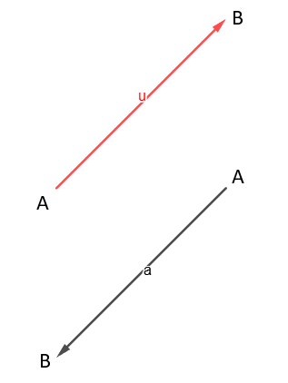
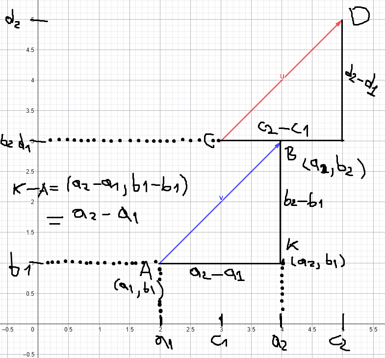
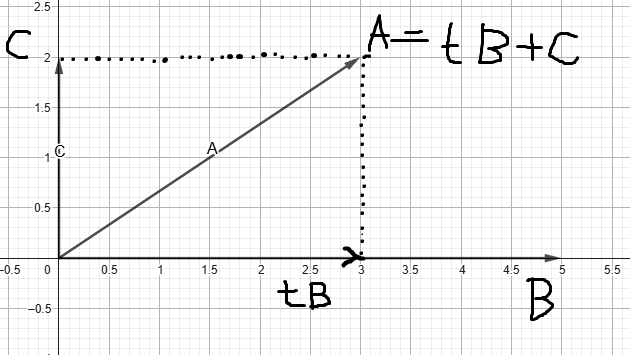
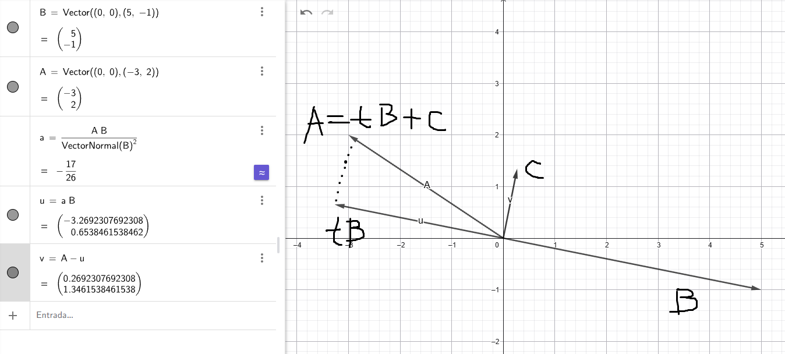

# Interpretación

Existen tres métodos escencialmente distintos para introducir el álgebra vectorial:

##### Geométricamente

Los vectores se representan por segmentos orientados o flechas. Las operacion es algebráicas con vectores como + - * por números reales se definen y estudian por métodos geométricos.

##### Analíticamente

Los vectores y las operaciones se expresan mediante números llamados componentes. Entonces, las propiedades se deducen a partir de las propiedades de los números de las componentes. La descripción analítica de los vectores surge espotáneamente de la representación geométrica en cuanto se introduce un sistema coordenado.

##### Axiomáticamente

No se intenta describir la naturaleza de un vector o de las operaciones algebráicas, en su lugar se imaginan como conceptos no definidos de los que nada se sabe excepto que satisfacen un cierto conjunto de axiomas.

Utilizaremos esos tres métodos simultaneamente en todo este análisis, ya que los tres son válidos al mismo tiempo. Lo importante es la comodidad y la facilidad, en algunas ocasiones las cosas se entenderán mejor con uno y no con los otros, pero eso lo veremos mas adelante....

La historia es que al inicio de todo, los griegos conocían como situar un punto en una recta, algo así como decir 1 está en el eje X. Mas adelante descartes introdujo el plano, y se dio cuenta de que podía ubicar un par de numeros $(a,b)$ allí, y también una terna $(a,b,c)$ en el espacio y así infinitamente sin limitaciones.

Entonces aquí tenemos nuestra primera idea, podemos considerar una n-pla $(a_1, a_2, \dots, a_n)$ como un punto n-dimensional. Dependiendo de la cantidad de componentes es el lugar donde vive, por ejemplo si nuestro punto n-dimensional es:

- $x = (a_1, a_2)$ entonces este es un punto del plano, o mejor dicho de $\mathbb{R}^2$
- $x = (a_1, a_2, a_3)$ entonces este es un punto del espacio, o mejor dicho de $\mathbb{R}^3$
- etc

"El conjunto de todos los vectores n-dimensionales se llama espacio vectorial de n-plas o n-espacio, designado con $V_n$. Para convertir $V_n$ en una estructura algebráica introducimos la igualda y adición de vectores y la multiplicación por escalar" - De hecho este enunciado es un análisis axiomático, que se puede explicar con los Espacios Lineales, un tema que veremos mas a profundidad en el futuro.

Por ahora, vale la pena enunciar los axiomas para $V_n$. Sean $A = (a_1, a_2, \dots, a_n)$ y $B = (b_1, b_2, \dots, b_n)$ de $V_n$, entonces:

- $A = B$ si $a_1 = b_1, a_2 = b_2 \dots a_n = b_n$
- $A + B = (a_1 + b_1, a_2 + b_2, \dots, a_n + b_n)$
- $cA = (ca_1, ca_2, \dots, ca_n)$ con $c \in \mathbb{R}$
- $A + B = B + A$
- $A + (B + C) = (A + B) + C$
- $c(dA) = (cd)A$
- $O = (0,0, \dots, 0)$ y $A + O = A$
- $(-1)A = -A$

Hasta aqui hay una semejanza indistinguible entre un número complejo y un vector de dos dimensiones, ambos se diferencian al introducir el producto.

## Interpretación geométrica en $\mathbb{R}^2$

En esta primera imagen tenemos dos vectores libres. De hecho, la palabra libre suena muy bien, ya que en esta primera aproximación solo podemos analizaros "morfológicamente". Podríamos en lugar de imaginarnos dos flechas, pensar que son dos renacuajos. Para ambos casos la cabeza es B y la cola es A

Por lo tanto, podríamos afirmar que el renacuajo "va" hacia una dirección, ya que la cabeza guía a la cola. Por lo tanto, con esta comparación en mente, nuestra flecha va desde A a B, de la cola a la cabeza, de punto inicial al punto final. Para indicar esta idea utilizamos la notación $\overrightarrow{AB}$, el vector a A a B.

Ahora que conocemos nuestros vectores, vamos a introducir el sistema coordenado

podemos ver en la imagen que al introducir el sistema coordenado podemos empezar a utilizar las propiedades vistas anteriormente. Vemos que el vector $\overrightarrow{AB}$ se descompone en dos componentes que podemos escribir como se muestra en la imagen. 

De igual manera si comparamos el vector $v$ con el vector $u$ y comparamos sus componentes en maginitud encontraremos que ambos tienen la misma longitud y dirección. Por lo tanto los llamamos vectores geométricos equivalentes. Osea

$$\overrightarrow{AB} = \overrightarrow{CD}$$

$$B-A = D - C$$

Si se cumple que 

$$a_2 - a_1 = c_2 - c_1$$

$$b_2 - b_1 = d_2 - d_1$$

### Ley del paralelogramo

También encontramos una curiosidad geométrica, observemos este ejemplo donde $A$ es el origen

si sumamos los vectores $b$ y $c$ obtenemos el vector $w$. Sin embargo, si nos fijamos en los vértices $A, B, C, D$ vemos que dibujan un paralelogramo, donde $\overrightarrow{AB}$ es equivalente a $\overrightarrow{CD}$ siempre que

$$B - A = D - C$$
$$A + D = B + C$$

lo que nos dice que los vértices opuestos del paralelogramos tienen la misma suma

# Producto escalar

No tengo claro como descubrieron esto... el caso es que lo hicieron y se define de esta manera

"Si $A = (a_1, \dots, a_n)$ y $B = (b_1, \dots, b_n)$ dos vectores de $V_n$ entonces su producto escalar se representa con $A \cdot B$, y se define con la igualdad"

$$A \cdot B = \sum_{k=1}^{n} a_k b_k$$

es decir, esta operación nos da como resultado un número real.

"Para todos los vectores $A, B, C$ de $V_n$ y todos los escalares $c$ tenemos las siguientes propiedades"

- $A \cdot B = B \cdot A$
- $A \cdot (B + C) = (A \cdot B) + (A \cdot C)$
- $c(A \cdot B) = cA \cdot B = A \cdot cB$
- $A \cdot A \gt 0 \text{ si } A \neq O$
- $A \cdot A = 0 \text{ si } A = O$

# Desigualdad de Cauchy-Schwarz

Si $A$ y $B$ son vectores de un espacio $V_n$ tenemos que

$$(A \cdot B)^2 \leq (A \cdot A) (B \cdot B)$$

$$\left( \sum_{i=1}^{n} a_i b_i \right)^2 \leq \left( \sum_{i=1}^{n} a_i^2 \right) \left( \sum_{i=1}^{n} b_i^2 \right)$$

el signo de igualdad es válido si y solo si hay un número real $x$ tal que $a_kx + b_k = 0 \forall k = 1, 2, \dots, n$, es decir, uno es múltiplo escalar del otro. En este caso si despejamos 

$$a_kx + b_k = 0$$

$$a_kx = -b_k$$

Ejemplo:

Si $A = (1, 2)$ y $B = (2, 4)$ entonces cuanto vale $x$? $1x = -2$, $2x = -4$ Entonces $x = -2$.

Asi que si reemplazaramos $-2A + B = 0$ se cumple. Por lo cual, introducir $a_kx + b_k = 0$ en la demostración nos ayuda a probar la igualdad, ya que al mismo tiempo es una forma de indicar cuando ambos vectores son múltiplos escalares, pero eso lo veremos más a fondo más adelante.

continuando... para todo real $x$ se tiene que

$$\sum_{k=1}^{n} (a_k x + b_k)^2 \geq 0$$

porque una suma de cuadrados nunca es negativa. En este paso elevamos al cuadrado nuestra expresión y efectivamente esto nos sirve para probar que siempre es mayor que cero. Entonces de esta manera tenemos las herramientras para probar ambos casos.

Esto se puede poner en la forma

$$\sum_{k=1}^{n}(a_k x + b_k)^2 =\sum_{k=1}^{n}(a_k^2x^2 + 2a_kb_kx +b_k^2)$$

$$Ax^2 + 2Bx + C \geq 0$$

Donde

$$A=\sum_{k=1}^{n}a_k^2 \text{ ; } B=\sum_{k=1}^{n}a_kb_k \text{ ; } C=\sum_{k=1}^{n}b_k^2$$

Queremos demostrar que 

$$\left( \sum_{k=1}^{n}a_kb_k \right)^2 \leq \left( \sum_{k=1}^{n}a_k^2  \right) \left( \sum_{k=1}^{n}b_k^2 \right)$$

$$B^2 \leq AC$$

Si $A=0$ cada $a_k = 0$ con lo que $B=0$ y el resultado es trivial. Si $A \neq 0$ podemos completar el cuadrado y escribir

$$Ax^2 + 2Bx + C = A \left( x + \frac{B}{A} \right)^2 + \frac{AC-B^2}{A}$$

para completarlo dividimos todo entre $A$

$Ax^2 + 2Bx + C = 0$

$x^2 + \frac{2B}{A}x + \frac{C}{A} = 0$

Sabemos que $(x + \alpha)^2 = x^2 + 2\alpha x + \alpha^2$

Nosotros tenemos $\alpha = \frac{B}{A}$ 

Entonces podemos escribir $x^2 + 2\alpha x = \left(x + \frac{B}{A} \right)^2 - \left(\frac{B}{A} \right)^2$

Entonces reescribirmos

$$Ax^2 + 2Bx + C = A \left[ \left(x + \frac{B}{A} \right)^2 - \left(\frac{B}{A} \right)^2 \right] + C$$

$$ = A \left(x + \frac{B}{A} \right)^2 -\frac{B^2}{A} + C$$

$$ = A \left(x + \frac{B}{A} \right)^2 + \left( C - \frac{B^2}{A} \right)$$

$$ Ax^2 + 2Bx + C  = A \left(x + \frac{B}{A} \right)^2 + \frac{AC - B^2}{A}$$

Aqui ya podemos ver varias cosas:

- $A \gt 0$
- $\left(x + \frac{B}{A} \right)^2 \gt 0$

Entonces

- $\frac{AC - B^2}{A} \to B^2 \leq AC$, la cual es la desigualdad del inicio

Para probar la igualdad observemos

$$ Ax^2 + 2Bx + C  = A \left(x + \frac{B}{A} \right)^2 + \frac{AC - B^2}{A}$$

el segundo miembro de la igualdad es mínimo cuando $x = \frac{-B}{A}$, hemos dicho que el valor mínimo es cero entonces verifiquemos

$A \left( \frac{-B}{A} \right)^2 + 2B\left( \frac{-B}{A} \right) + C = 0$

$\frac{B^2}{A} - \frac{-2B^2}{A} + C = 0$

$- \frac{-B^2}{A} + C = 0$

$B^2 \leq AC$

La desigualdad de Cauchy-Schwarz es muy importante y se utiliza en diversas demostraciones

# Longitud o norma de un vector

Cuando introdujimos los vectores observamos que estos tenían forma triangular al analizar sus componentes. En este momento podemos usar el teorema de pitágoras para definir la norma del vector. De igual manera que en un triángulo, lo utilizamos para saber la longitud de la hipotenusa

$$\lVert A \rVert = \left( A \cdot A\right)^{\frac{1}{2}} = \sqrt{A \cdot A} =  \sqrt{a_1^2 + a_2^2 + \cdots + a_n^2}$$

funciona para $n$ dimensiones

- $\lVert A \rVert \gt 0$ si $A \neq O$
- $\lVert A \rVert = 0$ si $A = O$
- $\lVert cA \rVert = |c| \lVert A \rVert$

# Desigualdad Triangular

La longitud de un lado de un triángulo no supera la suma de las longitudes de los otros lados.

Si $A$ y $B$ son vectores de $V_n$ tenemos que

$$\lVert A + B \rVert \leq \lVert A \rVert + \lVert B \rVert$$

Si hacemos:

$$\lVert A + B \rVert^2 \leq (\lVert A \rVert + \lVert B \rVert)^2$$

$$(A+B) \cdot (A+B) = \lVert A \rVert^2 + 2\lVert A \rVert \lVert B \rVert + \lVert B \rVert^2$$

$$A \cdot A + 2A \cdot B + B \cdot B = \lVert A \rVert^2 + 2\lVert A \rVert \lVert B \rVert + \lVert B \rVert^2$$

$$\lVert A \rVert^2 + 2A \cdot B + \lVert B \rVert^2= \lVert A \rVert^2 + 2\lVert A \rVert \lVert B \rVert + \lVert B \rVert^2$$

$$A \cdot B \leq \lVert A \rVert \lVert B \rVert$$

lo cual es la desigualdad de Cauchy-Schwartz y ya sabemos que es válida.

El razonamiento completo es:

1. Queremos probar la desigualdad triangular
2. La reducimos a una desigualdad con producto interno
3. Esa desigualdad es Cauchy–Schwarz
4. Cauchy–Schwarz ya está demostrada

# Ortogonalidad de vectores

En medio de la demostración anterior, viendo solo el desarrollo de la parte izquierda de la igualdad, llegamos a esto:

$$\lVert A + B \rVert^2 = \lVert A \rVert^2 + 2A \cdot B + \lVert B \rVert^2$$

Retomando de nuevo la identidad pitagórica, podemos formar un **triángulo rectángulo**, como vimos anteriormente, esta vez considerando la magnitud de sus partes, así:

$$\lVert A + B \rVert^2 = \lVert A \rVert^2 + \lVert B \rVert^2$$

ambas expresiones se diferencian por el término $2A \cdot B$, es decir, este es el término que describe el triángulo cuando es **no rectángulo**. Por lo cual, cuando el término es cero induscutiblemente el triángulo es rectángulo. 

Entonces este término es cero cuando $2A \cdot B = 0$ osea cuando $A \cdot B = 0$

> En otras palabras, cuando el producto punto entre dos vectores es cero nos indica que hacen parte de un triángulo rectángulo, o mejor dicho, **ambos vectores son perpendiculares**

Gracias a esto podemos sacar un resultado muy importante y muy utilizado

# Proyecciones y ángulos entre dos vectores

Observemos el siguiente gráfico

vemos que la proyección es una especie de "sombra" que hace el vector $A$ sobre el $B$. Para ello, queremos encontrar el escalar $t$, asi que asumimos el vector $C$ que forma un triángulo rectángulo con $tB$, de esta manera podemos definir A. Por lo tanto:

$$tB + C = A$$

multiplicamos por $B$

$tB \cdot B + C \cdot B = A \cdot B$

como $C$ y $B$ son perpendiculares entonces $C \cdot B = 0$ osea que

$tB \cdot B = A \cdot B$

$t = \frac{A \cdot B}{B \cdot B}$ osea que 

$$t = \frac{A \cdot B}{\lVert B \rVert^2}$$

De hecho, aqui tenemos un ejemplo que no es tan visual, pero vemos que funciona

### Ángulos

Gracias a esto podemos encontrar un resultado muy útil

$$cos(\theta) = \frac{\lVert tB \rVert}{\lVert A \rVert}$$

$$cos(\theta) = \frac{t\lVert B \rVert}{\lVert A \rVert}$$

ya conocemos $t$ así que reemplacemos 

$$cos(\theta) = \frac{\frac{A\cdot B}{\lVert B \rVert^2}\lVert B \rVert}{\lVert A \rVert}$$

$$cos(\theta) = \frac{\frac{A\cdot B}{\lVert B \rVert}}{\lVert A \rVert}$$

$$cos(\theta) = \frac{A\cdot B}{\lVert A \rVert \lVert B \rVert}$$

$$A \cdot B = \lVert A \rVert \lVert B \rVert cos(\theta)$$

y de igual manera 

$$\theta = cos^{-1}\left( \frac{A \cdot B}{\lVert A \rVert \lVert B \rVert} \right)$$

Esto es un resultado muy importante y muy usado, de hecho, muchos sistemas de recomendación se apoyan en esta idea para comparar vectores. En varios lugares lo llaman "cosine similarity", es prácticamente encontrar el ángulo entre dos vectores

# Vectores coordenados unitarios

A lo largo de este texto hemos escrito los vectores como tuplas, pero hay otra forma de escribirlos

$$(a, b) = a(1, 0) + b(0, 1)$$

$$(a, b) = (a, 0) + (0, b)$$

$$(a, b) = (a + 0, b + 0)$$

esto recuerda bastante a las distintas maneras en las que se puede escribir un número complejo. Aquí, estamos utilizando dos vectores muy especiales para representar $(a, b)$ ya que, recordando las propiedades, encontramos que estamos multiplicando un escalar por un vector.

Los vectores $(1, 0)$ y $(0, 1)$ que multiplican los componentes $a$, $b$ se llaman vectores coordenados unitarios. El k-ésimo componente de $E_k$ es $1$ y los demás son cero, así:

$$E_1 = (1, 0, 0, \dots, 0)$$
$$E_2 = (0, 1, 0, \dots, 0)$$
$$\vdots$$
$$E_n = (0, 0, 0, \dots, 1)$$

se llama vector unitario ya que cada vector $E_k$ tiene longitud $1$ y todos ellos son ortogonales entre si

$$E_k \cdot E_j = 0 \text{ si } k \neq j$$

Por lo tanto, todo vector $X = (X_1, \dots, X_n)$ de $V_n$ puede expresarse de la forma 

$$X = X_1E_1 + \cdots + X_nE_n = \sum_{k=1}^{n} X_kE_k$$

Esto lo conocemos como una **combinación lineal**, multiplicar cada componente por una constante y luego sumar los términos.

Los vectores coordenados unitarios $E_1, \dots, E_n$ generan el espacio $V_n$ y a su vez lo generan con unicidad. Esto empieza a abrir campo para otros temas pero veamoslo rápidamente

Consideremos $V_3$ y observemos los tres vectores unitarios

$$i = (1, 0, 0)$$
$$j = (0, 1, 0)$$
$$k = (0, 0, 1)$$

Esos son tres vectores que apuntan en dirección de los ejes coordenados y tiene magnitud 1. Puedo generar cualquier otro vector de $V_3$ haciendo la combinación lineal de $i, j, k$ con otras tres constantes cualquieras $c_1, c_2, c_3$

Por ejemplo $c_1 = 3, c_2 = 1, c_3 = 2$ me generan el vector 

$$q = 3(1,0,0) + 1(0,1,0) + 2(0,0,1)$$

$$q = (3,0,0) + (0,1,0) + (0,0,2)$$

$$q = (3,1,2)$$

Ahora bien, decimos que se genera con unicidad porque no hay otras tres constantes que me generen el vector $q$, la única manera es con $c_1 = 3, c_2 = 1, c_3 = 2$, esto lo escriben en los libros como 

$W = \sum_{k=1}^{n} X_kE_k$

$W= \sum_{k=1}^{n} Y_kE_k $

esto solo es cierto si

$X_k = Y_k$ para cada valor $k = 1, 2, ..., n$

# Envolvente lineal de un conjunto finito de vectores

Lo anterior nos da el insumo para generalizar el concepto. Vimos que a partir de un conjunto de vectores podemos generar todo un espacio. Para nuestro ejemplo anterior el conjunto fueron los vectores $i,j,k$ y con ellos pudimos generar todo $V_3$, haciendo la combinación lineal de ellos con tres constantes

Aqui vamos a decir que si tenemos un conjunto no vacio de $k$ vectores $S = \{A_1, \dots, A_n \}$ y un vector $V_n$ puede representarse como una combinación lineal de los vectores en el conjunto

$$X = \sum_{i = 1}^{k} C_iA_i$$

recordando que también necesitamos $k$ constantes. Entonces decimos que $S$ genera al vector $X$

> Entonces,  el conjunto de todos los vectores generados por $S$ se denomina **envolvente lineal de S** y se designa por $L(S)$

Ejemplo 1: un buen ejemplo fue el que vimos anteriormente para $V_3$

Ejemplo 2: Todo conjunto $S = \{A_1, \dots, A_n \}$ genera el vector nulo ya que

$$O = 0A_1 + \dots + 0A_k$$

Esta representación donde todos los coeficientes $c_1, \dots, c_2$ son cero se llama **representación trivial del vector nulo**.

Sin embargo pueden existir combinaciones no triviales que representen $O$. Por ejemplo si uno de los vectores del envolvente lineal es múltiplo escalar del otro

$i = (1, 0, 0)$

$j = (0, 1, 0)$

$k = (0, 0, 1)$

$h = (0, 0, 2)$ aquí $h = 2k$

si definimos el conjunto $S = \{i, j, k, h\}$ y generamos un vector

$$W = c_1(1,0,0) + c_2(0,1,0) + c_3(0,0,1) + c_4(0,0,2)$$

$$W = (c_1,0,0) + (0,c_2,0) + (0,0,c_3) + (0,0,2c_4)$$

$$W = (c_1, c_2, c_3 + 2c_4)$$

si usamos $c_1 = 0, c_2 = 0, c_3 = -2, c_4 = 1$ habremos generado el vector nulo con la representación **no trivial**, ya que sin usar todas las constantes en cero pudimos llegar al vector nulo.

# Independencia Lineal

