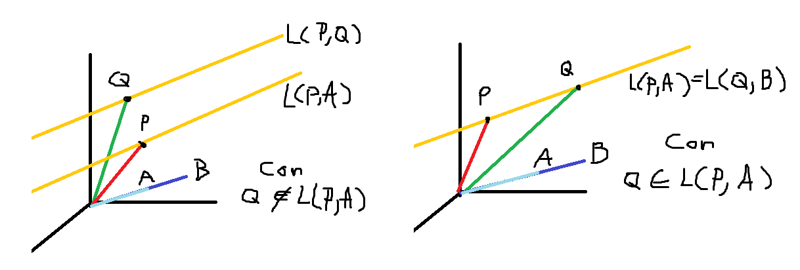
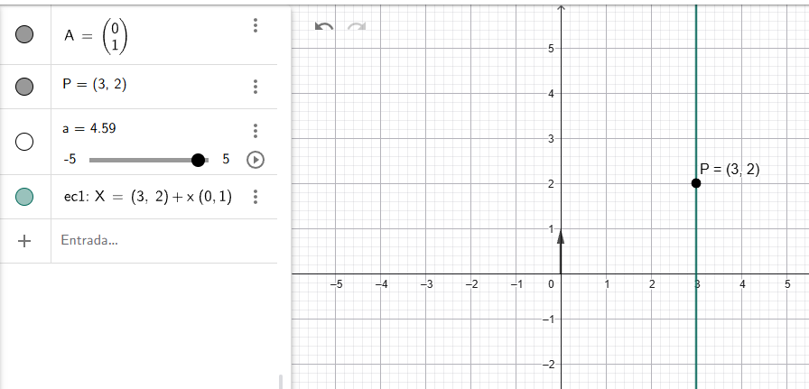
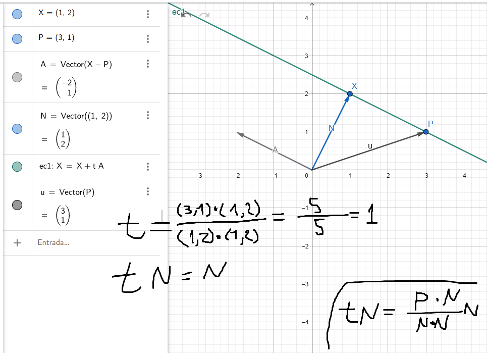

# Aplicaciones a Geometría Analítica

Vamos a realizar el análisis de todo lo que aprendimos para definir algunas cuesitones geométricas. Vamos a definir cosas como recta, plano y "en". Todo esto aplica para $R_n$, sin embargo por temas de visualización vamos a utilizar $R_3$ y hacer unas gráficas bien sabrosas

Vamos a emplezar las operaciones algebráicas de suma y multiplicación por escalar en $V_n$

## La Recta

Sea $P$ un punto y un vector $A$ no nulo. El conjunto de todos los puntos de la forma $P + tA$ con $t \in  \mathbb{R}$, es **una recta** que pasa por $P$ y es paralela a $A$. Designaremos esa recta con $L(P; A)$ 

$$L(P; A) = \{ P + tA | t \in  \mathbb{R}\}$$

> Recordando... $L$ es el envolvente lineal. Es un conjunto de $n$ vectores los cuales se les hace la combinación lineal con n constantes. Entonces el envolvente lineal $L$ genera vectores

En este caso, los vectores generados por $L$ son los vectores que describen una linea recta, y veamos estos enunciados importantes

En $L(P; A)$

1. El punto $P$ está en la recta, ya que corresponde a $t=0$
2. El vector $A$ se llama vector de dirección de la recta
3. La recta $L(O; A)$ que pasa por el origen $O$ es el envolvente lineal de $A$, es decir todos los productos de $A$ por escalares. En este caso prácticamente el conjunto $S = \{ A \}$.
4. La recta $P$ paralela a $A$ se obtiene sumando $P$ a cada vector de la envolvente lineal de $A$

[Ver en geogebra](https://www.geogebra.org/m/wnzeuzcw)

## Propiedades de las rectas

1. Podemos reemplazar el vector de dirección $A$ por uno paralelo a este. Es decir $A = cB$ o en otras palabras, $B$ es un múltiplo escalar de $A$ con $c \neq 0$. Por lo tanto, dos rectas $L(P;A)$ y $L(P;B)$ que pasan por el mismo punto son iguales si los vectores de dirección $A$ y $B$ son paralelos

2. Dos rectas $L(P;A)$ y $L(Q;A)$ con el mismo vector de dirección $A$ son iguales si $Q$ está en $L(P;A)$. Ya que, si $Q$ no está en $L(P;A)$, $L(Q;A)$ es una recta paralela pero no igual

3. Dadas $L$ y un punto $Q \notin L$, existe solo una recta $L'$ que contiene $Q$ y es paralela a $L$. Como se ve en el gráfico, la única manera es que se elija el vector director paralelo a $L$, ya que por $Q$ pasan infinitas rectas diferentes

4. Dos puntos distintos determinan una recta. Es decir, si $P \neq Q$ existe solo una recta que contiene $P$ y $Q$. Puede describirse como el conjunto $\{ P + t(Q - P) \}$. De esta manera podemos averiguar si un punto $Q$ está en una recta dada $L(P;A)$. $Q$ está en $L(P;A)$ si $Q-P$ es paralelo a $A$.

    Ejemplo:

    $P = (1,2,3)$ $A = (2,-1,5)$ $Q_1 = (1,1,4)$ $Q_2 = (5,0,13)$

    - $Q_1 - P = (0,-1,1)$ por lo tanto $Q_1 \notin L(P;A)$
    - $Q_2 - P = (4,-2,10) = 2A$ por lo tanto $Q_2 \in L(P;A)$

5. Los vectores $A$ y $B$ de un $V_n$ son linealmente dependientes si están en la misma recta que pasa por el origen. La dependencia lineal de dos vectores en $V_n$ puede expresarse geométricamente.

# Rectas y Funciones Vectoriales

Ya vimos como generar el envolvente lineal $L(P; A) = \{ P + tA | t \in  \mathbb{R}\}$ genera la recta en el momento en que $t$ toma valores diferentes. Podemos extrapolar esta idea y escribirlo como una función, la cual tiene $t$ como argumento, y genera como salida un vector

$$x(t) = P + tA$$

Entonces, el dominio es $\mathbb{R}$ y el recorrido es la recta $L(P; A)$

> - Le llamamos **función vectorial de variable real**
> - $t$ es el parámetro
> - También le llamamos ecuación paramétrica o ecuación vectorial de la recta

### Algunas consideraciones importantes

- Dos puntos $x(a)$ y $x(b)$ de $L(P; A)$ son iguales si y solo si $P + aA = P + bA$  o $(a-b)A = O$; como $A \neq O$ la igualdad se cumple si $a = b$
- Valores distintos de $t$ conducen a puntos distintos de la recta
- Tres puntos $x(a)$ $x(b)$ $x(c)$ siendo $a<b$; $x(c)$ **está entre $x(a)$ y $x(b)$** si $a < c < b$. Esto nos da la idea de que son puntos sucesivos y de hecho reafirma la forma de la recta.
- Un par de puntos $P, Q$ se llama congruente a $P', Q'$ si $\lVert P - Q \rVert = \lVert P' - Q' \rVert$, es decir la distancia entre ambos pares es igual
- Si una recta pasa por dos puntos distintos $P, Q$ podemos utilizar $P-Q$ como vector dirección 

    $x(t) = P + t(Q-P)$ o $x(t) = tQ + (1-t)P$

    De hecho esto lo encontramos con la definición como conjunto

### Ecuación vectorial en función de los componentes y ecuación cartesiana

Suponiendo dos puntos cualquiera 

$P = (p,q,r)$

$A = (a,b,c)$

Y sumamos ambos como lo hacemos para la recta, obtenemos

$(x,y,z) = (p,q,r) + t(a,b,c)$

$(x,y,z) = (p+ta, q+tb, r+tc)$

Y ahora hacemos la igualdad entre las componentes, entonces:

$$x = p+ta$$

$$y = q+tb$$

$$z = r+tc$$

ok ahora hagamos algo bien loco, y utilicemos solo $x$ y $y$, es decir hagamos el análisis para $\mathbb{R}^2$

$x = p+ta$ despejamos $t = \frac{(x-p)}{a}$

$y = q+tb$ despejamos $t = \frac{(y-q)}{b}$

igualamos 

$\frac{(x-p)}{a} = \frac{(y-q)}{b}$

$b(x-p) = a(y-q)$

$b(x-p) - a(y-q) = 0$

y vemos que es la ecuación cartesiana de la recta. Si $a \neq 0$ podemos escribir

$$y-q = \frac{b}{a}(x-p)$$

El punto $(p, q)$ está en la recta, y $\frac{b}{a}$ es la pendiente. Esa es la ecuación que nos enseñaron toda la vida, sin que nos dijeran que $\frac{b}{a}$ aparece gracias al vector director. Y pues, tiene total sentido que funcione

Y para ir mas allá, vamos a ratificar la frase que dice "para dibujar una linea solo se necesitan dos puntos". Hace un momento aprendimos que dos puntos $P, Q$ están en la recta si su diferencia es paralela a $A$. Esto nos sirve entonces para saber $A$ a partir de $P, Q$. Es decir, que vamos a justificar la otra fórmula bien conocida de la pendiente 

$$m = \frac{y_2 - y_1}{x_2 -x_1}$$

Esa es la que enseñan, pero ¿de dónde viene?. Recordemos esta expresión

$$x(t) = P + t(Q-P)$$

y hacemos el mismo razonamiento

$P = (p,q,r)$

$Q = (p_2,q_2,r_2)$

$A = (p_2 - p, q_2 - q, r_2 - r)$

$(x,y,z) = (p+t(p_2 - p), q+t(q_2 - q), r+t(r_2 - r))$ y tomamos solo $x,y$

depejamos $t$, igualamos y resolvemos

$x = p+t(p_2 - p)$ despejamos $t = \frac{(x-p)}{(p_2 - p)}$

$y = q+t(q_2 - q)$ despejamos $t = \frac{(y-q)}{(q_2 - q)}$

$(q_2 - q)(x-p) - (p_2 - p)(y-q) = 0$

$y-q = \frac{(q_2 - q)}{(p_2 - p)}(x-p)$

es decir, la pendiente que aprendimos en la escuela es el vector director. 

Otra de las preguntas que me hacía era las rectas verticales. Estas se escriben de la forma $y = ?$, porque se rompe la ecuación de la recta, ya que la pendiente es indeterminada ya que $\frac{b}{a}$ no se puede calcular porque $a$ es la componente en $x$ y si la recta es vertical $a = 0$

si lo hacemos con el vector director vemos que 

$A = (0 , 1)$ es decir apunta solo en el eje $y$

y un punto por ejemplo $P = (3, 2)$

y de esta manera podemos escribirla como una función.

#### Vector normal a la recta

Hay otra forma de escribir la recta utilizando algunas de las propiedades que vimos en el episodio de Geometría Analítica.

Retomando $b(x-p) - a(y-q) = 0$, podemos escribirla utilizando productos escalares así

$N = (b, -a)$

$(x-p) \cdot N = 0$ o también $x \cdot N = p \cdot N$

puesto que 

$(x,y) \cdot (p,q) \cdot (b,-a) = 0$

$(x-p, y-q) \cdot (b,-a) = 0$

$b(x-p) + (-a)(y-q) = 0$

esto es posible ya que el vector $N$ es perpendicular a $A$, y se llama vector normal a la recta

$N \cdot A = 0$ porque $(b,-a) \cdot (a,b) = 0$

En la imagen podemos ver (aunque no esté la ecuación para la recta debido a la herramienta) que $(X-P)$ genera el vector director $A$ y todos los puntos que cumplen la relación $(x-p) \cdot N = 0$ están en la recta. Es algo así como prolongar el vector director, el vector normal siempre será el mismo y ahí es donde se dibujan los puntos de la recta. 

Entonces $P,X \in L(P;A)$ y $N$ es ortogonal a $(P-X)$. Además podemos ver en la figura que de todos los puntos $x$ de la recta el de menor longitud $\lVert X \rVert$ se obtiene cuando $X$ es la proyección de $P$ sobre $N$

Así que finalmente podemos deducir la distancia del origen a la recta. Aprovechándonos de lo que encontramos con la proyección, vamos a hacer lo siguiente

$$\text{proj}_{N} P = \frac{P \cdot N}{N \cdot N} N$$

$d = \lVert \frac{P \cdot N}{N \cdot N} N \rVert$

$d = |\frac{P \cdot N}{N \cdot N}| \lVert N \rVert$

$d = \frac{|P \cdot N|}{\lVert N \rVert^2} \lVert N \rVert$

$d = \frac{|P \cdot N|}{\lVert N \rVert}$

Todo $X$ de $L$ tiene longitud $\lVert X \rVert \ge d$. Además $\lVert X \rVert = d$ si $X$  es la proyección de $P$ sobre $N$

# Planos en el espacio n-dimensional