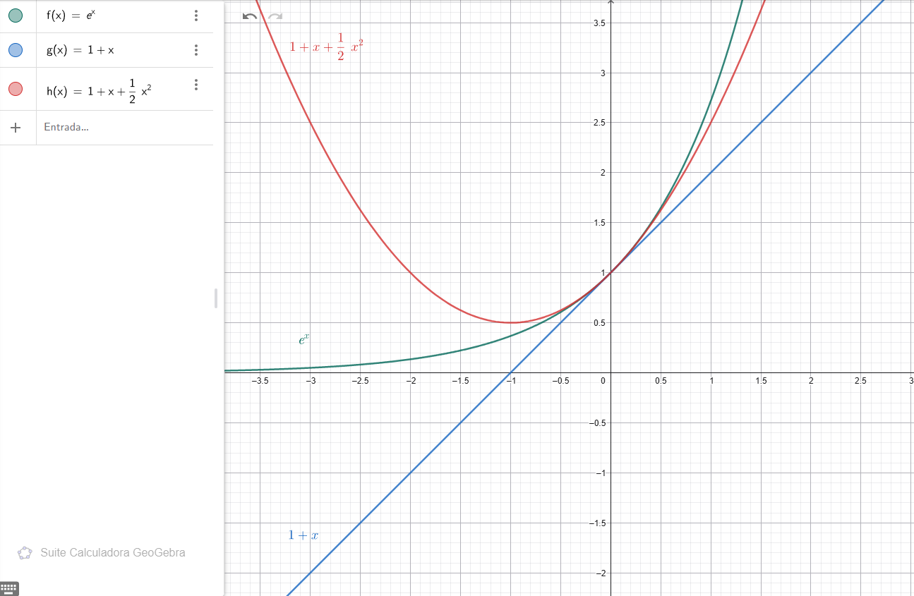
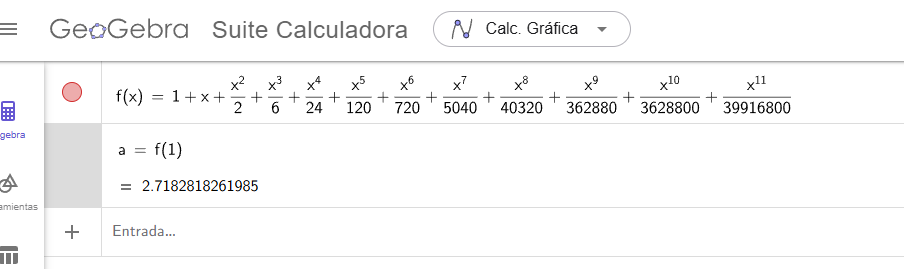

# Aproximación de funciones por medio de Polinomios de Taylor

Supongamos que tengo una función $f$ y una función desconocida que es muy parecida, es decir, la diferencia entre ambos resultados para un punto $a$ cualquiera es muy pequeña.

Ahora supongamos que esta función desconocida es un polinomio. Como la diferencia entre $f$  y nuestra funcion polinomio es muy pequeña, podríamos concluir que podría calcular directamente con el polinomio.

Esto sería muy conveniente ya que los polinomios son fáciles de calcular, se trata de sumas y multiplicaciones.

#### Ejemplo

Supongamos la función

$$f(x) = e^x$$

para $x = 0$ entonces $f(0) = 1$. Esto pasa para $f$ y todas sus derivadas

Ahora supongamos el polinomio de primer grado

$$g(x) = 1 + x$$

vemos que 

$$g(0) = 1 $$
$$g'(x) = 1  \rightarrow g'(0) = 1 $$

> Osea, $g$ coincide con $f$ y su primera derivada en $0$

Ahora probemos con otro polinomio desconocido $h$, pero esta vez uno de segundo grado, pero ahora que coincida con $f$ hasta la segunda derivada en 0, es decir:

$$h(0) = f(0) = 1$$
$$h'(0) = f'(0) = 1$$
$$h''(0) = f''(0) = 1$$

Si esto se cumple podríamos esperar una mejor aproximación de f, por lo menos en las proximidades de $(0, 1)$. Probemos con este

$$h(x) = 1 + x + \frac{1}{2}x^2 $$

vemos que cumple las condiciones anteriores.

$$h(0) = 1 + 0 + \frac{1}{2}0^2 = 1$$
$$h'(x) = 1 + x \rightarrow h'(0) = 1$$
$$h''(x) = 1 \rightarrow h''(0) = 1$$

#### Grafiquemos estas tres funciones

<!--  -->

vemos como $h$ se empieza a parecer visualmente a $f$

# Encontrando el polinomio

> Cálculo de Tom Apostol Vol. 1 pag 335
>
>Supongamos que $f$ tiene derivadas hasta el orden $n$ el en punto $x = 0$, siendo $n \geq 1$, e intentemos encontrar un polinomio $P$ que coincida con $f$ y sus $n$ primeras derivadas en $0$, deben satisfacerse $n + 1$ condiciones, a saber
>
>$$P(0) = f(0)$$
>$$P'(0) = f'(0)$$
>$$\vdots$$
>$$P^{(n)}(0) = f^{(n)}(0)$$
>
>
>Así que ensayamos un polinomio de grado $n$, por ejemplo
>
>$$P(x) = c_0 + c_1x + c_2x^2 + \dots + c_nx^n$$
>
> con $n + 1$ coeficientes por determinar

Veamos el varios pasos sucesivos

$x = 0$

---

$P(0) = c_0 \rightarrow f(0) = c_0$

$\text{ya que } P(0) = c_0 + c_1x + c_2(0)^2 + c_3(0)^3 + c_4(0)^4 +  \cdots + c_nx^{n}$

$\text{osea } P(0) = c_0 \text{ y además } P(0) = f(0)$

$\text{entonces } f(0) = c_0$

---

$P'(0) = c_1 \rightarrow f'(0) = c_1 $

$\text{ya que } P'(0) = 0 + c_1 + 2c_2(0) + 3c_3(0)^2 + 4c_4(0)^3 +  \cdots + nc_n(0)^{n - 1}$

$\text{osea } P'(0) = c_1 \text{ y además } P'(0) = f'(0) $

$\text{entonces } f'(0) = c_1$

---

$P''(0) = 2c_2 $

$\text{ya que } P''(0) = 0 + 0 + 2c_2 + 6c_3(0) + 12c_4(0)^2 +  \cdots + nc_n(0)^{n - 1}$

$\text{osea } P''(0) = 2c_2 \text{ y además } P''(0) = f''(0)$

$\text{entonces } \frac{f''(0)}{2} = c_2$

---

$P'''(0) = 6c_3$

$\text{ya que } P'''(0) = 0 + 0 + 0 + 6c_3 + 24c_4(0) + \cdots + nc_n(0)^{n - 1}$

$\text{osea } P'''(0) = 6c_3 \text{ y además } P'''(0) = f'''(0) $

$\text{entonces } \frac{f'''(0)}{6} = c_3$

---

y en general $P^{(k)}(0) = k!c_k$

osea que podemos determinar las constantes así

> $$c_k = \frac{f^{(k)}(0)}{k!} $$

Este razonamiento demuestra que existe un polinomio de grado $\leq n$ que satisface las $n+1$ condiciones en el punto $x = 0$

$$P(0) = f(0)$$
$$P'(0) = f'(0)$$
$$\vdots$$
$$P^{(n)}(0) = f^{(n)}(0)$$

Este polinomio viene dado por 

> $$ P(x) = \sum_{k = 0}^{n} \frac{f^{(k)}(0)}{k!}x^k$$

Similarmente podemos demostrar que existe un polinomio de grado  $\leq n$ que coincide con $f$ y sus $n$ primeras derivadas en el punto $x = a$

Hagamos de nuevo un par de iteraciones, esta vez probando este polinomio

$$P(x) = c_0 + c_1(x - a) + c_2(x - a)^2 + c_3(x - a)^3 + \dots + c_n(x - a)^n$$

y estas condiciones

$$P(a) = f(a)$$
$$P'(a) = f'(a)$$
$$\vdots$$
$$P^{(n)}(a) = f^{(n)}(a)$$

Entonces

$x = a$

---

$P(a) = c_0 \rightarrow f(a) = c_0$

$\text{ya que } P(a) = c_0 + c_1\cancel{((a) - a)} + c_2\cancel{((a) - a)}^2 + c_3\cancel{((a) - a)}^3 + c_4\cancel{((a) - a)}^4 +  \cdots + c_n\cancel{((a) - a)}^{n}$

$\text{osea } P(a) = c_0 \text{ y además } P(a) = f(a)$

$\text{entonces } f(a) = c_0$

---

$P'(a) = c_1 \rightarrow f'(a) = c_1 $

$\text{ya que } P'(a) = 0 + c_1 + 2c_2\cancel{((a) - a)} + 3c_3\cancel{((a) - a)}^2 + 4c_4\cancel{((a) - a)}^3 +  \cdots + nc_n\cancel{((a) - a)}^{n - 1}$

$\text{osea } P'(a) = c_1 \text{ y además } P'(a) = f'(a) $

$\text{entonces } f'(a) = c_1$

Podemos seguir con el mismo razonamiento que antes y vamos a encontrar que 

> $$ P(x) = \sum_{k = 0}^{n} \frac{f^{(k)}(a)}{k!}(x - a)^k$$

Satisface las condiciones, y se llama Polinomio de Taylor de grado $n$ generado por $f$ en el punto $a$.

### Notación

Es conveniente tener una notación que indique la dependencia del polinomio de Taylor $P$ respecto de $f$ y $n$. Así que utilizaremos el símbolo $T_nf$, $T_nf(x)$ o $T_n(f(x))$ y se denomina operador de Taylor de grado $n$

Cuando el operador se aplica a una función $f$ genera una nueva función $T_nf$

El valor de esta función en $x$ se representa con $T_nf$, y con respecto de $a$ es $T_nf(x ; a)$

### Ahora el ejemplo de toda la vida (pero que es muy útil)

Encontremos el polinmio de taylor para la función $sen(x)$

$f(x) = sen(x) \rightarrow f(0) = 0$

$f'(x) = cos(x) \rightarrow f'(0) = 1$

$f''(x) = -sen(x) \rightarrow f''(0) = 0$

$f'''(x) = -cos(x) \rightarrow f'''(0) = -1$

$f^{4}(x) = sen(x) \rightarrow f^{4}(0) = 0$

$\vdots$

$etc$

entonces $f^{(2n + 1)}(0) = (-1)^n$ y a su vez $f^{(2n)}(0) = 0$

Osea solo aparecen potencias impares de $x$ en los polinomios de Taylor generados por la función $sen(x)$ en $x = 0$. Entonces

$$T_{2n + 1}(sen(x)) = x - \frac{x^3}{3!} + \frac{x^5}{5!} - \frac{x^7}{7!} + \cdots + (-1)^n \frac{x^{2n + 1}}{(2n + 1)!}$$

Si hacemos el mismo razonamiento para la función $cos(x)$ (de hecho funciona el razonamiento de arriba) vemos que los polinomios de taylor generados por la función $cos(x)$ en $x = 0$ solo contiene potencias pares de $x$. Entonces

$$T_{2n}(cos(x)) = 1 - \frac{x^2}{2!} + \frac{x^4}{4!} - \frac{x^6}{6!} + \cdots + (-1)^n \frac{x^{2n}}{(2n)!}$$

### Algunas curiosidades

Recordando la regla de la derivación 

$$ f(x) = sen(x), f'(x) = cos(x)$$

y si vemos lo que pasó con la serie generada por el Polinomio de Taylor fue exactamente lo mismo, si derivamos $T_{2n + 1}(sen(x))$ nos da como resultado $T_{2n}(cos(x))$

##### Función tan(x)

¿Cómo podríamos encontrar la serie para la función $tan(x)$?, claro que podríamos hacer el mismo razonamiento que hicimos para $sen(x)$ y $cos(x)$, pero hagamos algo diferente...

Recordando los conceptos de trigonometría tenemos que:

$$tan(x) = \frac{sen(x)}{cos(x)}$$

la pregunta es, ¿podemos hacer lo mismo con las series y obtener la serie para la función tangente?

Si, y aquí hay un video donde lo hacen https://www.youtube.com/watch?v=ET3qjWs7g7w

De hecho lo podemos hacer con wolframalpha 

Por lo que podemos intuir que hay muchas propiedades que se pueden aplicar a los polinomios. Aqui no las voy a mencionar porque están en los libros, puedes revisar Cálculo de Tom Apostol Vol. 1 pag 337 en adelante

También encontraremos algo muy loco que nos revela también la importancia del centro utilizado para calcular el polinomio. 

La función $tan(x)$ tiene un comportamiento asintótico y el polinomio nunca va a llegar, ya que los polinomios tienen dominio de $(-\infty, \infty)$. Por lo cual queda una vez mas justificado de que **estamos hablando de aproximaciones**

# Polinomio de Taylor con resto

¿Qué tan buena es nuestra aproximación? Es necesario tener un mecanismo que nos **permita medir el error** que cometemos en la aproximación, también se le llama resto

Entonces, haciendo el experimento mental podemos decir que el error es equivalente a decir algo como "que tan lejos/diferente está el error del valor real de la función", para esto podemos expresar 

$$E_n(x) = f(x) - T_nf(x)$$

Resalta el signo $-$ sin valor absoluto, esto es porque el signo puede darnos información valiosa. Si el error es negativo no está diciendo que la aproximación es mayor al valor de la función, por ejemplo

$T_n(cos(x)) = 1 - \frac{x^2}{2} + \frac{x^4}{4!} - \cdots$

---

$T_0(x) = 1$

$cos(1) = 0.5403$

$T_0(1) = 1$

$E_0(1) = -0.4597$

---

$T_1(x) = 1 - \frac{x^2}{2}$

$cos(1) = 0.5403$

$T_1(1) = 0.50$

$E_1(1) = 0.0403$

Podemos ver que si aproximamos con el polinomio de grado $0$ la aproximación está por encima de la función entonces el error es negativo

Perfecto, ahora viene un momento importante. Sabemos que estamos aproximando una función $f$ y que cometemos un error en la aproximación. Entonces podemos afirmar que tenemos todo para saber cuanto es exactamente $f$, si sumamos la aproximación mas el error

De igual manera podemos "despejar" de la función $E_n(x) = f(x) - T_nf(x)$ y obtenemos

> $$f(x) = \sum_{k = 0}^{n} \frac{f^{(k)}(a)}{k!}(x - a)^k + E_n(x)$$

Esa se llama fórmula de Taylor con resto $E_n(x)$, y es util cuando podemos estimar la magnitud de $E_n(x)$, vamos a demostrar que se puede expresar como una integral

$$E_1(x) = \int_{a}^{x} (x-t)f''(t)dt$$

y en general

$$E_n(x) = \frac{1}{n!}\int_{a}^{x} (x-t)^{n}f^{(n+1)}(t)dt$$

### Demostración

# Estimación del error en la fórmula de Taylor

Ya que $E_n(x)$ ha sido expresado en forma de integral que afecta a lad erivada de ordne $n+1$ de $f$ necesitamos mas información acerca de $f^{(n+1)}$ antes de poder estimar la magnitud de $E_n(x)$

Un buen ejemplo es que nos planteen este problema: "La velocidad de un auto es $v(t)$ y la distancia recorrida es $\int_0^T v(t)dt$ ¿Qué tan lejos llegó el auto?"

Con esa información no podemos responder la pregunta porque $v(t)$ podría ser cualquier función

$v(y) = 1$

$v(y) = 1/\sqrt{t}$

$v(y) = 10sen(t)$

y resolver esa integral no nos dará la respuesta, la única manera sería decir algo como $0 \leq v(t) \leq 100T$. Ahí ya podemos decir algo sobre la distancia aunque no conocemos $v(t)$ ni la función que la origina

Lo mismo pasa con Taylor, de hecho todo lo que hemos visto se puede hacer sin conocer $f$. Hay ejemplos donde se puede construir el polinomio de Taylor solamente conociendo las derivadas de $f$ y un punto de $f(a)$, con eso basta. Por eso el error se debe acotar, conocemos solamente un entorno de a mas no toda la fución 

Al inicio usamos funciones como $e^x$ $sin(x)$ de forma pedagógica pero no necesitamos conocerlas 

"Para cualquier función suficientemente regular, aunque no sepamos como es, su comportamiento cerca de un punto está determinada por sus derivadas"

Así que vamos a acotar el error para poder estimarlo.

### Cotas m M

Si la derivada $(n+1)$-ésima de $f$ satisface las desigualdades 

$$m \leq f^{(n+1})(t) \leq M$$

Para todo $t$ en un cierto intervalo que contenga a $a$, entonces para todo $x$ de ese intervalo tenemos la estimación 

$$m \frac{(x-a)^{n+1}}{(n+1)!} \leq E_n(x) \leq M\frac{(x-a)^{n+1}}{(n+1)!} \text{ si x > a}$$

$$m \frac{(a-x)^{n+1}}{(n+1)!} \leq (-1)^{n+1} E_n(x) \leq M\frac{(a-x)^{n+1}}{(n+1)!} \text{ si x < a}$$

Demostración para x > a

$m \leq f^{(n+1})(t) \leq M$ multiplicamos por $\frac{(x - a)^n}{n!}$

$m \frac{(x-a)^n}{n!} \leq \frac{(x-a)^n}{n!} f^{(n+1})(t) \leq M\frac{(x-a)^n}{n!}$

integramos en las desigualdades

$\frac{m}{n!} \int_a^x (x-t)^ndt \leq E_n(x) \leq \frac{M}{n!} \int_a^x (x-t)^ndt$

resolvemos $\int_a^x (x-t)^ndt$  integrando por partes 

$u = x-t$

$du = -dt$

$\int_a^x (x-t)^ndt = \int_a^{x-a} u^ndu = \frac{(x-a)^{n+1}}{n+1}$

reemplazamos y obtenemos lo que estábamos buscando

$m \frac{(x-a)^{n+1}}{(n+1)!} \leq E_n(x) \leq M\frac{(x-a)^{n+1}}{(n+1)!} \text{ si x > a}$

Se puede demostrar para $x < a$

## Ejemplo

Queremos encontrar el valor de $e$. Tenemos la función $f(x) = e^x$ y $a = 0$. Tenemos el polinomio de taylor

$$T_n(e^x) = \sum_{k = 0}^{n} \frac{x^k}{k!} + E_n(x)$$

sabemos que todas las derivadas $f^{(n+1)}(x) = e^x$ y además  $f^{(n+1)}(x)$ es monotona creciente en cualquier intervalo, entonces $e^b \leq  f^{(n+1)}(x) \leq e^c$

Podemos estimar las cotas así $m = e^b$ y $M = e^c$ porque nuestro objetivo es estimar $e$, entonces tiene sentido acotarlo así.

Ahora tomamos estos valores $b = 0$ $c = 1$ y $x = 1$. Recordando que queremos estimar $e$ entonces $x = 1$ para tener $f(1) = e^1 = e$, y recordando que $a = 0$. Entonces

$$\frac{\cancel{e^0}x^{n+1}}{(n+1)!} \leq E_n(x) \leq \frac{e^1x^{n+1}}{(n+1)!}$$

$$\frac{1}{(n+1)!} \leq E_n(x) \leq \frac{1}{(n+1)!}$$

Sin embargo tenemos claro de analisis anteriores  previos a este tutorial que $e < 3$ entonces tiene mucho sentido que elijamos esta cota de una vez, porque sabemos que eso es verdad. Asi que tendremos

$$\frac{1}{(n+1)!} \leq E_n(x) \leq \frac{3}{(n+1)!}$$

De hecho podríamos utilizar cualquier otro valor, pero poniendo uno mas grande nos afectará la precisión, entre mas cerca mejor

Ahora, queremos estimar $e$ con una precisión de 8 decimales. La pregunta es ¿Cuántos términos $n$ en la serie necesitamos para tener esta precisión?. Por lo tanto necesitamos resolver esta desigualdad

$$\frac{3}{(n+1)!} \leq 10^{-8}$$

probemos valores

| n  | $(n+1)!$        | $\frac{3}{(n+1)!}$​ | decimales |
|----|-----------------|---------------------|-----------|
| 9  | $10!=3628800$   | $≈0.000000826$        | 6         |
| 10 | $11!=39916800$  | $≈0.000000075$        | 7         |
| 11 | $12!=479001600$ | $≈0.000000006$        | 8         |

En el ejemplo del libro utilizan $\frac{1}{2}10^{-8}$ para efectos de redondeo

pero en nuestro mini ejemplo podemos observar que la desigualdad se cumple. 

Ahora la prueba de fuego, calculemos $n = 11$ términos de la serie y veamos el resultado

el valor es $2.7182818261985$ y si lo comparamos con el valor real $2.71828182845904523536...$ podemos comprobar que cumplen las 8 cifras de precisión